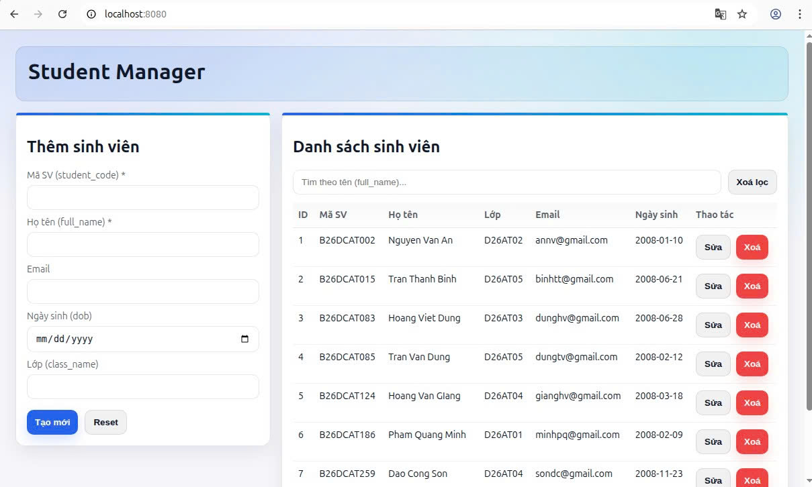
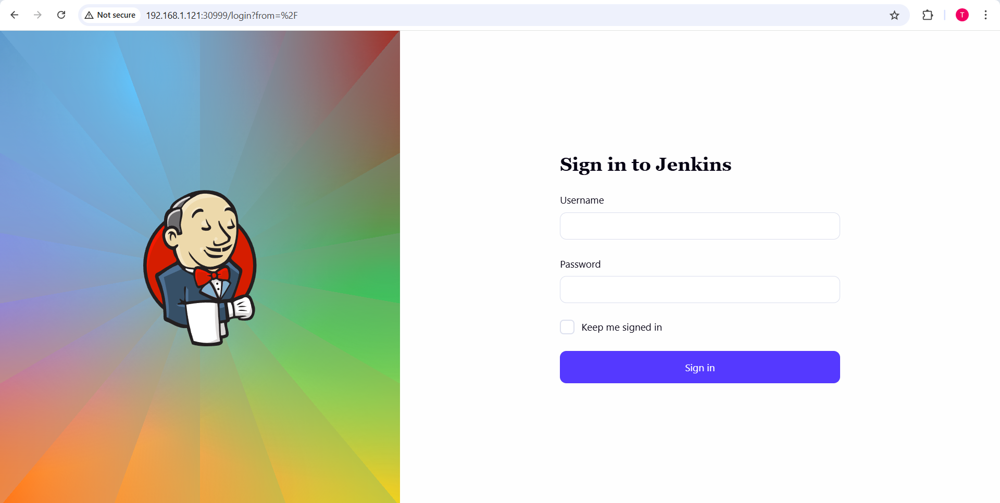
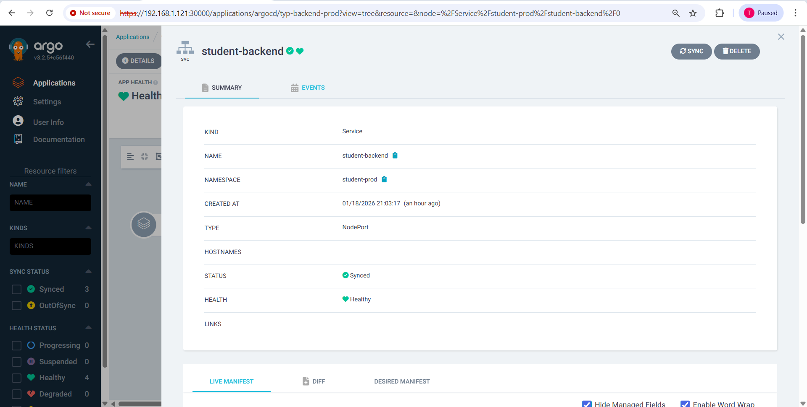
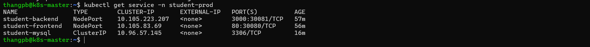
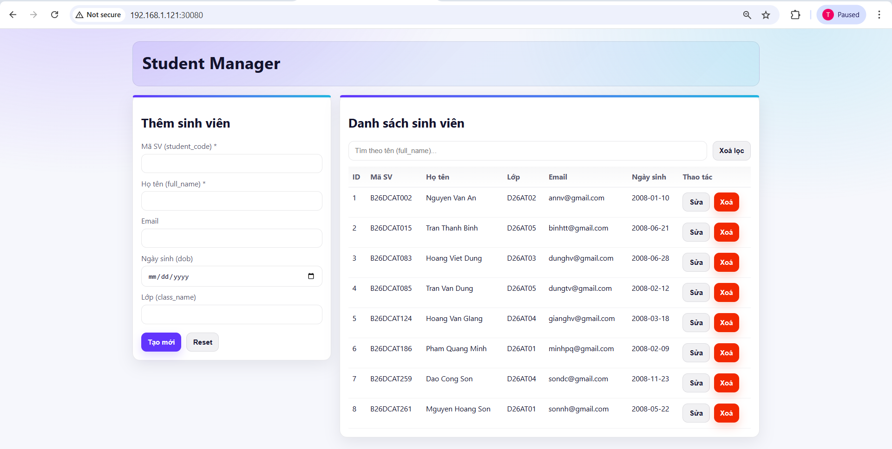

## Phần 2: K8s-HelmChart
### App được lựa chọn
- Web quản lý sinh viên
- Teck stack:
    - **Frontend**: React Vite JS
    - **Backend**: Node JS
    - **Database**: MySQL
- Hình ảnh



### Yêu cầu 1
- **Mục tiêu**: cài đặt được Jenkins và ArgoCD, expose được qua NodePort
#### Cài đặt ArgoCD
- Install ArgoCD:
    ```bash
    kubectl create namespace argocd
    kubectl apply -n argocd -f https://raw.githubusercontent.com/argoproj/argo-cd/stable/manifests/install.yaml
    ```
- File Manifest triển khai dịch vụ ArgoCD qua NodePort
    ```yml
    apiVersion: v1
    kind: Service
    metadata:
      name: argocd-server-nodeport
      namespace: argocd
    spec:
      type: NodePort
      ports:
        - port: 80
          targetPort: 8080
          nodePort: 30000
      selector:
        app.kubernetes.io/name: argocd-server
    ```
- Truy cập ArgoCD:
    - NodeIP: 192.168.1.121
    - NodePort của AgroCD: 30000
- Giao diện ArgoCD


- Lệnh lấy pasword ArgoCD:
    ```bash
    kubectl -n argocd get secret argocd-initial-admin-secret \
        -o jsonpath="{.data.password}" | base64 -d; echo
    ```
#### Cài đặt Jenkins
- Install Jenkins:
    ```bash
    kubectl create namespace jenkins
    kubectl apply -f jenkins.yaml
    ```
- File Manifest triển khai Jenkins: [File manifest jenkins](./manifest/jenkins.yaml)
- Truy cập jenkins:
    - NodeIP: 192.168.1.121
    - NodePort của Jenkins: 30999
- Giao diện jenkins



### Yêu cầu 2
- **Tổng hợp các Repository**

| Repository | Mô tả | Link | 
|------------|-------|------|
| typ-backend | Source code backend | [Github](https://github.com/Phamthang-25/typ-backend) |
| typ-backend-config | Cấu hình backend | [Github](https://github.com/Phamthang-25/typ-backend-config) |
| typ-frontend | Source code frontend | [Github](https://github.com/Phamthang-25/typ-frontend) |
| typ-frontend-config | Cấu hình frontend | [Github](https://github.com/Phamthang-25/typ-frontend-config) |
| typ-db | Helm Chart cho DB | [Github](https://github.com/Phamthang-25/typ-db) |

- **Các Helm Chart để triển khai app**
1. Helm chart triển khai backend: [Source code](https://github.com/Phamthang-25/typ-backend/tree/main/backend-chart)
2. Helm chart triển khai frontend: [Source code](https://github.com/Phamthang-25/typ-frontend/tree/main/frontend-chart)
3. Helm chart triển khai database: [Source code](https://github.com/Phamthang-25/typ-db/tree/main/db-chart)

- **`values-prod.yaml` của backend-config**
    ```yml
    image:
      repository: thang05/typ-backend
      tag: "v1.0.1"
      pullPolicy: IfNotPresent

    service:
      name: student-backend
      port: 3000

    env:
      PORT: "3000"

      DB_HOST: "student-mysql"
      DB_PORT: "3306"
      DB_NAME: "studentdb"
      DB_USER: "appuser"
      DB_PASSWORD: "apppass"
    ```
- **`values-prod.yaml` của frontend-config**
    ```yml
    image:
      repository: thang05/typ-frontend
      tag: "v1.0.1"
      pullPolicy: IfNotPresent

    service:
      name: student-frontend
      port: 80

    ingress:
      enabled: true
      className: nginx
      host: student.example.com
      path: /
    ```
#### Manifest ArgoCD Application
1. **Manifest triển khai backend**
```yml
apiVersion: argoproj.io/v1alpha1
kind: Application
metadata:
  name: typ-backend-prod
  namespace: argocd
spec:
  project: default
  destination:
    server: https://kubernetes.default.svc
    namespace: student-prod
  syncPolicy:
    automated:
      prune: true
      selfHeal: true
    syncOptions:
      - CreateNamespace=true

  sources:
    - repoURL: https://github.com/Phamthang-25/typ-backend.git
      targetRevision: main
      path: backend-chart
      helm:
        valueFiles:
          - $values/helm-values/values-prod.yaml

    - repoURL: https://github.com/Phamthang-25/typ-backend-config.git
      targetRevision: main
      ref: values
```
2. **Manifest triển khai frontend**
```yml
apiVersion: argoproj.io/v1alpha1
kind: Application
metadata:
  name: typ-frontend-prod
  namespace: argocd
spec:
  project: default
  destination:
    server: https://kubernetes.default.svc
    namespace: student-prod
  syncPolicy:
    automated:
      prune: true
      selfHeal: true
    syncOptions:
      - CreateNamespace=true

  sources:
    - repoURL: https://github.com/Phamthang-25/typ-frontend.git
      targetRevision: main
      path: frontend-chart
      helm:
        valueFiles:
          - $values/helm-values/values-prod.yaml

    - repoURL: https://github.com/Phamthang-25/typ-frontend-config.git
      targetRevision: main
      ref: values
```
3. **Manifest triển khai database**
```yml
apiVersion: argoproj.io/v1alpha1
kind: Application
metadata:
  name: typ-db-prod
  namespace: argocd
spec:
  project: default
  destination:
    server: https://kubernetes.default.svc
    namespace: student-prod
  syncPolicy:
    automated:
      prune: true
      selfHeal: true
    syncOptions:
      - CreateNamespace=true
  source:
    repoURL: https://github.com/Phamthang-25/typ-db.git
    targetRevision: main
    path: db-chart
    helm:
      valueFiles:
        - values.yaml
```
- **Ảnh chụp màn hình ArgoCD**
- Tổng quan các Application


- Backend application





- frontend application


- Database application


- **Ảnh màn hình trình duyệt**: đến đây e có tạo thêm các NodePort



- Hình ảnh truy cập frontend



- Truy cập vào API


