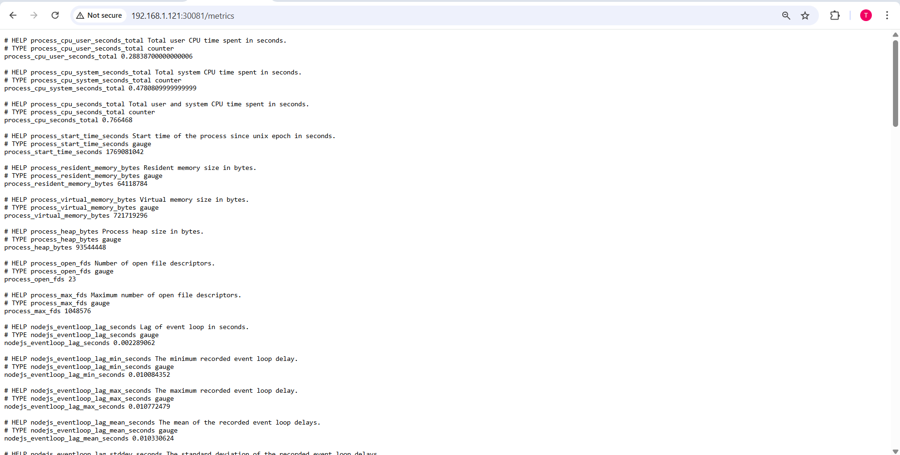
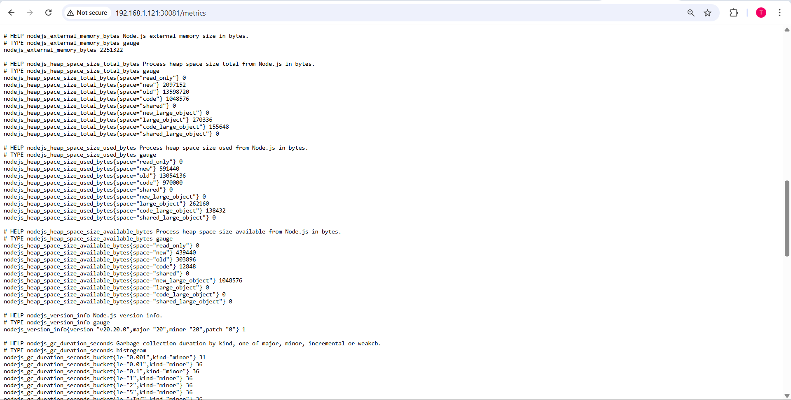
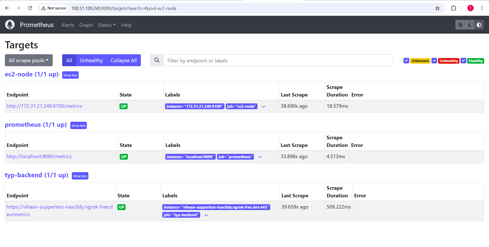
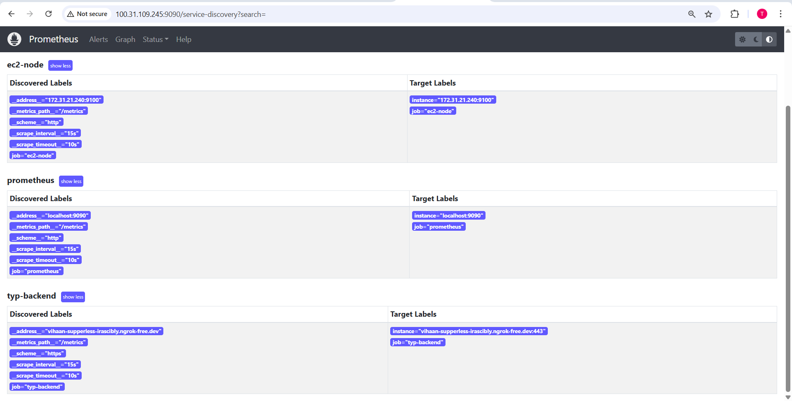
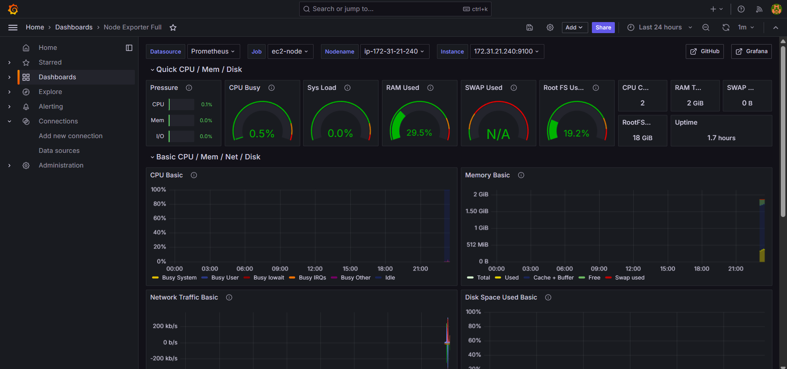
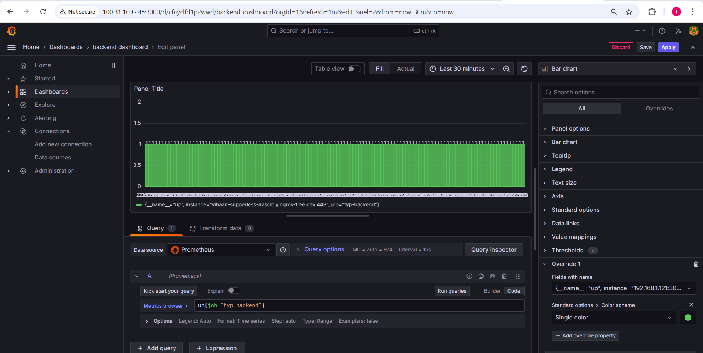

## Phần 4: Monitoring

### Yêu cầu
- **Expose metric của app ra 1 http path**
  - Tham khảo: [https://github.com/korfuri/django-prometheus](https://github.com/korfuri/django-prometheus)

- **Sử dụng ansible playbooks để triển khai container Prometheus server**
  - Cấu hình prometheus add target giám sát các metrics đã expose ở trên

### Output
- Các file setup để triển khai Prometheus
- Hình ảnh khi truy cập vào Prometheus UI thông qua trình duyệt  
- Hình ảnh danh sách target của App được giám sát bởi Prometheus
---

### Expose metric của app ra 1 http path
- [Tài liệu tham khảo](https://www.npmjs.com/package/prom-client)
- **Enable metrics cho Node JS**
    - Thêm dependencies: **prom-client**
    - Thêm đoạn code sau:
```
// -------------------- Prometheus metrics --------------------
const register = new client.Registry();
client.collectDefaultMetrics({ register });

const httpRequestDurationSeconds = new client.Histogram({
  name: "http_request_duration_seconds",
  help: "Duration of HTTP requests in seconds",
  labelNames: ["method", "route", "status_code"],
  buckets: [0.005, 0.01, 0.025, 0.05, 0.1, 0.25, 0.5, 1, 2.5, 5, 10],
});
register.registerMetric(httpRequestDurationSeconds);

// Expose /metrics
app.get("/metrics", async (req, res) => {
  try {
    res.set("Content-Type", register.contentType);
    res.end(await register.metrics());
  } catch (err) {
    res.status(500).send("Error generating metrics");
  }
});

app.use((req, res, next) => {
  if (req.path === "/metrics") return next();
  const end = httpRequestDurationSeconds.startTimer();
  res.on("finish", () => {
    const route =
      (req.route && req.route.path) ||
      (req.baseUrl ? req.baseUrl : "") ||
      req.path;
    end({
      method: req.method,
      route: String(route),
      status_code: String(res.statusCode),
    });
  });
  next();
});
```
- **Kết quả thu được metrics qua URL**





### Triển khai Prometheus và Grafana với Ansible
- [Folder chứa các file ansible](./ansible-monitoring/)
- Do sử dụng 1 con EC2 instance làm server monitor, nên app cần sử dụng một giải pháp tunneling để có thể truy cập từ bên ngoài
  ```bash
  nohup ngrok http 192.168.1.121:30081 --log=stdout > ngrok.log 2>&1 &
  ```
#### Kết quả monitoring**
- **Prometheus UI**





- **Grafana UI**



