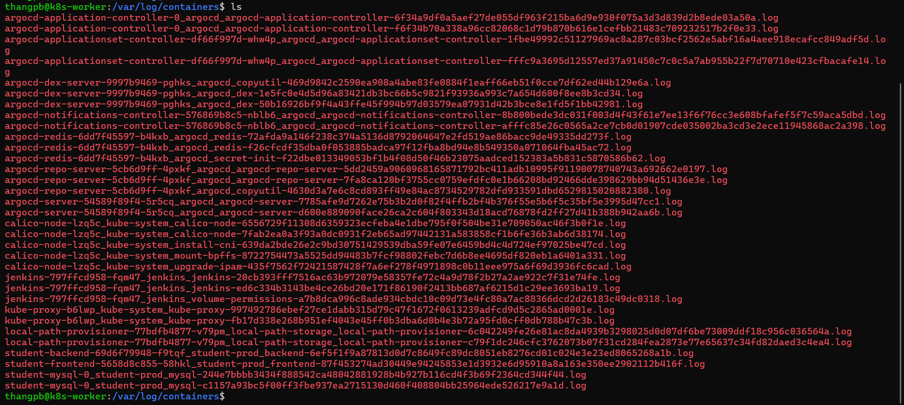
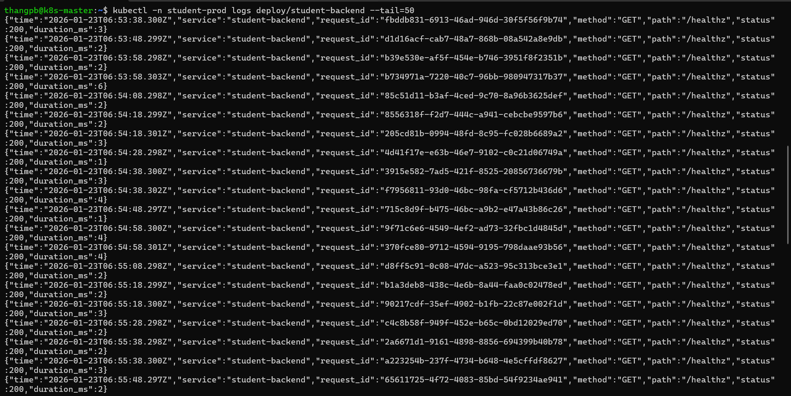
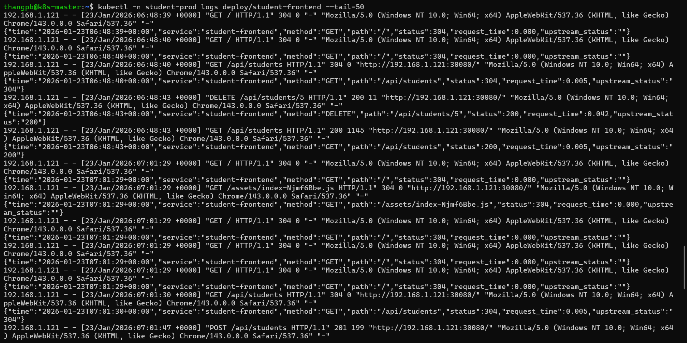
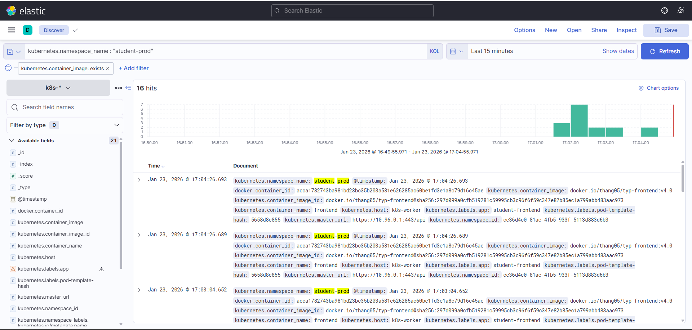
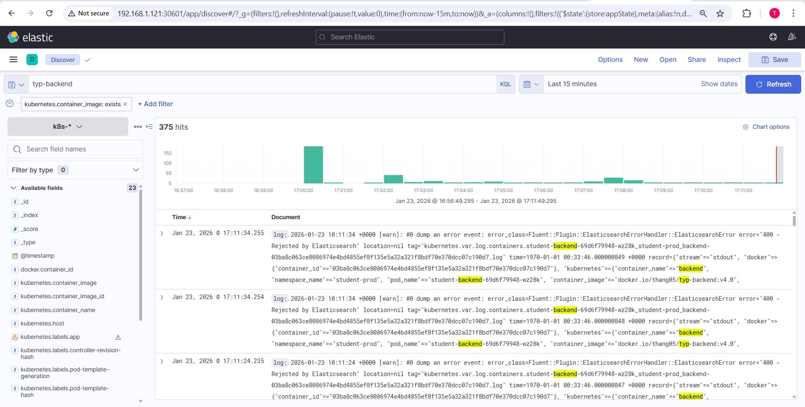

## Phần 5: Logging

### Yêu cầu
Sử dụng **Ansible Playbooks** để triển khai stack **EFK** (Elasticsearch, Fluentd, Kibana), sau đó cấu hình logging cho **web service** và **api service**, đảm bảo khi có HTTP request gửi vào thì log ghi nhận đầy đủ thông tin sau:

- **Request Path** (VD: `/api1/1`, `/api2/3`, ...)
- **HTTP Method** (GET, POST, PUT, DELETE, ...)
- **Response Code** (200, 201, 202, 302, ...)
---

### Triển khai
- Khi cụm k8s được chạy, log sẽ được lưu ở `/var/log/containers` trên node mà chạy pods



1. **Chuẩn bị log cho backend và frontend**
- **Backend**
    - Thêm đoạn code sau:
```
const { v4: uuidv4 } = require("uuid");

// -------------------- Request logging --------------------
app.use((req, res, next) => {
  if (req.path === "/metrics") return next();

  const requestId = req.header("x-request-id") || uuidv4();
  res.setHeader("X-Request-Id", requestId);

  const startNs = process.hrtime.bigint();

  res.on("finish", () => {
    const durationMs = Number((process.hrtime.bigint() - startNs) / 1000000n);

    const log = {
      time: new Date().toISOString(),
      service: "student-backend",
      request_id: requestId,
      method: req.method,
      path: req.originalUrl,
      status: res.statusCode,
      duration_ms: durationMs,
    };

    console.log(JSON.stringify(log));
  });

  next();
});
```
- Ảnh log backend:



- **Frontend**
    - Thực hiện thêm cấu hình file `nginx.conf`
```
log_format json_combined escape=json '{'
  '"time":"$time_iso8601",'
  '"service":"student-frontend",'
  '"method":"$request_method",'
  '"path":"$request_uri",'
  '"status":$status,'
  '"request_time":$request_time,'
  '"upstream_status":"$upstream_status"'
'}';

access_log /dev/stdout json_combined;
error_log  /dev/stderr warn;

server {
    ...
}
```
- Ảnh log frontend:



2. **Tạo configmap để customize cấu hình fluent.conf**
```yml
<source>
  @type tail
  path /var/log/containers/*.log
  pos_file /var/log/fluentd-containers.pos
  tag kubernetes.**
  read_from_head true
  <parse>
    @type regexp
    expression ^(?<time>.+) (?<stream>stdout|stderr) [^ ]* (?<log>.*)$
    time_format %Y-%m-%dT%H:%M:%S.%N%:z
  </parse>
</source>

<filter kubernetes.**>
  @type kubernetes_metadata
</filter>

<filter kubernetes.**>
  @type parser
  key_name log
  reserve_data true
  remove_key_name_field true
  emit_invalid_record_to_error false
  <parse>
    @type json
  </parse>
</filter>

<match **>
  @type elasticsearch
  host elasticsearch
  port 9200
  logstash_format true
  logstash_prefix k8s
  <buffer>
    @type file
    path /var/log/fluentd-buffers/kubernetes.system.buffer
    flush_interval 5s
  </buffer>
</match>
```
3. **Kết quả**
- Log được hiển thị trên giao diện Kibana



