# Week 5: Caching & Redis

## 1. Tìm hiểu về Caching & Redis

### Caching là gì?
Caching - Bộ nhớ đệm: là kỹ thuật lưu trữ bản sao của dữ liệu tại một vị trí truy cập nhanh hơn (thường là RAM) so với nguồn dữ liệu gốc (thường là ổ cứng hoặc DB) để phục vụ các yêu cầu trong tương lai nhanh hơn.

### Vì sao cần Caching/Redis?
- **Tăng tốc độ phản hồi (Reduced Latency)**: Truy xuất từ RAM nhanh hơn nhiều so với disk/network
- **Giảm tải cho DB (Reduced DB Load)**: Tránh các truy vấn lặp lại, phức tạp vào DB
- **Tăng khả năng chịu tải (High Throughput)**: Hỗ trợ hàng triệu request mỗi giây
- **Redis đặc biệt mạnh vì**: Là in-memory key-value store, hỗ trợ cấu trúc dữ liệu phong phú, persistence, replication, publish/subcribe

### Các chiến lược Caching phổ biến?
1.  **Cache-Aside (Lazy Loading)**: Phổ biến nhất. Ứng dụng kiểm tra Cache:
    - Nếu có (Hit): Trả về dữ liệu.
    - Nếu không (Miss): Truy vấn DB -> Lưu vào Cache -> Trả về.
2.  **Write-Through**: Ghi dữ liệu vào Cache và DB đồng thời. Đảm bảo dữ liệu nhất quán nhưng ghi chậm hơn.
3.  **Write-Around**: Ghi trực tiếp vào DB, bỏ qua Cache. Chỉ cập nhật Cache khi đọc.
4.  **Write-Back (Write-Behind)**: Ghi vào Cache trước, sau đó Cache sẽ ghi xuống DB bất đồng bộ (Async). Hiệu năng ghi cao nhưng rủi ro mất dữ liệu nếu Cache bất ngờ sập

### Kiểu dữ liệu cơ bản trong Redis?
-   **String**: Cơ bản nhất, lưu text, JSON, số (counter). Dùng cho cache thông thường
-   **List**: Danh sách liên kết (Linked List). Dùng cho Queue, Timeline
-   **Set**: Tập hợp các phần tử duy nhất không thứ tự. Dùng cho Tagging, Friends list
-   **Hash**: Lưu object dưới dạng field-value. Dùng lưu thông tin User, Product
-   **Sorted Set (ZSet)**: Giống Set nhưng mỗi phần tử có thêm Score để sắp xếp. Dùng cho bảng xếp hạng

## 2. Implement
Đã thực hiện tích hợp Redis vào project Spring Boot (`demo(2)`):

### Các thay đổi chính:
1.  **Dependencies**: Thêm `spring-boot-starter-data-redis` vào `pom.xml`.
2.  **Configuration**:
    -   Cấu hình kết nối trong `application.properties` (localhost:6379).
    -   Tạo `RedisConfig.java` để tùy chỉnh Serialization (Key: String, Value: JSON).
3.  **Services**:
    -   Tạo `RedisService.java`: Helper class cho các thao tác `get`, `set`, `delete`, `zadd`, `zrevrange`.
    -   Cập nhật `UserService.java`:
        -   **GET**: Kiểm tra Cache trước, nếu miss thì query DB và cache với TTL 10 phút.
        -   **SAVE/DELETE**: Xóa (Invalidate) cache tương ứng để tránh dữ liệu cũ (Stale data).
4.  **Leaderboard Feature**:
    -   Tạo `LeaderboardController.java` demo tính năng Bảng xếp hạng sử dụng Redis Sorted Set.

### Lưu ý khi implement:
-   **TTL (Time to Live)**: Đặt TTL 10 phút cho user cache kết hợp với Cache Aside để dữ liệu tự hết hạn nếu không dùng.
-   **Cache Invalidation**: Chủ động xóa cache `user:{id}` khi cập nhật hoặc xóa user.
-   **Cache Penetration**: Đã xử lý bằng cách cache giá trị null (ví dụ string `"USER_NOT_FOUND"`) với TTL ngắn (1 phút) nếu tìm trong DB không thấy, tránh tấn công vào DB với các ID không tồn tại.
-   **Cache Avalanche**: Để tránh, nên dùng TTL ngẫu nhiên (Random jitter) cho các key cache hàng loạt (chưa implement trong demo này, nhưng nên lưu ý).

## 3. Chi tiết thực hiện & Kết quả:
### 3.1 Chi tiết thực hiện
#### Thiết lập môi trường
Em đã cấu hình docker-compose.yml để chạy redis server dưới dạng 1 container

-> Tác dụng: chỉ cần chạy = lệnh `docker-compose up -d` chứ không cần cài đặt thủ công trên máy

#### Thêm thư viện Dependencies trong pom.xml
- `spring-boot-starter-data-redis` 

-> Tác dụng: Cung cấp các công cụ để ứng dụng SpringBoot kết nối & làm việc với Redis.

#### Cấu hình kết nối trong RedisConfig.java (Configuration)

- File cấu hình này dùng để định nghĩa cách ứng dụng lưu dữ liệu vào Redis.

-> Tác dụng: 

    - Tạo Bean RedisTemplate để định nghĩa cách lưu dữ liệu vào Redis.

    - Cấu hình key để lưu dưới dạng chuỗi (String) và value dưới dạng JSON.

    --> Giúp Redis dể đọc và dễ chuyển đổi ngược lại thành Object khi cần.

#### Tạo Service cho Redis
Thay vì gọi trực tiếp RedisTemplate, emd tạo RedisService để đóng gói các thao tác thành vào 1 class riêng.

-> Tác dụng: Cung cấp các hàm đơn giản như:

    - set() dùng để lưu dữ liệu

    - setWithTTL() : lưu dữ liệu có hẹn giờ tự xóa (Time to Live)

    - get() : lấy dữ liệu

    - delete() : xóa dữ liệu


#### Tích hợp:
- Sử dụng mô hình Cache Aside

- Luồng xử lý cơ bản:
    - Lấy User bằng handleGetUserById():
        + Kiểm tra trong Redis(Cache) trước
        + Nếu có (sẽ là TH hit) -> trả về
        + Nếu không (sẽ là TH miss) -> query DB -> lưu vào Redis cho lần sau nếu có lấy thì sẽ lấy nhanh hơn -> trả về
    - Lưu/Xóa User sử dụng handleSaveUser/handleDeleteUser:
        + Khi dữ liệu gốc thay đổi, mình sẽ phải dùng RedisService gọi đến phương thức delete() để xóa cache cũ. Điều này đảm bảo người dùng không bị nhìn thấy dữ liệu cũ sai lệch --> đảm bảo tính nhất quán

### 3.2 Kết quả demo
#### Do cần chạy Redis server nên em đã dùng docker-compose để chạy Redis server dưới dạng container,trước khi test các API thì cần đăng nhập để lấy token 
- Method : POST
- URL : http://localhost:8080/api/auth/login
- Body : 
```json
{
    "username": "buianhduc1@example.com",
    "password": "123456789"
}
```
- Lấy được accessToken trả về

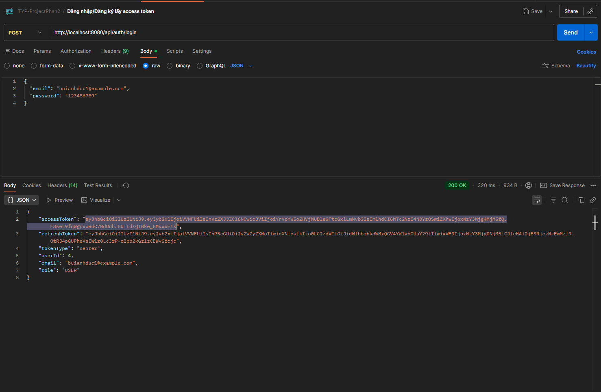

#### Test Cache User có Token 
Chèn Token vào Bearer Token và paste Token vừa lưu bên trên vào

- Test với ID tồn tại = 3
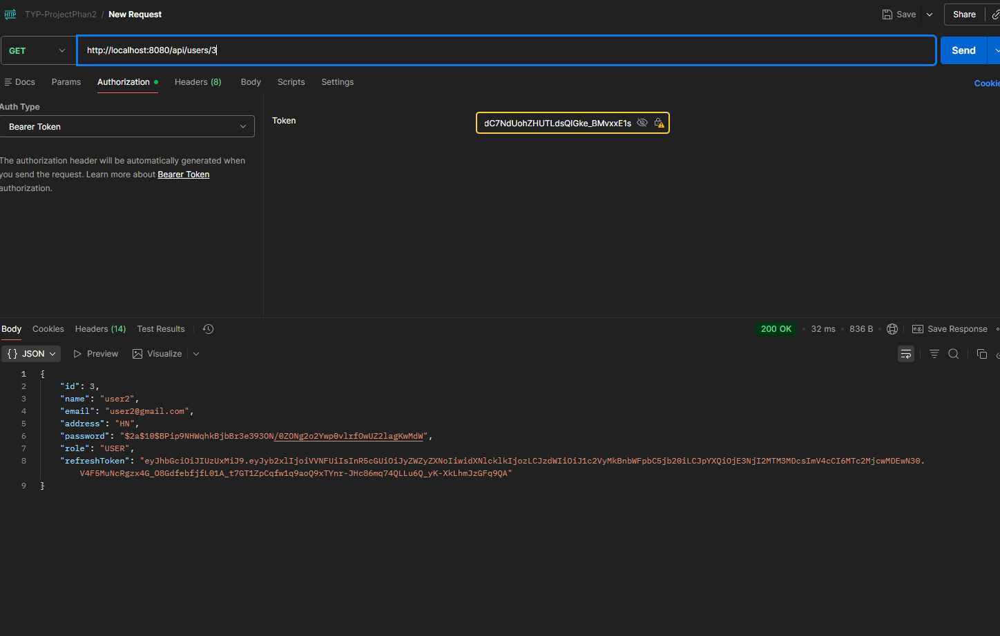
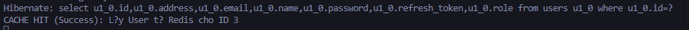

- Test thử với ID rác = 999
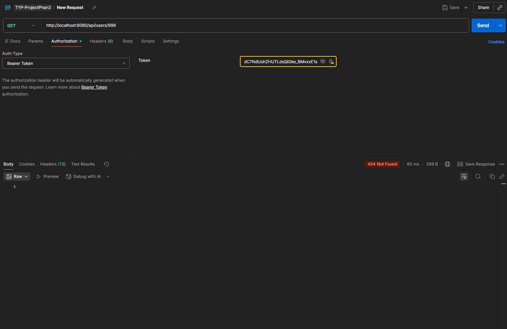
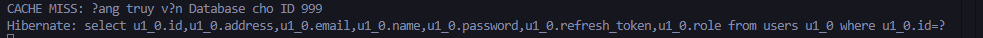

#### Test Leaderboard

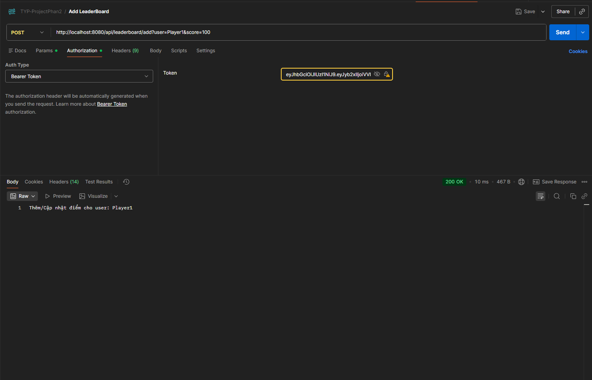


- Làm tương tự với Player2,3,4,5 
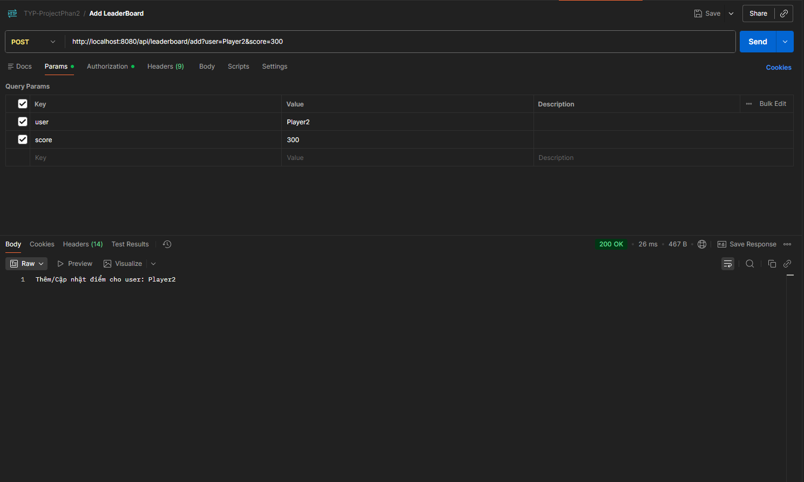
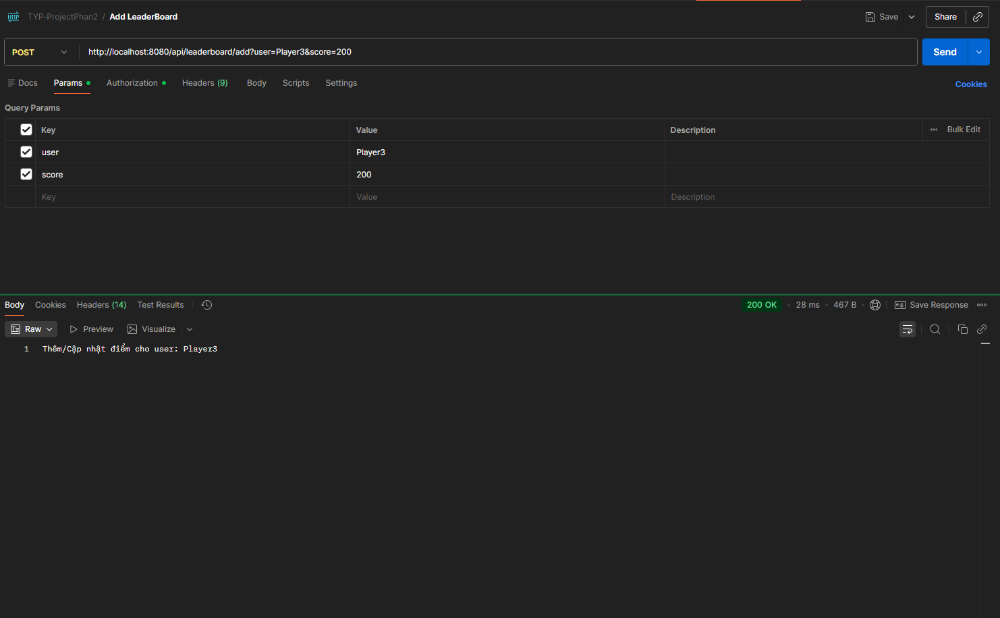
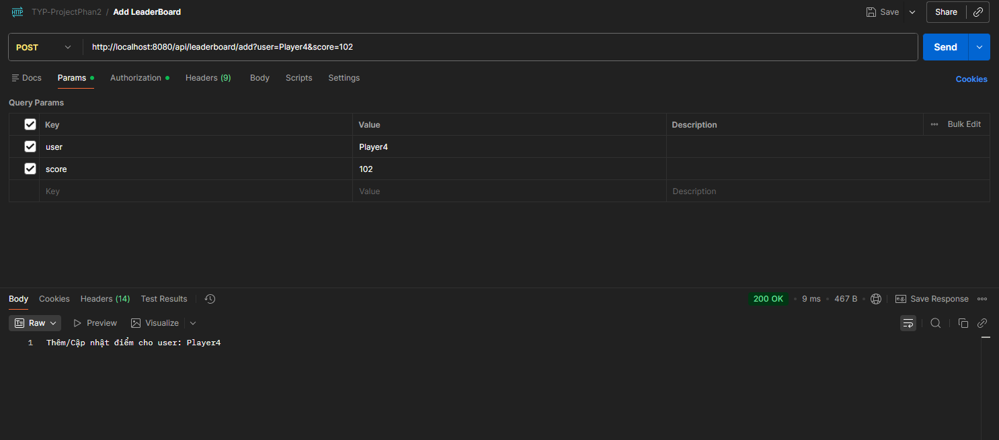
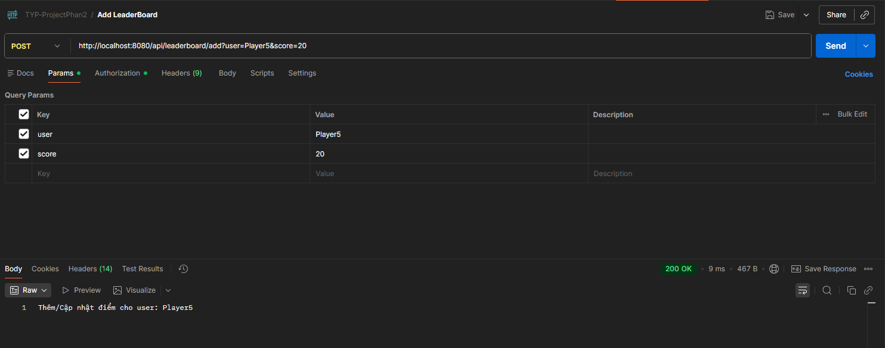

=> sau đó gọi test API leaderboard `http://localhost:8080/api/leaderboard/top` ra được như sau:
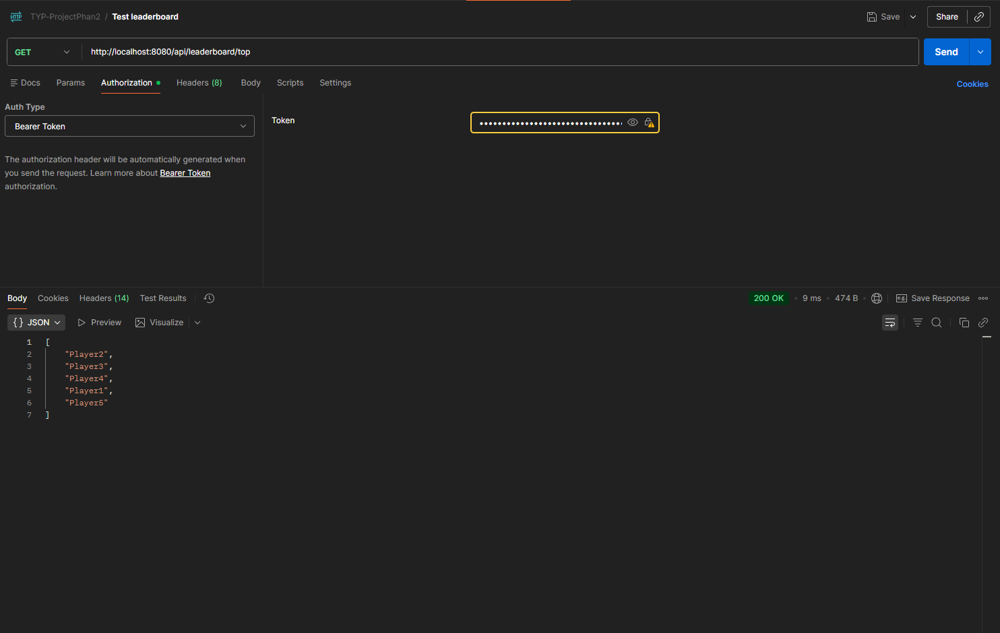