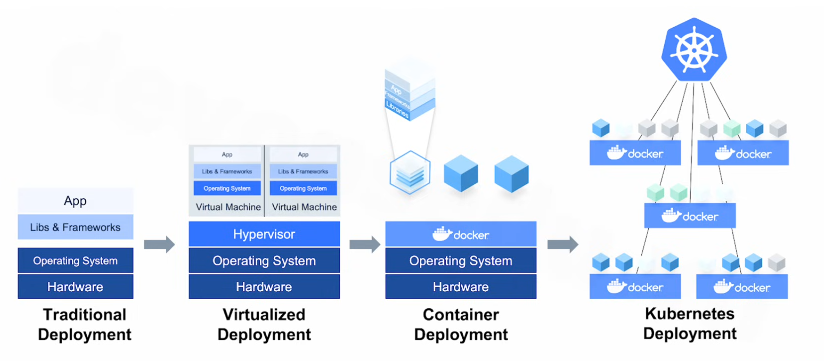
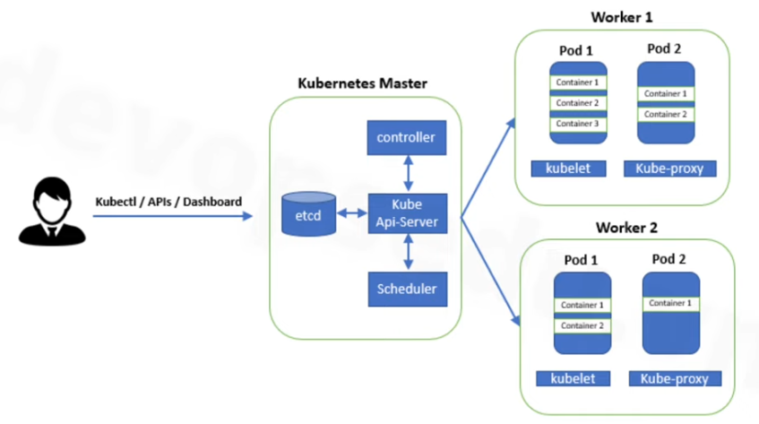
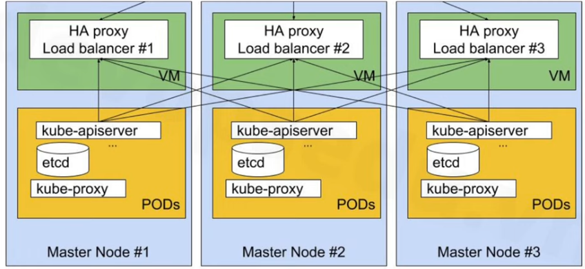
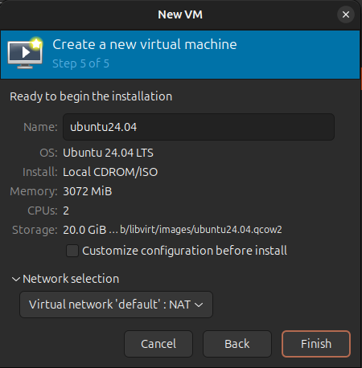
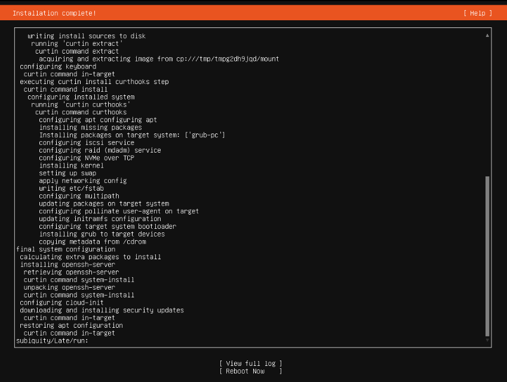
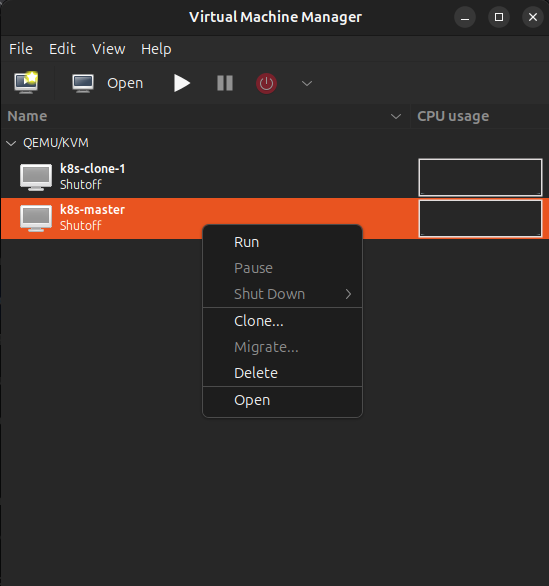
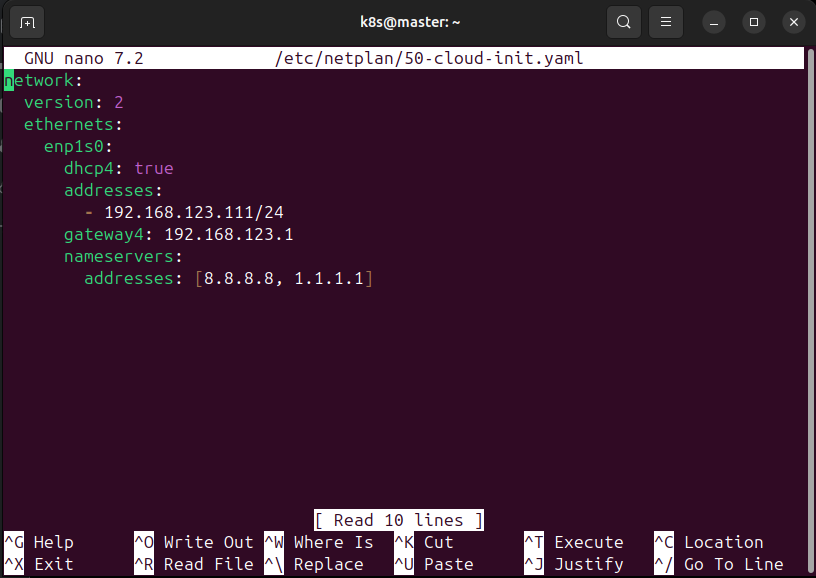
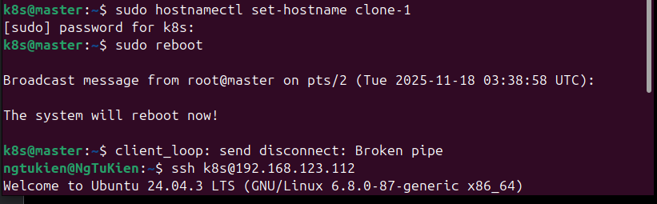
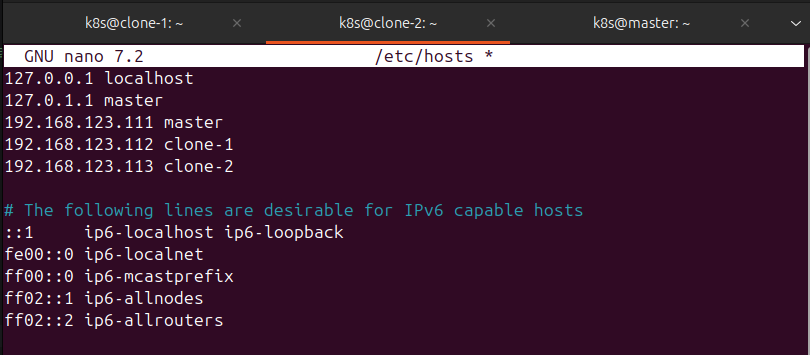
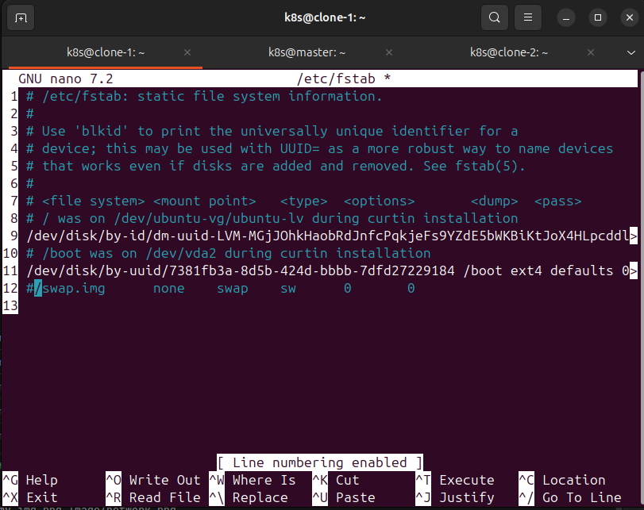

# Kubernetes
___
## 1. Kubernetes là gì?
**Kubernetes (K8S)** là một nền tảng mã nguồn mở, khả năng chuyển, có thể mở rộng để quản lý các ứng dụng được đóng gói và các service, giúp thuận tiện trong việc cấu hình và tự động hóa việc triển khai ứng dụng.
### Mô hình triển khai


**Bài toán:** Công nghệ ảo hóa và container được tạo ra để giải quyết được vấn đề về tài nguyên phần cứng và mở rộng quy mô, bằng cách cấp phát tài nguyên rành mạch và tính riêng biệt giữa chúng. Tuy nhiên, việc backup, sửa lỗi, quản lý giá trị quan trọng hay tăng giảm tài nguyên đều phải thực hiện thủ công gây mất nhiều thời gian và có rủi ro.
> **K8s** ra đời để khắc phục bằng cách:
> - Tự động backup, sửa lỗi, scale.
> - Quản lý các giá trị một cách tường minh, chuyên nghiệp.
---
### Khi nào nên dùng K8s?
- Dự án lớn, dự án lâu dài.
- Dự án có nhu cầu scaling cao.
- Dự án cần triển khai đa môi trường.
- Dự án theo mô hình microservice.
- Dự án cần khả năng tự phục hồi.
---
### Hạ tầng K8s

* **Control Plane (Bộ não)**
    * **`kube-api-server`:** Cửa ngõ giao tiếp API. Tiếp nhận, xác thực và xử lý *mọi* yêu cầu (lệnh) từ người dùng và các thành phần khác.
    * **`etcd`:** Cơ sở dữ liệu (kho lưu trữ) lưu *toàn bộ* trạng thái và cấu hình của cluster.
    * **`kube-scheduler`:** Quyết định (xếp lịch) xem Pod mới nên được chạy ở Node (máy trạm) nào.
    * **`kube-controller-manager`:** Giám sát trạng thái cluster. Khi thực tế khác mong muốn (ví dụ: Pod chết), nó sẽ tự động "sửa lỗi" (tạo Pod mới).
    * **`cloud-controller-manager`**: (Tùy chọn) "Phiên dịch" các yêu cầu của K8s thành hành động của nhà cung cấp mây (AWS, GCP, Azure). Ví dụ: tạo Load Balancer, yêu cầu ổ đĩa lưu trữ (storage) từ mây.
* **Worker Nodes (Nơi làm việc)**
    * **`kubelet`:** Agent (đặc vụ) chạy trên mỗi Node. Nhận lệnh từ Control Plane và đảm bảo các container trong Pod đang chạy đúng như yêu cầu.
    * **`kube-proxy`:** Quản lý quy tắc mạng (networking) trên mỗi Node, xử lý cân bằng tải (load balancing) cho các Service.
    * **`Pod`:** Đơn vị nhỏ nhất, là "ngôi nhà" chứa một hoặc nhiều container ứng dụng của bạn.
---
## [2. Các cách cài đặt một cụm K8s](https://kubernetes.io/docs/reference/setup-tools/kubeadm/)
Có khá nhiều phương pháp cài đặt K8s với ưu nhược điểm khác nhau. Dưới đây là một số cách phổ biến:

| Phân loại | Phương pháp/Công cụ | Trường hợp sử dụng chính | Ưu điểm | Nhược điểm |
| :--- | :--- | :--- | :--- | :--- |
| **Dịch vụ Cloud** | GKE, EKS, AKS | Production (trên Cloud) | Dễ dàng, tự động quản lý control plane, tích hợp sâu. | Tốn chi phí, vendor lock-in, ít tùy chỉnh control plane. |
| **Cài đặt Tự động** | Kubeadm | Nền tảng (building block) | Chính thức, luôn mới nhất, linh hoạt. | Chỉ tự động hóa K8s, không tự động hóa máy chủ/OS. |
| **Cài đặt Tự động** | Kubespray (Ansible) | Production (On-premise, Cloud) | Tự động hóa A-Z, hỗ trợ nhiều môi trường. | Phức tạp (cần biết Ansible), chậm cập nhật K8s mới. |
| **Cài đặt Tự động** | RKE (Rancher) | Production (Đặc biệt với Rancher) | Nhanh, đơn giản (1 file YAML), K8s-in-Docker. | Phụ thuộc Docker, "cứng nhắc" (opinionated). |
| **Cài đặt Tự động** | kOps | Production (Tập trung AWS) | Tự động hóa cả tài nguyên cloud (VPC, EC2) và K8s. | Phụ thuộc nhiều vào AWS. |
| **Local / Nhẹ** | Minikube, Kind | Học tập, Phát triển (local) | Nhẹ, khởi động nhanh trên máy cá nhân. | Chỉ dành cho local, không phải production. |
| **Local / Nhẹ** | K3s | Edge, IoT, Học tập | Siêu nhẹ, cài đặt cực nhanh (1 lệnh). | Không phải K8s chuẩn 100% (dùng SQLite mặc định). |
| **Thủ công** | The Hard Way | **Chỉ để học sâu** | Hiểu rõ mọi thành phần. | Cực kỳ phức tạp, tốn thời gian, không dùng cho production. |
----
### a. On-premise
**Mô hình K8s cluster**


---
**Các bước cái đặt VM**
#### 1. Tạo 3 máy ảo (VM) với cấu hình tối thiểu (tạo 1 máy master và 2 máy clone)
- CPU: 2 vCPU
- RAM: 3 GB
- Ổ cứng: 20 GB
- Hệ điều hành: [Ubuntu Server](https://ubuntu.com/download/server)
- Network: Bridge Adapter (để các VM có thể giao tiếp với nhau) hoặc NAT nếu không có Bridge.
   
     
- Lựa chon setting mặc định (`Enter`) và đồng ý cài đặt `ssh`
    
     
     
---
#### 2. Cài đặt Ubuntu Server trên từng VM.
- Setup lại `hostname` và `ip` của 2 máy clone.
  - Để thay đổi `ip`, chạy lệnh sau để vào file cấu hình mạng:
      ```shell 
       sudo ls /etc/netplan
       sudo nano /etc/netplan/<<network_interface>>.yaml
      ```
    - Thay đổi `addressed` thành `static ip` mong muốn, ví dụ:
      
       > **Lưu ý :** hãy đảm bảo `gateway` và `nameservers` đúng với mạng của bạn. (`192.168.xxx.xxx`)
    - Chạy `sudo netplan apply` để áp dụng thay đổi.
    - Kiểm tra lại bằng `ip a`
  - Để thay đổi `hostname`, chạy lệnh:
      ```shell
      sudo hostnamectl set-hostname <new_hostname>
      ```
    - Sau đó 'sudo reboot' để máy cập nhật.
    
- Làm tương tự với 2 máy clone.
---
#### 3. Setup cho K8s (trên cả 3 máy)
- **Thêm hostname vào /etc/hosts**
    ```bash
    sudo nano /etc/hosts
    ```

- **Update & upgrade hệ thống**
    ```
    sudo apt update -y && sudo apt upgrade -y
    ```
- **Tắt swap**
    ```
    sudo swapoff -a # Tắt swap ngay lập tức
    sudo nano /etc/fstab # Mở file fstab để tắt swap vĩnh viễn
    ```

- **Cấu hình module kernel containerd**
  - Tạo file:
    ```
    sudo nano /etc/modules-load.d/containerd.conf
    ```
  - Thêm:
    ```
    overlay
    br_netfilter
    ```
  - Load module:
    ```
    sudo modprobe overlay
    sudo modprobe br_netfilter
    ```
- **Cấu hình networking cho Kubernetes**
```
echo "net.bridge.bridge-nf-call-ip6tables = 1" | sudo tee -a /etc/sysctl.d/kubernetes.conf
echo "net.bridge.bridge-nf-call-iptables = 1" | sudo tee -a /etc/sysctl.d/kubernetes.conf
echo "net.ipv4.ip_forward = 1"           | sudo tee -a /etc/sysctl.d/kubernetes.conf
```

Áp dụng:

```
sudo sysctl --system
```

---

## **7. Cài đặt công cụ & repo Docker**

```
sudo apt install -y curl gnupg2 software-properties-common apt-transport-https ca-certificates
sudo curl -fsSL https://download.docker.com/linux/ubuntu/gpg | sudo gpg --dearmour -o /etc/apt/trusted.gpg.d/docker.gpg
sudo add-apt-repository "deb [arch=amd64] https://download.docker.com/linux/ubuntu $(lsb_release -cs) stable"
```

---

## **8. Cài đặt containerd**

```
sudo apt update -y
sudo apt install -y containerd.io
```

Tạo config mặc định:

```
containerd config default | sudo tee /etc/containerd/config.toml > /dev/null 2>&1
```

Bật SystemdCgroup:

```
sudo sed -i 's/SystemdCgroup = false/SystemdCgroup = true/g' /etc/containerd/config.toml
```

Khởi động:

```
sudo systemctl restart containerd
sudo systemctl enable containerd
```

---

## **9. Thêm repo Kubernetes**

```
echo "deb [signed-by=/etc/apt/keyrings/kubernetes-apt-keyring.gpg] https://pkgs.k8s.io/core:/stable:/v1.30/deb/ /" | sudo tee /etc/apt/sources.list.d/kubernetes.list
curl -fsSL https://pkgs.k8s.io/core:/stable:/v1.30/deb/Release.key | sudo gpg --dearmor -o /etc/apt/keyrings/kubernetes-apt-keyring.gpg
```

---

## **10. Cài đặt kubeadm, kubelet, kubectl**

```
sudo apt update -y
sudo apt install -y kubelet kubeadm kubectl
sudo apt-mark hold kubelet kubeadm kubectl
```

---

# ✅ **II. TRIỂN KHAI CLUSTER KUBERNETES (3 MASTER)**

Bạn chọn mô hình **high availability: 3 master (có thể kiêm worker)**

---

## **BƯỚC 1 – Khởi tạo control-plane trên k8s-master-1**

Thực hiện:

```
sudo kubeadm init --control-plane-endpoint "192.168.1.111:6443" --upload-certs
```

Copy file kubeconfig:

```
mkdir -p $HOME/.kube
sudo cp /etc/kubernetes/admin.conf $HOME/.kube/config
sudo chown $(id -u):$(id -g) $HOME/.kube/config
```

Cài Calico CNI:

```
kubectl apply -f https://raw.githubusercontent.com/projectcalico/calico/v3.25.0/manifests/calico.yaml
```

---

## **BƯỚC 2 – Trên master-2 và master-3, join vào cluster**

Sau khi init, master-1 sẽ in ra lệnh join dạng:

```
sudo kubeadm join 192.168.1.111:6443 --token <token> \
  --discovery-token-ca-cert-hash sha256:<hash> \
  --control-plane --certificate-key <cert_key>
```

Chạy đúng lệnh đó trên **k8s-master-2** và **k8s-master-3**.

Copy kubeconfig để sử dụng kubectl:

```
mkdir -p $HOME/.kube
sudo cp /etc/kubernetes/admin.conf $HOME/.kube/config
sudo chown $(id -u):$(id -g) $HOME/.kube/config
```

---

# 🎯 **TÓM TẮT QUY TRÌNH THEO THỨ TỰ**

### **Trên cả 3 máy:**

1. Thêm hosts
2. Update + Upgrade
3. Tạo user devops
4. Tắt swap
5. Enable module kernel
6. Cấu hình sysctl
7. Cấu hình repo Docker
8. Install containerd
9. Cấu hình containerd (SystemdCgroup=true)
10. Enable containerd
11. Thêm repo Kubernetes
12. Install kubeadm, kubelet, kubectl

### **Triển khai cluster 3 master:**

13. Init cluster trên master-1
14. Cài Calico
15. Join master-2 & master-3 (tham số control-plane + cert key)

---

Nếu bạn muốn, tôi có thể viết lại thành **script tự động hóa hoàn toàn cho từng máy**, hoặc **so sánh mô hình 1 master vs 3 master**, hoặc **vẽ sơ đồ kiến trúc cluster**.

### b. Cloud