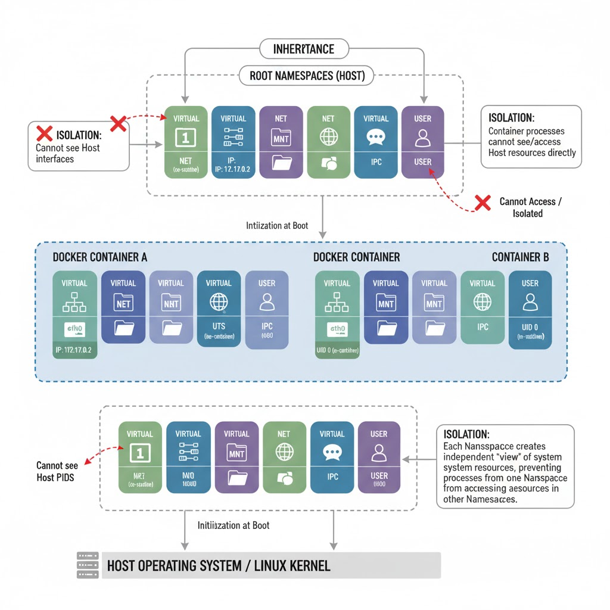
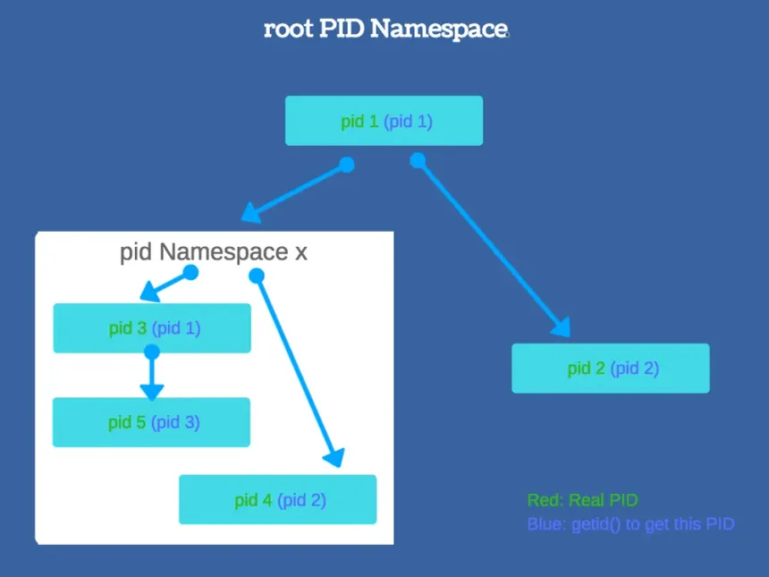

# Docker Core : Namespace, Cgroups và UnionFS.
Docker thực chất là một công nghệ ảo hóa cấp hệ điều hành. Nó tận dụng các tính năng của nhân Linux như Namespace, Cgroups và UnionFS để tạo ra các container nhẹ và hiệu quả. Dưới đây là một cái nhìn tổng quan về cách Docker sử dụng các công nghệ này:
## 1. Namespaces
**Namespaces** là một tính năng của **nhân Linux** cho phép cô lập các tài nguyên hệ thống giữa các tiến trình khác nhau (tức tiến trình A chỉ có thể "nhìn thấy" tài nguyên của tiến trình A mà không thể thấy tài nguyên của tiến trình khác). 

**Namespaces** hoạt động bằng cách nó sẽ tạo ra không gian riêng biệt cho một bộ tài nguyên và một bộ tiến trình riêng biệt, giúp các tiến trình trong một namespace không thể truy cập tài nguyên của tiến trình trong namespace khác.

Khi khởi động máy, Linux kernel sẽ tạo ra một namespace mặc định cho tất cả các tiến trình. Khi một tiến trình được tạo ra, nó sẽ kế thừa namespace của tiến trình cha. Docker sử dụng namespaces để cô lập các container với nhau và với hệ thống chủ.

Có nhiều loại namespaces khác nhau trong Linux, mỗi loại cô lập một loại tài nguyên cụ thể. Dưới đây là một số loại namespaces chính mà Docker sử dụng:
___
### a. PID Namespace
* Mỗi **PID namespace** cung cấp cho các tiến trình bên trong nó một bộ **PIDs** riêng biệt. 
* **PID namespace** có tính kế thừa, nghĩa là một tiến trình trong một PID namespace có thể nhìn thấy các tiến trình trong namespace con của nó nhưng không thể nhìn thấy các tiến trình trong các namespace cha hoặc các tiến trình song song khác.
* Tiến trình đầu tiên trong một PID namespace luôn có PID là 1, tương tự như tiến trình init trong hệ thống Linux. Vậy nên nó có thể "quản lý" các tiến trình con bên trong namespace của nó, và khi tiến trình này kết thúc, tất cả các tiến trình con bên trong namespace cũng sẽ bị kết thúc theo.

___
### b. Network Namespace
- Mỗi **Network namespace** cung cấp một ngăn xếp mạng riêng biệt, bao gồm các giao diện mạng, bảng định tuyến, firewall rules, v.v.
- Ban đầu, mỗi **Network namespace** chỉ chứa một giao diện loopback (lo) và không có kết nối mạng bên ngoài.
- Mỗi card mạng (dù ảo hay vật lý) chỉ thuộc về duy nhất một namespace mạng, tuy nhiên nó có thể thay đổi giữa các namespace khác nhau.
- Khi xóa một **Network namespace**, tất cả các tài nguyên mạng bên trong nó sẽ bị giải phóng và trả về namespace ban đầu.
---
### c. Mount Namespace
- **Mount namespace** quản lý các **mount point** (ví dụ: `/mnt/data` hay `/run/docker`). 
- Khi khởi tạo, các mount point sẽ được sao chép từ namespace gốc sang namespace mới. Sau đó, các thay đổi về mount point trong namespace mới sẽ không ảnh hưởng đến namespace gốc và ngược lại.
- Tuy nhiên, có thể sử dụng cơ chế [`shared subtrees`](https://www.kernel.org/doc/Documentation/filesystems/sharedsubtree.txt) để chia sẻ các mount point giữa các namespace khác nhau nếu cần thiết.
___
### d. UTS Namespace
- **UTS namespace** (Unix Timesharing System) cho phép các tiến trình bên trong nó có thể thiết lập tên máy (hostname) và tên miền (domain name) riêng biệt.
- Mỗi **UTS namespace** có một cặp hostname và domain name riêng, và các tiến trình bên trong namespace chỉ có thể nhìn thấy và thay đổi giá trị này trong phạm vi của namespace đó.
- Khi một tiến trình được tạo ra trong một UTS namespace, nó sẽ kế thừa hostname và domain name từ tiến trình cha.
- Khi ảo hóa, mỗi container sẽ sao chép hostname và domain name từ hệ thống chủ vào UTS namespace của nó. Sau đó, nó sẽ thay đổi hostname và domain name bên trong namespace mà không ảnh hưởng đến hệ thống chủ nhờ cơ chế cô lập của namespace.
___
### e. IPC Namespace
- **IPC namespace** (Inter-Process Communication) cô lập các tài nguyên IPC như semaphores, message queues và shared memory giữa các tiến trình trong các namespace khác nhau.
- Mỗi **IPC namespace** có bộ tài nguyên IPC riêng biệt, và các tiến trình bên trong namespace chỉ có thể truy cập và sử dụng các tài nguyên IPC trong phạm vi của namespace đó.
- Khi một IPC Namespace mới được tạo ra (ví dụ: khi Docker start container), nó bắt đầu với một trạng thái rỗng (Empty). Và các chương trình bên trong namespace chỉ có thể tạo và sử dụng các tài nguyên IPC mới mà không thể truy cập các tài nguyên IPC từ namespace khác.
___
### f. User Namespace
- **User namespace** cho phép ánh xạ các UID (User ID) và GID (Group ID) bên trong namespace sang các UID và GID khác bên ngoài namespace.
- Mỗi **User namespace** có bảng ánh xạ UID và GID riêng biệt, cho phép các tiến trình bên trong namespace có thể chạy với các quyền khác nhau so với bên ngoài namespace.
- Khi một **User namespace** mới được tạo ra, nó khởi đầu với bảng ánh xạ rỗng và cần được cấu hình (bởi Container Runtime) để thiết lập mối quan hệ giữa ID bên trong và bên ngoài.
- Trong ảo hóa (khi kích hoạt tính năng này), container giúp tăng cường bảo mật tối đa: Ngay cả khi hacker chiếm được quyền root trong container, họ vẫn chỉ là người dùng vô hại đối với hệ thống chủ.
___
## 2. Cơ chế giới hạn tài nguyên với Cgroups cho CPU, RAM, I/O.

