# 1. Triển khai Kubernetes
---
##  Yêu cầu:
### Y/c 1:
- Triển khai được Kubernetes thông qua công cụ **Minikube trên 1 node**: **0.5 điểm**  
  **Hoặc**
- Triển khai được Kubernetes thông qua công cụ **kubeadm** hoặc **kubespray** lên:
  - **1 master node VM**
  - **1 worker node VM**  
  👉 **1 điểm**
---
##  Output:
- **Tài liệu cài đặt**:
  - Đã sử dụng công cụ gì?
  - Các file config liên quan

- **Ảnh chụp log** của các lệnh kiểm tra hệ thống như:
  - `kubectl get nodes -o wide`
  - `kubectl get pods -A -o wide`
---
## Tài liệu triển khai:
**Chuẩn bị:** 2 máy ảo có cấu hình như sau: 
* CPU: 2 vCPU

  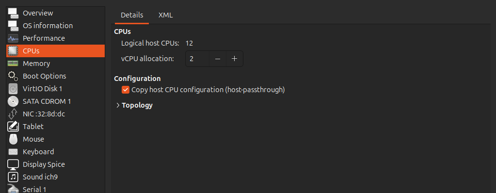

* RAM: 3 GB

  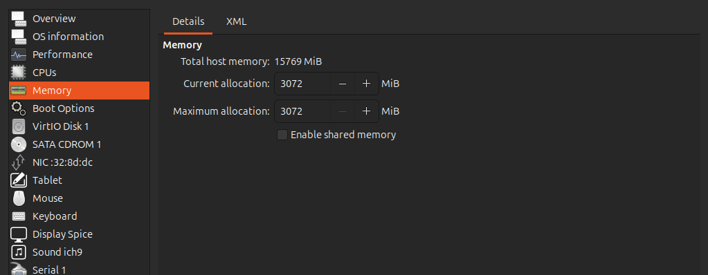

* Memory: 20 GB

  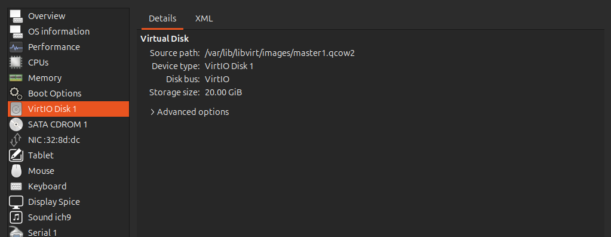

* OS: Ubuntu 22.04 LTS

  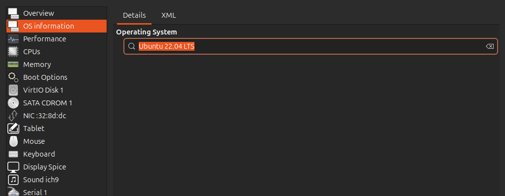

**Tài liệu hướng dẫn cài đặt Kubespray:** [Lab1](https://github.com/nguyenvuong310/Kubenestes-Lab/blob/master/lab1/lab1.md)

**Cấu hình mạng**: 
* Master node: 
  * IP tĩnh: 192.168.123.10
  * Hostname: master1
  * SSH port: 22 (Mặc định)

  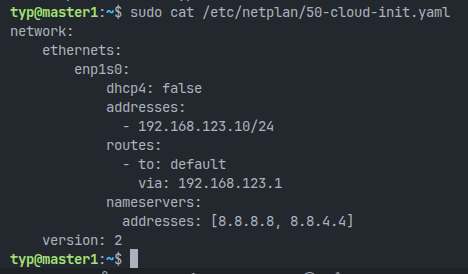
* Worker node:
  * IP tĩnh: 192.168.123.11
  * Hostname: worker1
  * SSH port: 22 (Mặc định)

  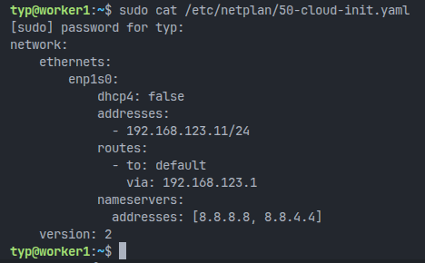

**Bổ xung ssh-key cho 2 VM:** mục đích để tiện kết nối và triển khai tự động.
* Trên master node (Đã bao gồm ssh-key của docker container cùa kubespray): 
  
  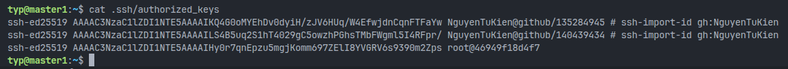

* Trên worker node (Đã bao gồm ssh-key của docker container cùa kubespray):

  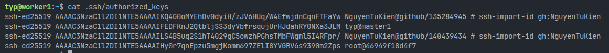

---
## Triển khai Kubernetes thông qua công cụ kubespray lên 1 master node VM + 1 worker node VM
* Clone và run container:
  ```shell
  git clone https://github.com/kubernetes-sigs/kubespray

  cd kubespray

  docker run --rm -it \
  --mount type=bind,source="$(pwd)"/inventory/sample,dst=/inventory \
  --mount type=bind,source="${HOME}"/.ssh/id_rsa,dst=/root/.ssh/id_rsa \
  quay.io/kubespray/kubespray:v2.28.0 bash
  ```
* Viết lại inventory cho kubespray:

  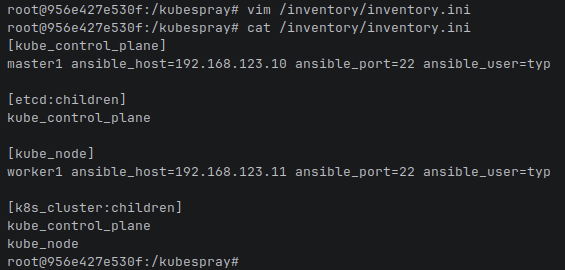

* Thực hiện cài đặt Kubernetes bằng ansible playbook (cần nhập mật khẩu user và root của 2 VM):
  ```shell
  ansible-playbook -i /inventory/inventory.ini cluster.yml --become --ask-pass --ask-become-pass
  ```
---
## Cài đặt kubectl:
* Cài đặt kubectl trên local machine: 
  ```shell
  curl -LO "https://dl.k8s.io/release/$(curl -sL https://dl.k8s.io/release/stable.txt)/bin/linux/amd64/kubectl"

  sudo install -o root -g root -m 0755 kubectl /usr/local/bin/kubectl
  ```
* Config kubectl:
  * Copy kubectl config từ master node về local:
  
    
  * Paste và sửa ip chỏ tới master node:
  
    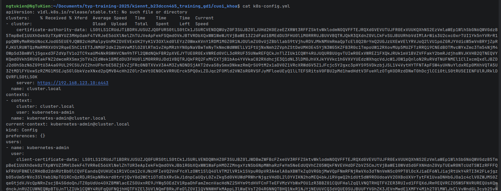
  * Export kubectl config: `export KUBECONFIG=./k8s-config.yml`
---
## Kiểm tra kết quả:
* **Kiểm tra các node trong cluster:**
  ```shell
  kubectl get nodes -o wide
  ```
  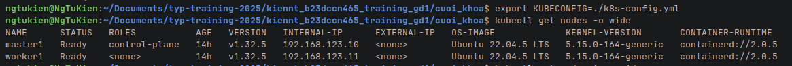
* **Kiểm tra các pod trong cluster:**
  ```shell
  kubectl get pods -A -o wide
  ```
  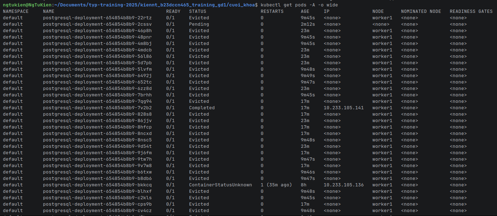


    

    
  
    
    
  


  
  