# 2. Helm Chart (1.5đ)
---
## [Tài liệu triển khai:](kiennt_b23dccn465_training_gd1/cuoi_khoa/0.Source_code)
**Chuẩn bị:** Đã có Kubernetes cluster chạy ổn định (tham khảo phần 1).
* **Ứng dụng được lựa chọn:** WebApp CRUD đơn giản.
  * Service backend: Spring Boot
  * Service frontend: ReactJS
  * Database: MySQL

* **Giao diện WebApp CRUD:**
  
  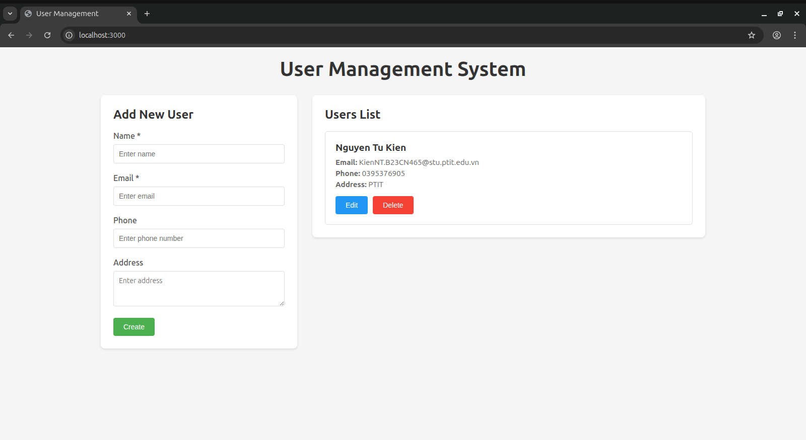
---
## Yêu cầu 1:
* Cài đặt ArgoCD lên Kubernetes cluster, expose được ArgoCD qua NodePort.
* Cài đặt Jenkins lên Kubernetes cluster, expose được Jenkins qua NodePort.

## Output 1:
* File manifest được sử dụng để triển khai ArgoCD lên K8s cluster
* Ảnh chụp giao diện màn hình hệ thống ArgoCD khi truy cập qua trình duyệt.
* File manifest được sử dụng để triển khai Jenkins lên K8s cluster
* Ảnh chụp giao diện màn hình hệ thống Jenkins khi truy cập qua trình duyệt.

---
### Cài đặt ArgoCD lên K8s cluster
* **Thực hiện theo tài liệu:** [Lab7](https://github.com/nguyenvuong310/Kubenestes-Lab/blob/master/lab7/lab7.md)
* Cài đặt ArgoCD:
  ```shell
  kubectl create namespace argocd
  kubectl apply -n argocd -f https://raw.githubusercontent.com/argoproj/argo-cd/stable/manifests/install.yaml
  ```
* Mở port truy cập ArgoCD:
  ```shell
  apiVersion: v1
  kind: Service
  metadata:
    name: argocd-server
    namespace: argocd
    labels:
      app.kubernetes.io/name: argocd-server
      app.kubernetes.io/part-of: argocd
  spec:
    type: NodePort
    ports:
      - port: 80
        targetPort: 8080
        nodePort: 32000
    selector:
      app.kubernetes.io/name: argocd-server
  ```
* Các files manifest ArgoCD Application: [Manifest Files](argocd/setup/)
* Export ArgoCD qua NodePort:
  ```shell
  kubectl patch svc argocd-server -n argocd -p '{"spec": {"type": "NodePort"}}'
  ```
* Truy cập ArgoCD qua trình duyệt: `http://192.168.123.11:32000`

  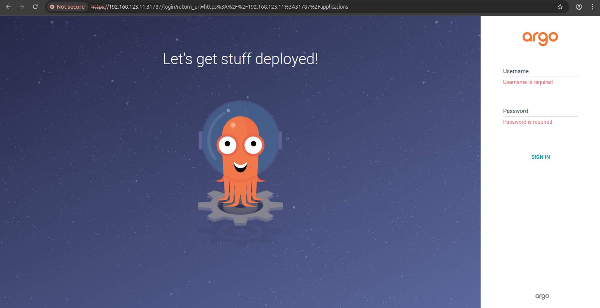

* Login ArgoCD:
  * Username: admin
  * Password: Lấy bằng câu lệnh: `kubectl -n argocd get secret argocd-initial-admin-secret -o jsonpath="{.data.password}" | base64 -d; echo`
* Đăng nhập ArgoCD:
    
  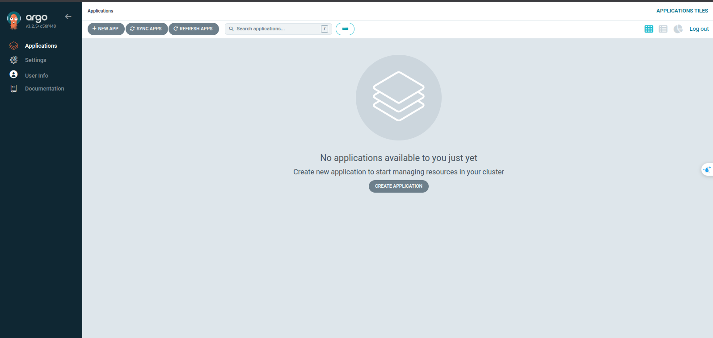
---
### Cài đặt Jenkins
* **Tài liệu hướng dẫn:** [Lab6](https://github.com/nguyenvuong310/Kubenestes-Lab/blob/master/lab6/lab6.md)
* **Các file manifest**: [Manifest Files](jenkins/)
* Cài đặt Jenkins:
  ```shell
  kubectl apply -f jenkins/namespace.yml
  kubectl apply -f jenkins/pv-volume.yml
  kubectl apply -f jenkins/pv-claim.yml
  kubectl apply -f jenkins/deployment.yml
  kubectl apply -f jenkins/service.yml
  ```

* Truy cập Jenkins qua trình duyệt: `http://192.168.123.11:30000`
  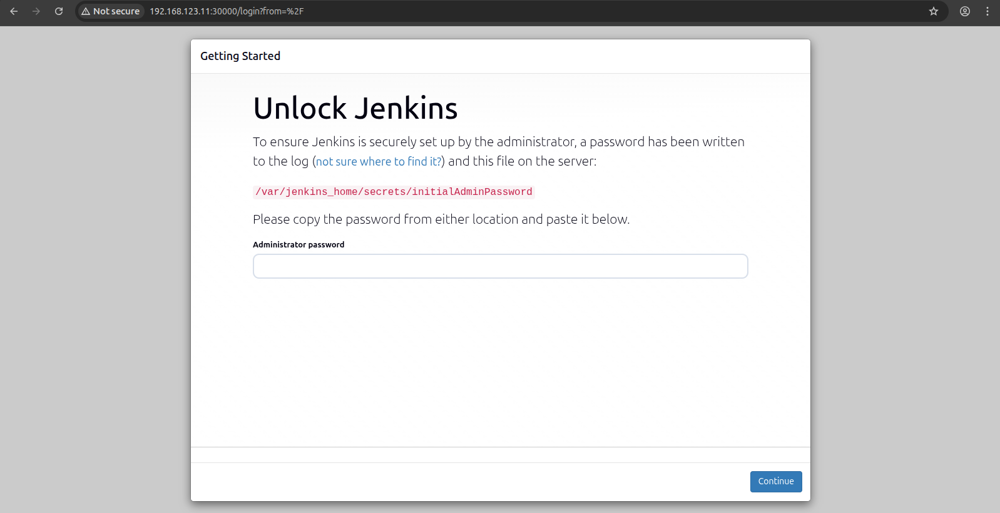

* Lấy passwork Jenkins bằng câu lệnh: 
  ```shell
  kubectl exec -n jenkins jenkins-deployment-6f9c57d55c-zdxhw -- cat /var/jenkins_home/secrets/initialAdminPassword
  ```
  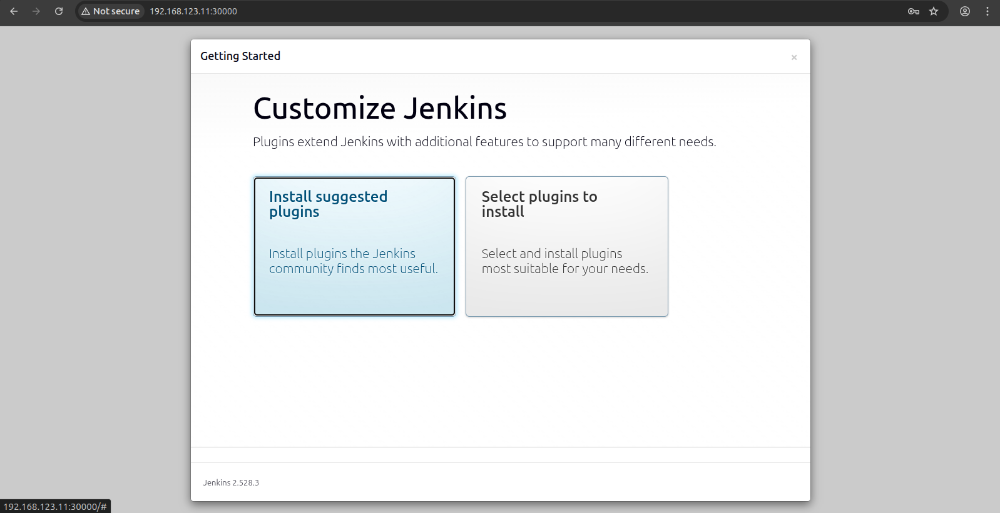
*  Cài đặt các plugin cần thiết:
  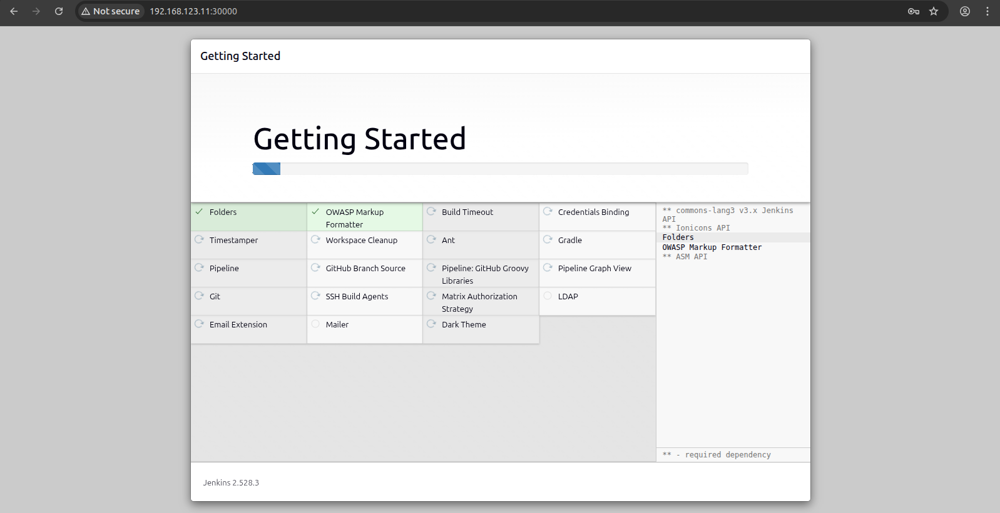
* Tạo user:
  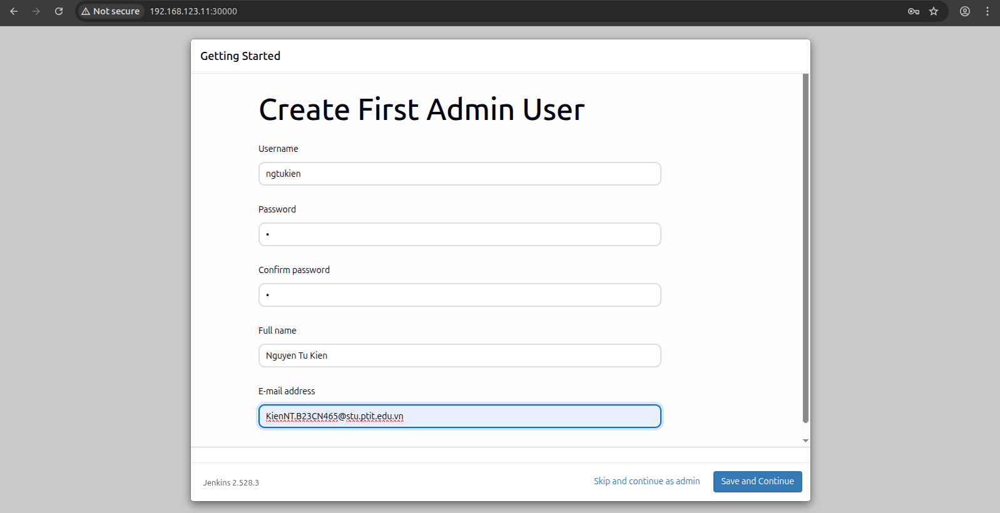
* Giao diện:
  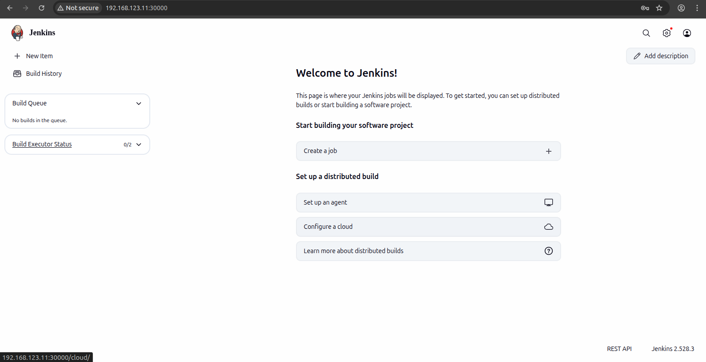

---

## Yêu cầu 2:
* Viết hoặc tìm kiếm mẫu Helm Chart cho app bất kì, để vào 1 folder riêng trong `repo app`.
* Tạo `repo config` cho app trên, trong repo này chứa các file `values.yaml` với nội dung của các file `values.yaml` là các config cần thiết để chạy ứng dụng trên k8s bằng Helm Chart.

## Output 2:
* Các Helm Chart đã sử dụng để triển khai app lên K8s cluster.
* Các file `values.yaml` trong `repo config`.
* Manifest của ArgoCD Application.
* Ảnh chụp giao diện hệ thống ArgoCD trên trình duyệt.
* Ảnh chụp giao diện màn hình trình duyệt khi truy cập vào Web URL, API URL.
---
## Tổng quan Repository
**Project gồm 5 repo:**
| Repo Name | Mô tả | Link |
| --------- | ----- | ---- |
| Typ 2026 Database | Repo chứa các file helm chart và value deployment | [Database](https://gitlab.com/NguyenTuKien/typ_2026_database)|
| Typ 2026 Backend | Repo chứa source code backend (Spring Boot) | [Backend](https://gitlab.com/NguyenTuKien/typ_2026_backend)|
| Typ 2026 Frontend | Repo chứa source code frontend (ReactJS) | [Frontend](https://gitlab.com/NguyenTuKien/typ_2026_frontend)|
| Typ 2026 BE Config | Repo chứa các file helm chart và value deployment | [BE-Config](https://gitlab.com/NguyenTuKien/typ_2026_be_config)|
| Typ 2026 FE Config | Repo chứa các file helm chart và value deployment |  [FE-Config](https://gitlab.com/NguyenTuKien/typ_2026_fe_config)|


**Danh sách các Helm Chart đã sử dụng:**
| Ứng dụng | Vị trí | Link |
| --------- | ----- | ---- |
| Database | database-chart/ | [MySQL Helm Chart](https://gitlab.com/NguyenTuKien/typ_2026_database/-/tree/main/database-chart?ref_type=heads)|
| Backend | backend-chart/ | [Backend Helm Chart](https://gitlab.com/NguyenTuKien/typ_2026_backend/-/tree/main/backend-chart?ref_type=heads)|
| Frontend | frontend-chart/ | [Frontend Helm Chart](https://gitlab.com/NguyenTuKien/typ_2026_frontend/-/tree/main/frontend-chart?ref_type=heads)|

**Thông số triển khai:**

| Service | Replicas | Service Type | Port |
| ------- | -------- | -------------| ---- |
| Database | 1 | NodePort | 30336 |
| Backend | 2 | ClusterIP | 30080 |
| Frontend | 1 | NodePort | 30030 |
---
### Helm Charts
#### Cài đặt Helm:
```shell
curl -fsSL -o get_helm.sh https://raw.githubusercontent.com/helm/helm/main/scripts/get-helm-4
chmod 700 get_helm.sh
./get_helm.sh
```

#### Tạo Helm Chart
***[`values-prod.yaml` cho backend](https://gitlab.com/NguyenTuKien/typ_2026_be_config/-/blob/main/helm-values/values-prod.yml)***
```yaml
backend:
  name: backend
  replicaCount: 2
  image:
    repository: ngtukien218/typ-backend
    tag: "v1.0"
    pullPolicy: IfNotPresent
  service:
    type: ClusterIP
    port: 8080
  env:
    MYSQL_HOST: "typ-database-database"
    CORS_ALLOWED_ORIGINS: "*"

database:
  service:
    port: 3306
  env:
    MYSQL_DATABASE: "typ-database"
    MYSQL_USER: "typ-admin"
    MYSQL_PASSWORD: "password123"
```
***[`values-prod.yaml` cho frontend](https://gitlab.com/NguyenTuKien/typ_2026_fe_config/-/blob/main/helm-values/values-prod.yml)***
```yaml
frontend:
  name: frontend
  replicaCount: 1
  image:
    repository: ngtukien218/typ-frontend
    tag: "v1.0"
    pullPolicy: IfNotPresent
  service:
    type: NodePort
    port: 3000
    nodePort: 30080
  env:
    BACKEND_HOST: "typ-backend-backend"

backend:
  service:
    port: 8080
```
***`values.yaml` cho database***
```yaml
database:
  replicaCount: 1

  image:
    repository: mysql
    tag: "8.0"
    pullPolicy: IfNotPresent

  service:
    type: ClusterIP
    port: 3306

  env:
    MYSQL_ROOT_PASSWORD: "rootpassword123"
    MYSQL_DATABASE: "typ-database"
    MYSQL_USER: "typ-admin"
    MYSQL_PASSWORD: "password123"
```

#### Manifest ArgoCD Application
***Manifest ArgoCD Application Database: [Database Manifest](argocd/deploy/database.yml)***
```yaml
apiVersion: argoproj.io/v1alpha1
kind: Application
metadata:
  name: typ-database
  namespace: argocd
spec:
  project: default
  source:
    repoURL: 'https://gitlab.com/NguyenTuKien/typ_2026_database.git'
    targetRevision: HEAD
    path: 'database-chart'
    helm:
      valueFiles:
      - values.yaml
  destination:
    server: 'https://kubernetes.default.svc'
    namespace: typ-app
  syncPolicy:
    syncOptions:
    - CreateNamespace=true
    automated:
      prune: true
      selfHeal: true
```
***Manifest ArgoCD Application Backend: [Backend Manifest](argocd/deploy/backend.yml)***
```yaml
apiVersion: argoproj.io/v1alpha1
kind: Application
metadata:
  name: typ-backend
  namespace: argocd
spec:
  project: default
  sources:
    - repoURL: 'https://gitlab.com/NguyenTuKien/typ_2026_be_config.git'
      targetRevision: HEAD
      ref: values
    - repoURL: 'https://gitlab.com/NguyenTuKien/typ_2026_backend.git'
      targetRevision: HEAD
      path: 'backend-chart'
      helm:
        valueFiles:
        - $values/helm-values/values-prod.yml
  destination:
    server: 'https://kubernetes.default.svc'
    namespace: typ-app
  syncPolicy:
    syncOptions:
    - CreateNamespace=true
    automated:
      prune: true
      selfHeal: true
```
***Manifest ArgoCD Application Frontend: [Frontend Manifest](argocd/deploy/frontend.yml)***
```yaml
apiVersion: argoproj.io/v1alpha1
kind: Application
metadata:
  name: typ-frontend
  namespace: argocd
spec:
  project: default
  sources:
    - repoURL: 'https://gitlab.com/NguyenTuKien/typ_2026_fe_config.git'
      targetRevision: HEAD
      ref: values
    - repoURL: 'https://gitlab.com/NguyenTuKien/typ_2026_frontend.git'
      targetRevision: HEAD
      path: 'frontend-chart'
      helm:
        valueFiles:
        - $values/helm-values/values-prod.yml
  destination:
    server: 'https://kubernetes.default.svc'
    namespace: typ-app
  syncPolicy:
    syncOptions:
    - CreateNamespace=true
    automated:
      prune: true
      selfHeal: true
```
---
### Ảnh chụp giao diện ArgoCD và Deployment
#### Hình ảnh toàn bộ các Application đã được deploy trên ArgoCD:
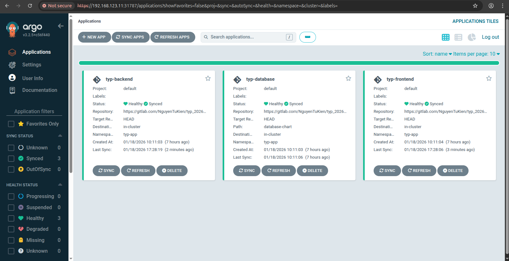
#### Chi tiết Backend Application:
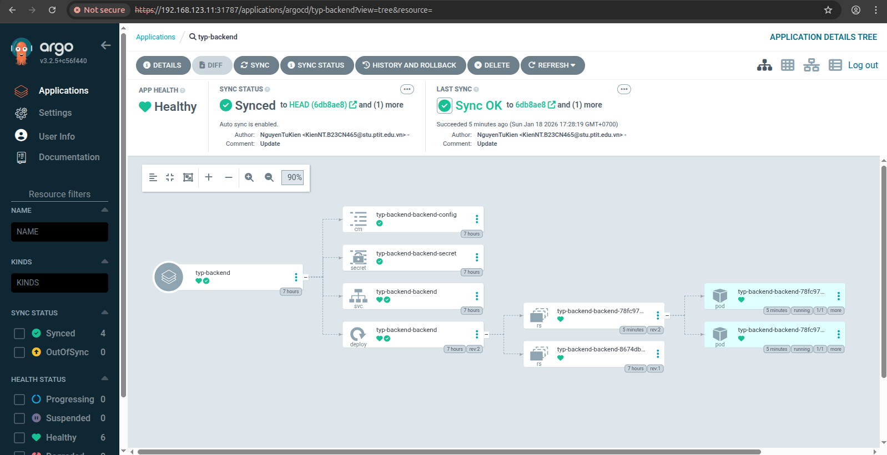
* **Chi tiết Backend Service:**
  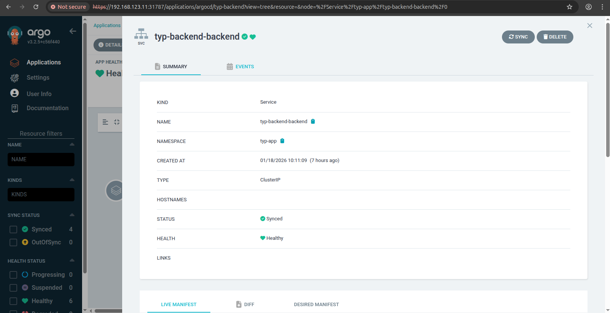
* **Thông tin chi tiết Backend Application**:
  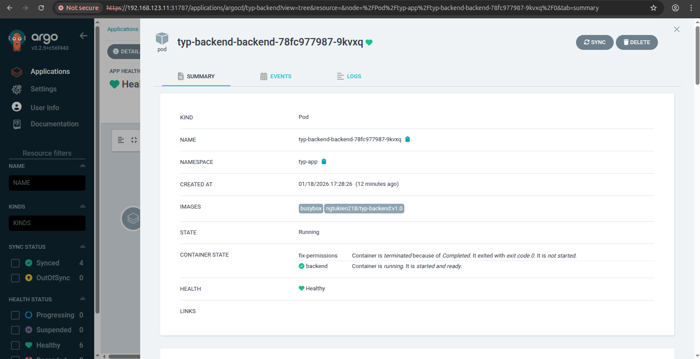
#### Chi tiết Frontend Application:
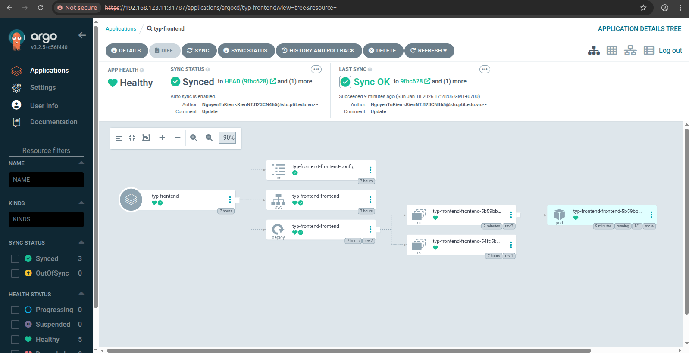
* **Chi tiết Frontend Service:**
  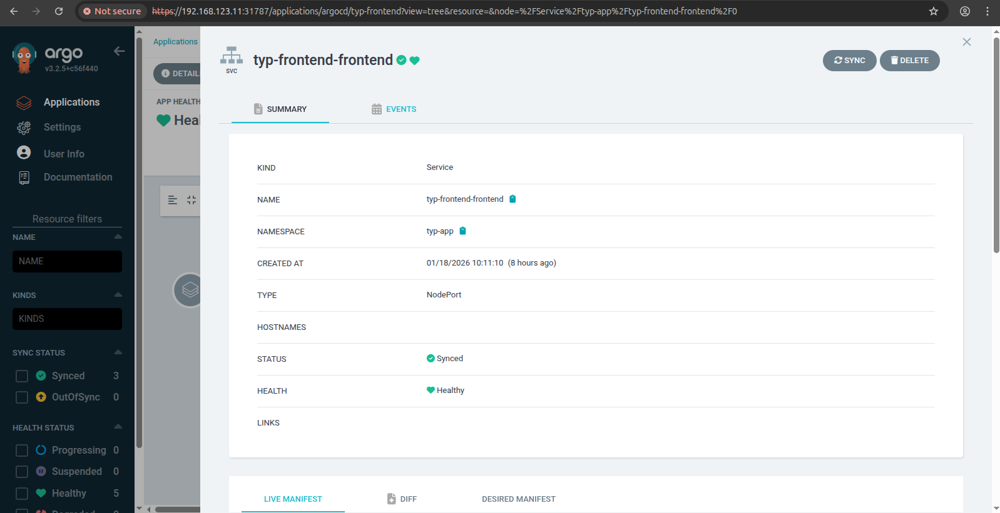
* **Thông tin chi tiết Frontend Application**:
  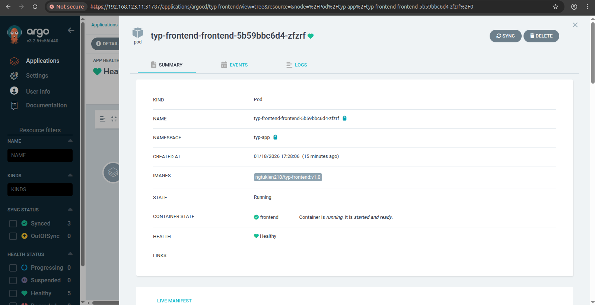
#### Chi tiết Database Application:
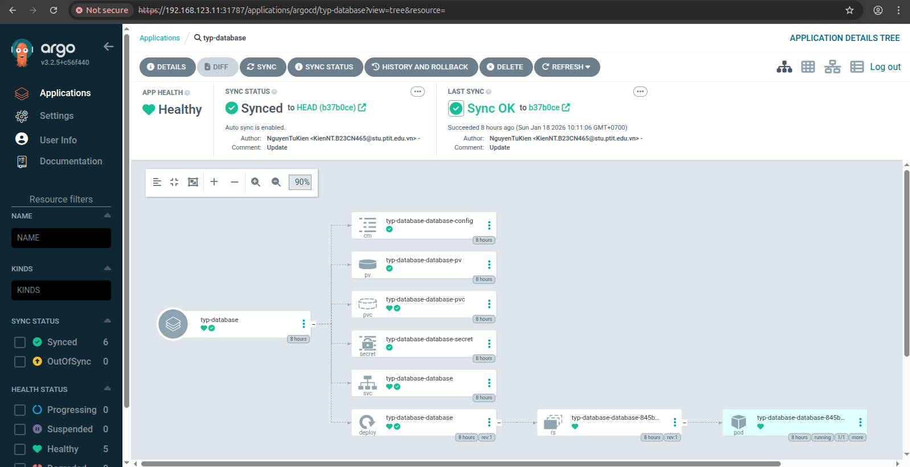
* **Chi tiết Database Service:**
  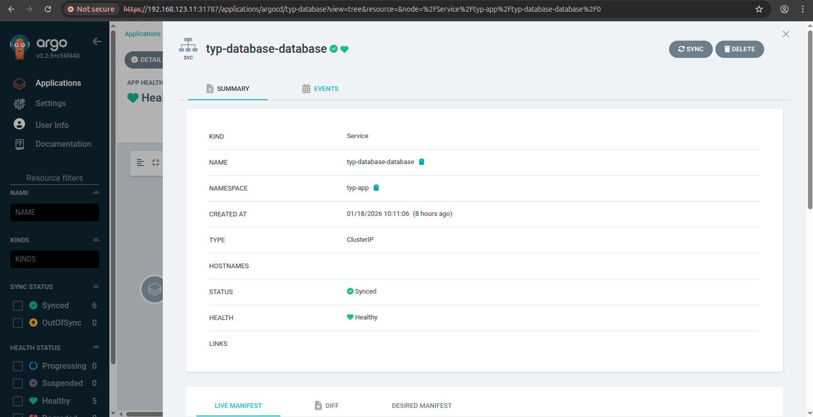
* **Thông tin chi tiết Database Application**:
  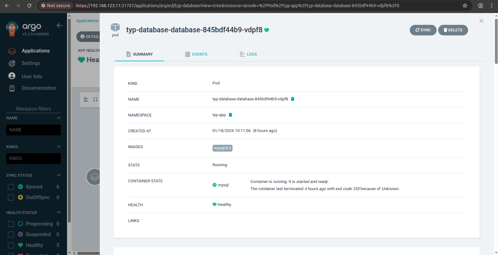


