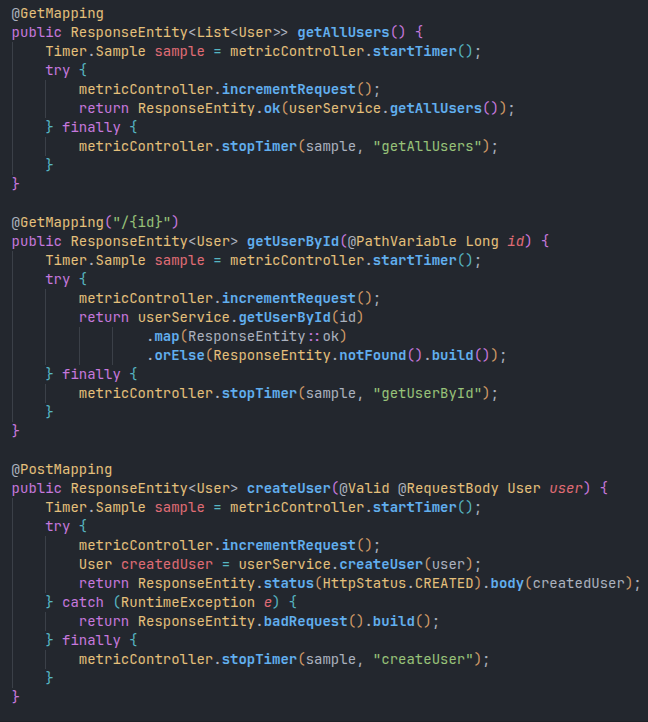
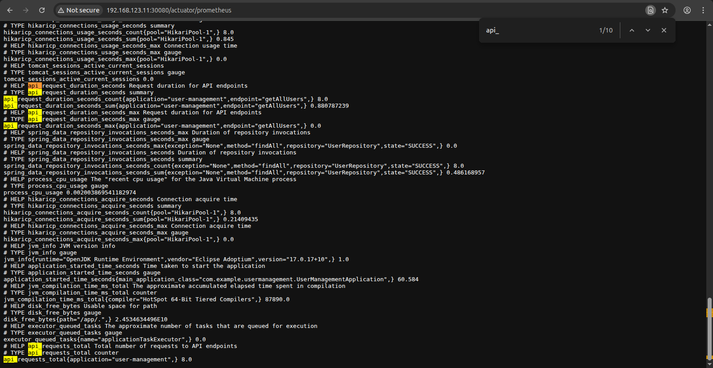
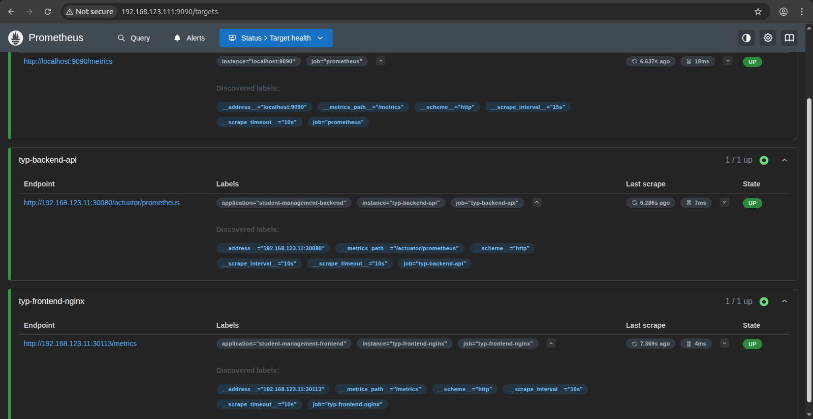
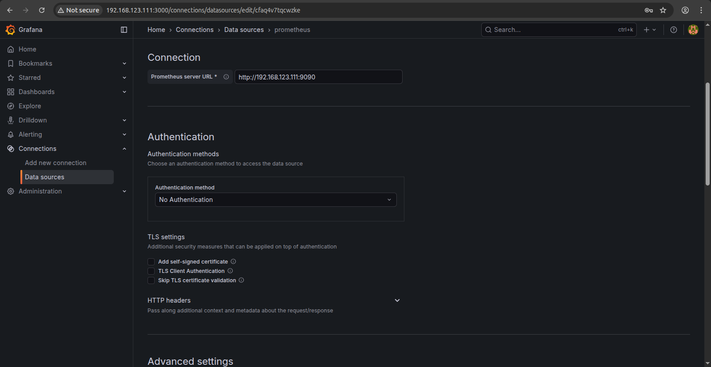
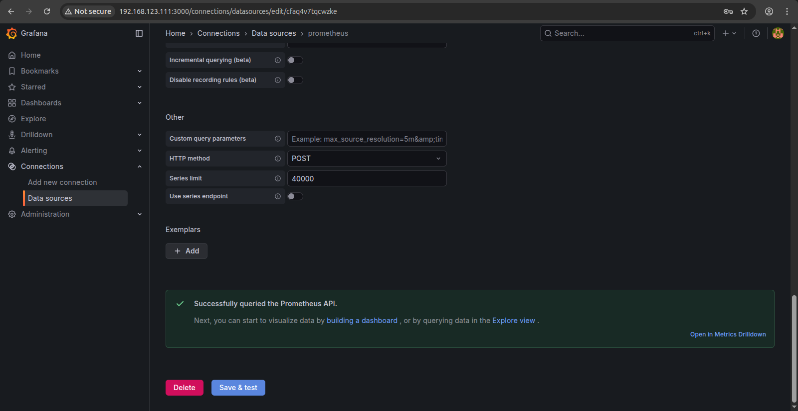
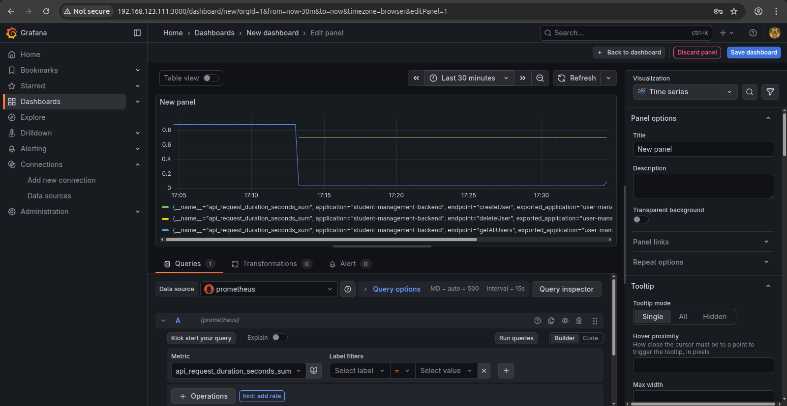
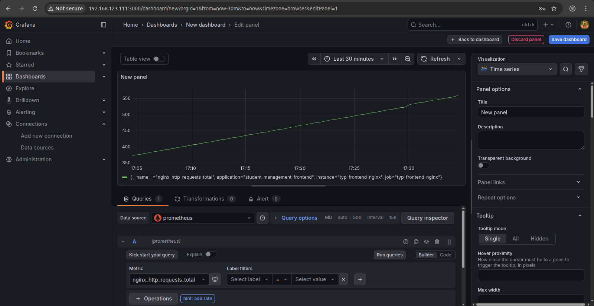

# 4. Monitoring (1.5đ)

## Yêu cầu

- **Expose metric của app ra 1 http path**
  - Tham khảo: [https://github.com/korfuri/django-prometheus](https://github.com/korfuri/django-prometheus)

- **Sử dụng ansible playbooks để triển khai container Prometheus server**
  - Cấu hình prometheus add target giám sát các metrics đã expose ở trên

## Output

- Các file setup để triển khai Prometheus
- Hình ảnh khi truy cập vào Prometheus UI thông qua trình duyệt  
- Hình ảnh danh sách target của App được giám sát bởi Prometheus

---
## Hướng triển khai.
### 1. Cấu hình expose metrics.
* **Backend**: Sử dụng Spring Boot với thư viện Micrometer Registry Prometheus để expose metrics tại endpoint `/actuator/prometheus`.
* **Frontend**: Sử dụng Nginx Reporter để thu thập metrics từ Nginx và expose tại endpoint `/metrics`.
### 2. Triển khai monitoring infrastructure.
* Tạo 1 VM riêng (tận dụng lại `agent1`).
* Sử dụng Ansible playbook để triển khai tự động Prometheus và Grafana.
### 3. Cấu hình dashboard Grafana.
* Thiết lập Grafana để hiển thị biểu đồ cho các metrics.
* Tạo dashboard monitoring cho cả Backend và Frontend.
---
### Cấu hình cho Backend và Frontend
#### Backend (Spring Boot)
* Thêm `dependency` vào file `pom.xml`:
    ```xml
    <dependency>
        <groupId>org.springframework.boot</groupId>
        <artifactId>spring-boot-starter-actuator</artifactId>
    </dependency>

    <dependency>
        <groupId>io.micrometer</groupId>
        <artifactId>micrometer-registry-prometheus</artifactId>
    </dependency>
    ```
* Thêm cấu hình vào file `application.properties`:
    ```properties
    # Actuator exposure
    management.endpoints.web.exposure.include=health,info,prometheus
    management.endpoint.health.show-details=always

    # Prometheus metrics
    management.prometheus.metrics.export.enabled=true

    # Enable common metrics
    management.metrics.enable.jvm=true
    management.metrics.enable.process=true
    management.metrics.enable.system=true
    management.metrics.enable.http=true
    management.metrics.enable.tomcat=true
    ```
* File `MetricController`: [Gitlab](https://gitlab.com/NguyenTuKien/typ_2026_backend/-/blob/main/src/main/java/com/example/demo/controller/MetricController.java).
* Tạo class `MetricController` để expose các metrics tùy chỉnh.
    * `api_request_total`: Counter cho tổng số request.
    * `api_request_duration`: Thời gian xử lý cho cho các endpoint.
**Integrate metrics và endpoint:** Trong mỗi endpoint, thực hiện: 
    * Tăng counter cho tổng số request.
    * Tính toán thời gian xử lý request.

    
#### Frontend (Nginx)
* Cấu hình Nginx Status module trong file `nginx.conf`:
    ```nginx
    server {
        ...

        location /nginx_status {
            stub_status;
            access_log off;
            allow 127.0.0.1;
            allow 10.0.0.0/8;
            allow 172.16.0.0/12;
            allow 192.168.0.0/16;
            deny all;
        }
    }
    ```
* Cấu hình Nginx Exporter Deployment: [Exporter Deployment](https://gitlab.com/NguyenTuKien/typ_2026_frontend/-/blob/main/frontend-chart/templates/04_exporter_deployment.yml).

---
## Kết quả Metrics Exposure
**Backend Metrics:** dữ liệu được expose tại endpoint `/actuator/prometheus`.


**Frontend Metrics:** dữ liệu được expose tại endpoint `/metrics` với port `30113`.


---
## Triển khai Prometheus và Grafana bằng Ansible
### Cấu trúc thư mục Ansible
**Folder chứa playbook Ansible:** [Ansible Playbook](./ansible/)
**Deployment Command:**
```bash
ansible-playbook -i inventory/hosts.ini deployment.yml --ask-become-pass
```
Ansible playbook sẽ triển khai:
* Prometheus server: `http://192.168.123.111:9090`
* Grafana server: `http://192.168.123.111:3000` (default user: `typ-admin`, password: `password123`)
* Cấu hình tự động các targets.
---
## Kết quả triển khai Prometheus và Grafana
### Prometheus UI

### Grafana config


### Dashboard Visualization

