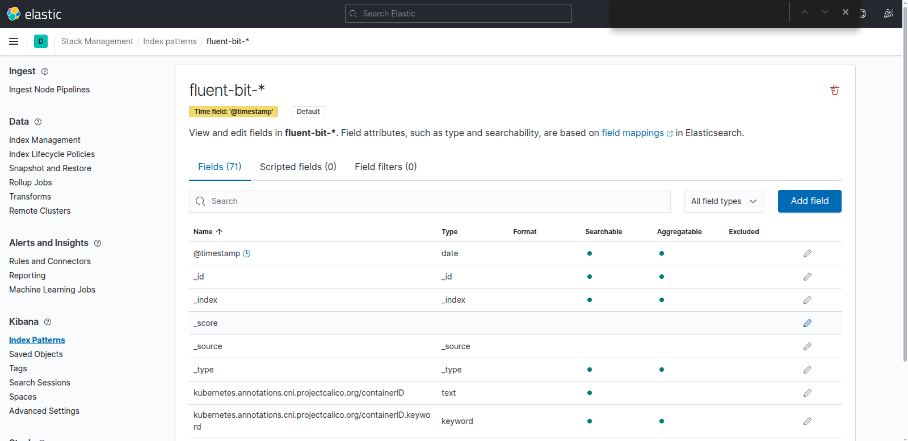
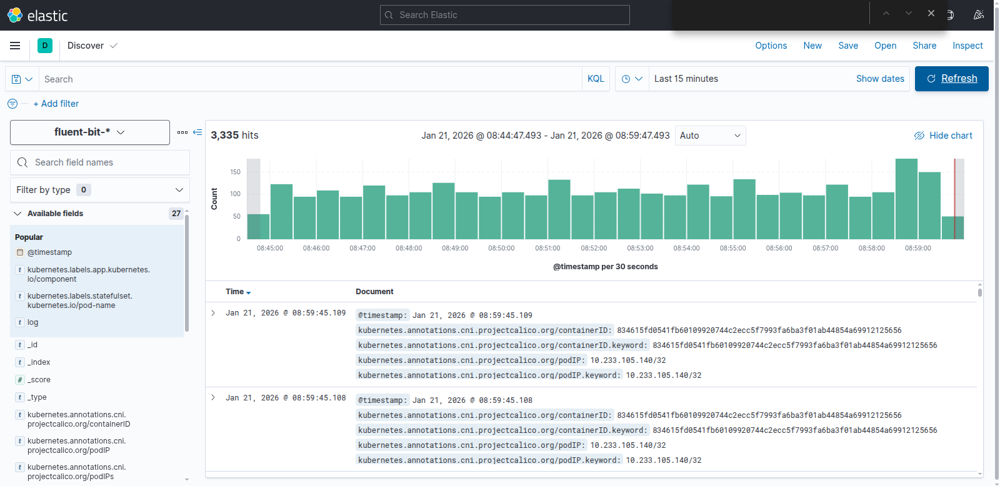
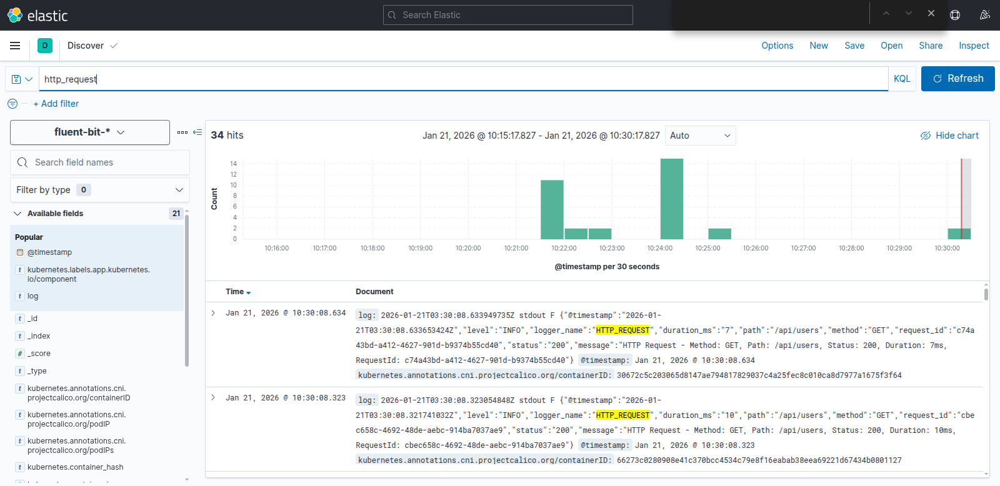
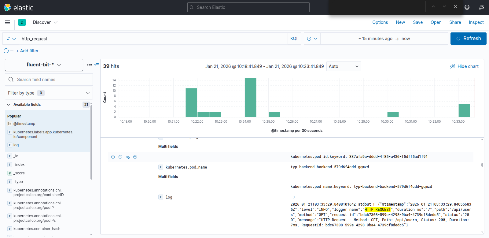
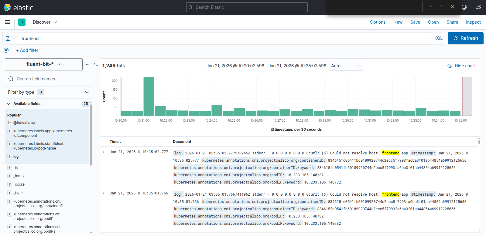
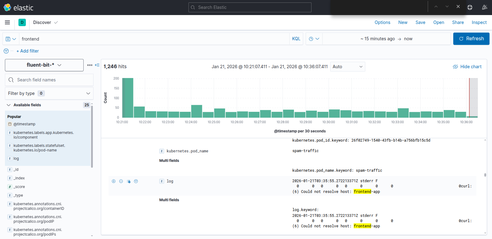

# 5. Logging (1.5đ)

## Yêu cầu
Sử dụng **Ansible Playbooks** để triển khai stack **EFK** (Elasticsearch, Fluentd, Kibana), sau đó cấu hình logging cho **web service** và **api service**, đảm bảo khi có HTTP request gửi vào thì log ghi nhận đầy đủ thông tin sau:

- **Request Path** (VD: `/api1/1`, `/api2/3`, ...)
- **HTTP Method** (GET, POST, PUT, DELETE, ...)
- **Response Code** (200, 201, 202, 302, ...)

---
## Hướng triển khai
* Sử dụng Ansible Playbooks để triển khai stack EFK (Elasticsearch, Kibana) trên 1 VM riêng biệt.
* Cấu hình Fluentd trên trong cụm cluster để chuyển log sang Elasticsearch.
* Cấu hình logging trong ứng dụng web service và api service để ghi log theo định dạng đã yêu cầu.
* Kiểm tra và xác nhận log được ghi nhận đầy đủ trong Kibana.
---
## Cài đặt và cấu hình EFK stack
### Deploy Elastic Search và Kibana
* Cài đặt Elastic Search và Kibana sử dụng Ansible Playbook có sẵn trong thư mục [`ansible/`](./ansible/).
    ```bash
    ansible-playbook -i inventory.ini deployment.yml --ask-become-pass
    ```
    * Elastic Search sẽ chạy trên cổng `9200`
    * Kibana sẽ chạy trên cổng `5601` 
* Cài đặt Fluentd để chuyển log sang Elastic Search sử dụng file cấu hình trong thư mục [`fluent_bit/`](./fluent_bit/).
    ```bash
    kubectl apply -f fluent_bit/
    ```

### Cấu hình Kibana
* Truy cập vào `http://192.168.123.111:5601` để vào giao diện Kibana.
* Vào mục **Stack Management** -> **Index Patterns** -> **Create index pattern**
* Tạo index pattern với tên là `fluentd-*`, chọn trường `@timestamp` làm trường thời gian.
* Lưu lại index pattern.
    
* Vào mục **Discover** để kiểm tra log đã được ghi nhận.
    
---
## Cấu hình logging trong ứng dụng
### Cấu hình Backend
* Bổ xung thêm `dependency` cho `logback-spring-boot-starter` trong file `pom.xml`.
    ```xml
    <dependencies>

        <!-- Other dependencies -->

        <dependency>
            <groupId>net.logstash.logback</groupId>
            <artifactId>logstash-logback-encoder</artifactId>
            <version>7.4</version>
        </dependency>
    </dependencies>
    ```
* Cấu hình định dạng log trong file `application.properties`.
    ```properties
    # Other configurations

    # Logging Configuration
    logging.pattern.console=%d{yyyy-MM-dd HH:mm:ss.SSS} [%thread] %-5level [%X{requestId}] %logger{36} - %msg%n
    logging.level.com.example.demo=INFO
    logging.level.HTTP_REQUEST=INFO
    logging.level.org.springframework.web=INFO

    # Tomcat Access Log Configuration
    server.tomcat.basedir=.
    server.tomcat.accesslog.enabled=true
    server.tomcat.accesslog.pattern=%t %a "%r" %s (%D ms)
    server.tomcat.accesslog.directory=logs
    server.tomcat.accesslog.prefix=access_log
    server.tomcat.accesslog.suffix=.txt
    ```
* Tạo [RequestLoggingFilter.java](../0.Source_code/typ_2026_backend/src/main/java/com/example/demo/filter/RequestLoggingFilter.java) để ghi log cho các HTTP request.
* Tạo [logback-spring.xml](../0.Source_code/typ_2026_backend/src/main/resources/logback-spring.xml) để cấu hình log định dạng JSON.
    ```xml
    <?xml version="1.0" encoding="UTF-8"?>
    <configuration>
        <include resource="org/springframework/boot/logging/logback/defaults.xml"/>
        <appender name="STDOUT" class="ch.qos.logback.core.ConsoleAppender">
            <encoder class="net.logstash.logback.encoder.LoggingEventCompositeJsonEncoder">
                <providers>
                    <timestamp/>
                    <logLevel/>
                    <loggerName/>
                    <mdc/>
                    <message/>
                    <arguments/>
                </providers>
            </encoder>
        </appender>
        <appender name="CONSOLE" class="ch.qos.logback.core.ConsoleAppender">
            <encoder>
                <pattern>%d{yyyy-MM-dd HH:mm:ss.SSS} [%thread] %-5level %logger{36} - %msg%n</pattern>
            </encoder>
        </appender>
        <logger name="HTTP_REQUEST" level="INFO" additivity="false">
            <appender-ref ref="STDOUT"/>
        </logger>
        <logger name="com.example.demo" level="INFO" additivity="false">
            <appender-ref ref="STDOUT"/>
        </logger>
        <root level="INFO">
            <appender-ref ref="CONSOLE"/>
        </root>
    </configuration>
    ```
### Cấu hình Frontend
Thực hiện cấu hình tại [01.configMap.yml](../0.Source_code/typ_2026_frontend/frontend-chart/templates/01_configmap.yml) để ghi log các HTTP request từ frontend.
```yaml
apiVersion: v1
kind: ConfigMap

# Một số phần khác của ConfigMap

data:
  default.conf: |
    log_format json_analytics escape=json
    '{'
        '"timestamp":"$time_iso8601",'
        '"request_path":"$uri",'              
        '"http_method":"$request_method",'    
        '"response_code":$status,'            
        '"remote_addr":"$remote_addr",'
        '"query_string":"$query_string",'
        '"body_bytes_sent":$body_bytes_sent,"
        '"request_time":$request_time,'       
        '"http_referer":"$http_referer",'
        '"http_user_agent":"$http_user_agent",'
        '"upstream_response_time":"$upstream_response_time"'
    '}';

    server {
        # Các cấu hình khác của server
    }
```
--- 
## Kiểm tra kết quả
Các log được tạo bởi API service, Web service đã có đầy đủ 3 thành phần quan trọng:
* Request Path
* HTTP Method 
* Response Code

Ngoài ra còn có log được tạo bởi k8s cluster.

### Log khi truy cập API backend



### Log khi truy cập Web frontend



### Log hệ thống từ k8s cluster


