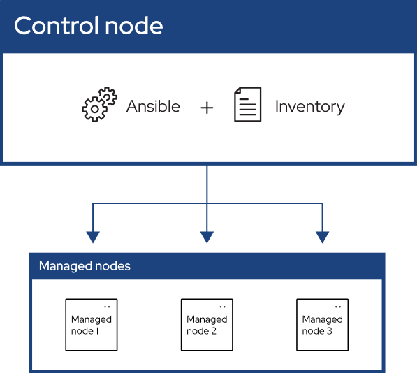
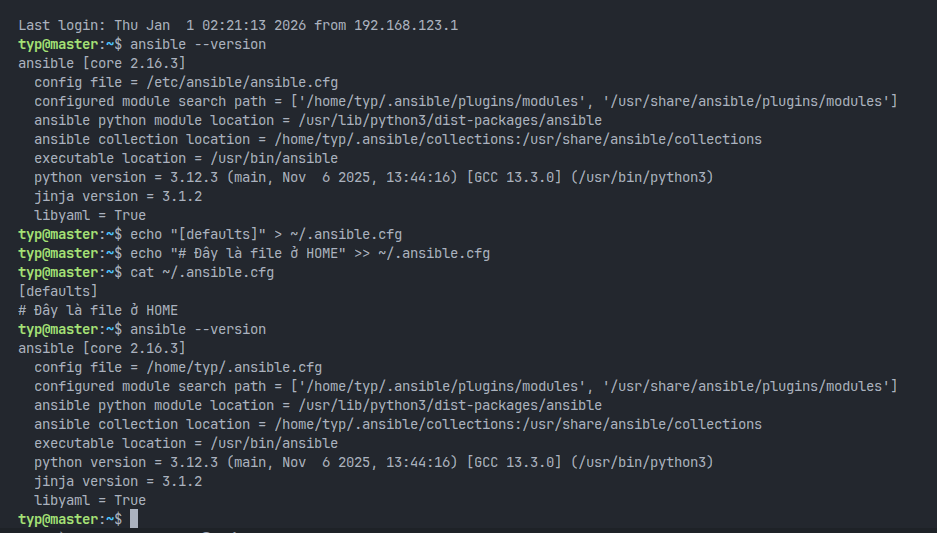
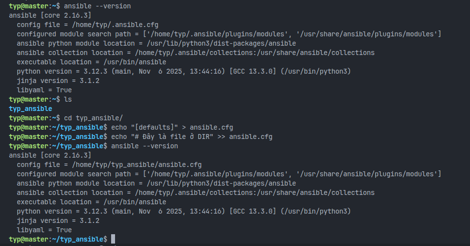
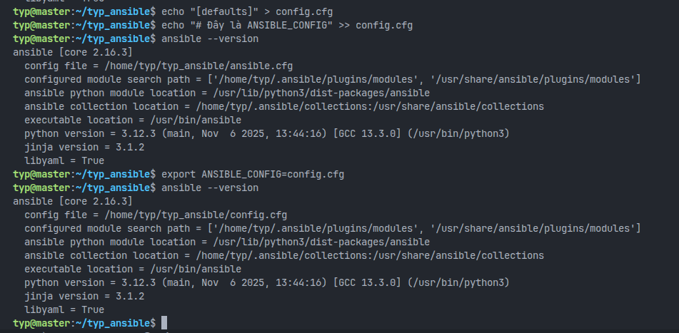

# 1. Ansible là gì?
* Ansible là một công cụ tự động hóa mã nguồn mở được sử dụng để quản lý cấu hình, triển khai ứng dụng và từ động hóa.
* Ansible được thiết kế theo một số nguyên tắc:
  * Agent-less architect: Ansible không yêu cầu cài đặt bất kỳ phần mềm nào trên các nút được quản lý. Nó sử dụng SSH để giao tiếp với các hệ thống từ xa.
  * Simplicity: Ansible sử dụng cú pháp đơn giản và dễ đọc, thường được viết bằng YAML trong các tệp gọi là **playbook**.
  * Scalability and flexibility: Ansible có thể mở rộng để quản lý từ vài hệ thống đến hàng ngàn hệ thống.
  * Idempotence and predictability: Ansible đảm bảo rằng các tác vụ có thể được chạy nhiều lần mà không gây ra các thay đổi không mong muốn.



* Ansible gồm 3 thành phần:
  * Control node: Một hệ thống được cài đặt Ansible. Bạn chạy các lệnh Ansible như ansible hoặc ansible-inventory trên nút điều khiển.
  * Inventory: Danh sách các nút được quản lý.
  * Managed node: Các hệ thống từ xa được quản lý bởi Ansible.
-----
# 2. Cài đặt Ansible trên Control Node (Ubuntu 24.04)
- Có một số cách để cài đặt Assible, trong đó có 2 cách phổ biến nhất:
  * Cài đặt qua apt (dành cho Ubuntu/Debian).
  * Cài đặt qua pip (Python package manager).
  * Cài đặt qua repo chính thức của Ansible.
## Bước 1: Cập nhật hệ thống
```bash
sudo apt update
sudo apt upgrade -y
```
## Bước 2: Cài đặt Ansible (sử dụng apt)
```bash
sudo apt install ansible -y
```
## Bước 3: Kiểm tra cài đặt
```bash
typ@master:~$ ansible --version
ansible [core 2.16.3]
  config file = None
  configured module search path = ['/home/typ/.ansible/plugins/modules', '/usr/share/ansible/plugins/modules']
  ansible python module location = /usr/lib/python3/dist-packages/ansible
  ansible collection location = /home/typ/.ansible/collections:/usr/share/ansible/collections
  executable location = /usr/bin/ansible
  python version = 3.12.3 (main, Nov  6 2025, 13:44:16) [GCC 13.3.0] (/usr/bin/python3)
  jinja version = 3.1.2
  libyaml = True
```
-----
# 3. Ansible Config (Ansile.cfg)
## 3.1. Ansible.cfg là gì?
* `ansible.cfg` là tập tin cấu hình chính của Ansible, nơi có thể định nghĩa các thiết lập và tùy chọn để điều chỉnh hành vi của Ansible khi nó chạy.
* Mục đích chính của `ansible.cfg` bao gồm:
  * **Tổ chức Inventory:** Tập tin cấu hình cần thiết để tham chiếu đến inventory (danh sách các host), giúp tổ chức các máy chủ được quản lý (managed hosts).
  * **Thiết lập kết nối:** Nó định nghĩa cách thức kết nối đến các host trong inventory. Đối với hệ thống Linux, kết nối được thực hiện qua giao thức SSH.
  * **Xác định User:** Cấu hình quy định user nào sẽ được sử dụng để kết nối (ví dụ: user `DevOps`).
  * *Lưu ý:* Để tự động hóa hiệu quả, user này cần được tạo trước trên các managed hosts và đã được cài đặt SSH Public Key (trong khi Private Key nằm trên Ansible controller).
## 3.2. Các mức độ ưu tiên của tập tin cấu hình
Ansible có nhiều nguồn cấu hình khác nhau và chúng tuân theo một thứ tự ưu tiên (precedence) cụ thể, từ yếu nhất đến mạnh nhất. Ansible sẽ gộp (merge) các cài đặt lại, và nếu có xung đột, nguồn có độ ưu tiên cao hơn sẽ ghi đè nguồn thấp hơn.

Thứ tự ưu tiên như sau:

1. **`/etc/ansible/ansible.cfg` (Yếu nhất):** Đây là nơi chứa các thiết lập mặc định toàn cục cho hệ thống. Người dùng thông thường không cần quyền root để chạy Ansible, nên file này thường chỉ để tham khảo các giá trị mặc định.



2. **`~/.ansible.cfg` (Thư mục Home):** Đây là file ẩn nằm trong thư mục Home của user. Nó chứa các cấu hình riêng cho user đó và sẽ ghi đè các thiết lập toàn cục.



3. **`./ansible.cfg` (Thư mục hiện tại):** Nằm ngay trong thư mục dự án bạn đang đứng. Đây là cấu hình đặc thù cho dự án (project-specific) và sẽ ghi đè hai loại trên.



4. **Biến môi trường `ANSIBLE_CONFIG` (Mạnh nhất):** Đây là thẩm quyền cao nhất. Nếu bạn định nghĩa biến môi trường này trỏ đến một file bất kỳ, Ansible sẽ sử dụng file đó và bỏ qua các nguồn khác.

## 3.3. Các lệnh kiểm tra và xác minh

* **Kiểm tra file cấu hình đang dùng:** Sử dụng lệnh `ansible --version`. Kết quả trả về sẽ hiển thị dòng "config file", cho biết chính xác file nào đang được Ansible sử dụng dựa trên thư mục bạn đang đứng.
* **Xem toàn bộ cấu hình hiện tại:** Sử dụng lệnh `ansible-config dump`. Lệnh này sẽ in ra tất cả các thiết lập đang có hiệu lực sau khi đã gộp và xử lý ưu tiên từ các nguồn khác nhau.
* **Tạo file cấu hình mẫu:** Bạn có thể tạo một file chứa các thiết lập mặc định (đã bị comment) để tham khảo bằng cách chạy lệnh sinh file mẫu (ví dụ: `ansible-config init --disabled > default-ansible.cfg`).

## 3.4. Tạo file cấu hình ansible.cfg cơ bản
### 3.4.1. Nhóm `[defaults]` (Cấu hình chung)
Đây là nhóm quan trọng nhất, quy định các hành vi mặc định của Ansible.

| Từ khóa | Ý nghĩa & Tác dụng | Ví dụ / Mặc định |
| --- | --- | --- |
| **`inventory`** | Đường dẫn đến file hoặc thư mục chứa danh sách host. | `./inventory` hoặc `/etc/ansible/hosts` |
| **`remote_user`** | User mặc định dùng để SSH vào máy đích. | `root` hoặc `ubuntu` |
| **`private_key_file`** | Đường dẫn đến file SSH private key (nếu bạn không dùng ssh-agent). | `~/.ssh/id_rsa` |
| **`host_key_checking`** | Kiểm tra SSH key fingerprint. Đặt `False` để tránh lỗi khi kết nối server mới lần đầu. | `False` (Rất hay dùng) |
| **`forks`** | Số lượng host được xử lý song song cùng lúc. Tăng lên giúp chạy nhanh hơn nếu máy mạnh. | `5` (Mặc định). Có thể tăng lên `20` hoặc `50`. |
| **`roles_path`** | Đường dẫn nơi Ansible tìm kiếm các Roles. | `./roles` |
| **`log_path`** | Đường dẫn file log để lưu lại lịch sử chạy lệnh (mặc định Ansible không lưu log). | `./ansible.log` |
| **`interpreter_python`** | Chỉ định phiên bản Python trên máy đích. Đặt `auto_silent` để nó tự tìm và tắt cảnh báo. | `auto_silent` |
| **`timeout`** | Thời gian chờ (giây) khi cố kết nối SSH trước khi báo lỗi. | `10` (Mặc định) |

### 3.4.2. Nhóm `[privilege_escalation]` (Cấu hình leo quyền/Sudo)

Nhóm này quản lý việc chuyển đổi quyền hạn (tương tự lệnh `sudo`).

| Từ khóa | Ý nghĩa & Tác dụng | Ví dụ |
| --- | --- | --- |
| **`become`** | Kích hoạt leo quyền (tương đương gõ sudo trước câu lệnh). | `True` hoặc `False` |
| **`become_method`** | Phương thức leo quyền. | `sudo` (phổ biến nhất), `su`, `pbrun` |
| **`become_user`** | User bạn muốn trở thành sau khi leo quyền. | `root` (Mặc định) |
| **`become_ask_pass`** | Có hỏi mật khẩu khi sudo không? Nếu server cấu hình NOPASSWD thì để False. | `False` |

### 3.4.3. Nhóm `[ssh_connection]` (Tối ưu kết nối)

Nhóm này dành cho người dùng nâng cao muốn tối ưu tốc độ và sự ổn định của kết nối SSH.

| Từ khóa | Ý nghĩa & Tác dụng | Ví dụ |
| --- | --- | --- |
| **`pipelining`** | Giảm số lượng kết nối SSH cần thiết để thực thi module. Giúp Ansible chạy **nhanh hơn rất nhiều**. | `True` (Nên bật nếu không dùng `requiretty` trong sudoers) |
| **`ssh_args`** | Các tham số truyền thêm vào lệnh SSH. Thường dùng để giữ kết nối sống (KeepAlive). | `-o ControlMaster=auto -o ControlPersist=60s` |
| **`retries`** | Số lần thử lại nếu kết nối SSH thất bại. | `3` |

# 4. Invectory trong Ansible
### 4.1. Tổng quan về Inventory
* **Inventory** là một thành phần quan trọng trong Ansible, nó là nơi lưu trữ danh sách các máy chủ (hosts) mà Ansible sẽ quản lý và thực thi các tác vụ trên đó.
* Inventory có thể được định nghĩa dưới dạng:
  * **File tĩnh (Static Inventory):** Là các file văn bản (thường là định dạng INI hoặc YAML) chứa danh sách các host và nhóm host.
  * **File động (Dynamic Inventory):** Là các script hoặc chương trình tạo ra danh sách host một cách tự động từ các nguồn bên ngoài như dịch vụ đám mây (AWS, GCP, Azure).
* Inventory giúp tổ chức các máy chủ thành các nhóm (groups) để dễ dàng quản lý và thực thi các tác vụ trên các nhóm máy chủ cụ thể.
### 4.2. Cấu hình đường dẫn Inventory

Trong file cấu hình `ansible.cfg`:

* Chỉ thị `inventory` có thể trỏ đến một **thư mục** (ví dụ: `./my_inventory`) thay vì một file đơn lẻ.
* Khi trỏ vào thư mục, Ansible sẽ tự động xử lý và gộp tất cả các file nằm trong thư mục đó để tạo thành inventory hoàn chỉnh.

### 4.3. Cách viết file Inventory

#### 4.3.1. Quản lý Nhóm (Groups)

Ansible cho phép gom các máy chủ vào các nhóm để dễ quản lý.
* **Nhóm mặc định:**
  * `all`: Chứa tất cả các host.
  * `ungrouped`: Chứa các host không thuộc nhóm nào (trừ nhóm `all`).
* **Một host thuộc nhiều nhóm:** Bạn có thể phân loại host theo tiêu chí:
  * **What (Cái gì):** Ứng dụng, Database, Web...
  * **Where (Ở đâu):** Region (East, West), Datacenter...
  * **When (Khi nào):** Môi trường (Prod, Test, Dev).
* **Nhóm lồng nhau (Parent/Child Groups):** Tạo nhóm cha chứa các nhóm con.
  * *INI:* Dùng hậu tố `:children`.
  * *YAML:* Dùng mục `children:`.
  * *Lợi ích:* Giúp quản lý biến chung cho cả một tập hợp lớn (ví dụ: nhóm `prod` chứa `east` và `west`).

#### 4.3.2. Khai báo Host hàng loạt (Ranges)
Nếu tên host tuân theo quy tắc số hoặc chữ cái, bạn có thể khai báo theo dải thay vì liệt kê từng cái.
* Ví dụ: `www[01:50].example.com` (từ www01 đến www50).
* Có thể quy định bước nhảy (stride): `www[01:50:2]` (chỉ lấy số lẻ: 01, 03, 05...).

#### 4.3.3. Nguồn Inventory (Inventory Sources)
* **Nhiều nguồn:** Bạn có thể dùng nhiều file inventory cùng lúc bằng cách dùng tham số `-i` nhiều lần hoặc trỏ vào một thư mục chứa nhiều file.
* **Thứ tự load:** Ansible load file theo thứ tự bảng chữ cái. File load sau có thể ghi đè thông tin của file trước.

#### 4.3.4. Biến trong Inventory (Inventory Variables)
Có thể gán biến (variables) cho từng host hoặc cả nhóm.
* **Host Variables:** Gán riêng cho 1 máy.
  * *INI:* Viết cùng dòng với host (`host1 http_port=80`).
  * *YAML:* Khai báo dưới mục host đó.

* **Group Variables:** Gán cho cả nhóm (tất cả máy trong nhóm đều nhận biến này).
  * *INI:* Dùng section `[ten_nhom:vars]`.
  * *YAML:* Dùng mục `vars:`.


* **Tổ chức biến (Khuyên dùng):** Thay vì viết hết vào file inventory, nên tách ra thư mục riêng:
  * `/etc/ansible/host_vars/`: Chứa file biến cho từng host.
  * `/etc/ansible/group_vars/`: Chứa file biến cho từng nhóm.


* **Thứ tự ưu tiên (Precedence):** Biến cụ thể sẽ ghi đè biến chung.
* Thấp nhất: Nhóm `all` -> Nhóm cha -> Nhóm con -> Cao nhất: Host.

#### 4.3.5. Các tham số kết nối (Behavioral Inventory Parameters)
Đây là các biến đặc biệt để điều khiển cách Ansible kết nối SSH tới máy đích:
**Kết nối chung:**
  * `ansible_host`: IP hoặc Hostname thực tế để kết nối (nếu khác với tên alias trong inventory).
  * `ansible_port`: Cổng SSH (mặc định 22).
  * `ansible_user`: Username để đăng nhập SSH.
  * `ansible_password`: Mật khẩu đăng nhập (Khuyên dùng Ansible Vault để bảo mật, không nên lưu text rõ).
**Kết nối SSH:**
  * `ansible_ssh_private_key_file`: Đường dẫn tới file private key (nếu không dùng ssh-agent).
  * `ansible_connection`: Loại kết nối (mặc định là `ssh`, có thể là `local`, `winrm`...).
**Leo thang đặc quyền (Privilege Escalation - Sudo):**
  * `ansible_become`: Đặt là `yes` để bật chế độ sudo.
  * `ansible_become_user`: User muốn trở thành (thường là `root`).
  * `ansible_become_password`: Mật khẩu sudo.
**Môi trường Python:**
  * `ansible_python_interpreter`: Đường dẫn tới Python trên máy đích (Hữu ích nếu máy đích cài Python ở vị trí lạ hoặc dùng Python 2/3 lẫn lộn).

#### 4.3.6. Các ví dụ tổ chức Inventory (Inventory Setup Examples)
* **Theo môi trường:** Tạo file riêng cho mỗi môi trường (`inventory_test`, `inventory_staging`, `inventory_prod`) để tránh chạy nhầm lệnh lên Production.
* **Theo chức năng:** Gom nhóm dbserver, appserver để chạy các task cài đặt firewall hoặc phần mềm đặc thù.
* **Theo vị trí:** Gom nhóm theo Datacenter (DC1, DC2) để xử lý các vấn đề hạ tầng cục bộ.

### 4.4. Cách kiểm tra Inventory
* **`ansible-inventory --graph`** (Khuyên dùng):
  * Hiển thị cấu trúc dạng cây (tree layout).
  * Dễ đọc, trực quan.
  * Các nhóm sẽ có tiền tố `@` (ví dụ: `@all`, `@webservers`).
  * Hiển thị rõ nhóm mặc định `all` và `ungrouped`.
* **`ansible-inventory --list`**:
  * Hiển thị dữ liệu dạng **JSON**.
  * Chứa đầy đủ thông tin chi tiết nhưng khó đọc hơn đối với con người.
-----
# 5. Ad-Hoc commands trong Ansible.
## 5.1. Giới thiệu về Ad-hoc Commands
**Ad-hoc command** là các lệnh chạy nhanh, thực hiện **một nhiệm vụ duy nhất** trên một hoặc nhiều máy chủ.
* **Đặc điểm:** Nhanh, dễ dùng, nhưng không lưu lại để tái sử dụng (khác với Playbook).
* **Khi nào dùng:** Cho các việc hiếm khi lặp lại (ví dụ: tắt toàn bộ máy trong phòng Lab để nghỉ lễ, check nhanh thông tin hệ thống).
* **Cấu trúc lệnh:**
```bash
ansible [nhóm_máy] -m [tên_module] -a "[tham_số]"
```
## 5.2. Các trường hợp sử dụng phổ biến
**Ad-hoc** cũng hoạt động dựa trên mô hình **khai báo (declarative)** và **tính bất biến (idempotence)**: Nó kiểm tra trạng thái hiện tại, nếu máy đích đã ở đúng trạng thái mong muốn rồi thì nó sẽ không làm gì cả.
### 5.2.1. Khởi động lại Server (Reboot)
Module mặc định của Ansible là `command` (không cần gõ `-m command`).
* **Reboot toàn bộ nhóm [chatbot]:**
`ansible chatbot -a "/sbin/reboot"`
* **Chạy song song (Forks):** Mặc định Ansible chạy 5 luồng cùng lúc. Muốn reboot 10 máy cùng lúc để nhanh hơn:
`ansible chatbot -a "/sbin/reboot" -f 10`
* **Quyền admin (Sudo):** Dùng `--become` để chạy với quyền root (nếu cần nhập pass sudo thì thêm `-K`):
`ansible chatbot -a "/sbin/reboot" --become -K`
* **Lưu ý quan trọng:** Module `command` không hỗ trợ các ký tự đặc biệt của shell như `|` (pipe), `>` (redirect). Nếu cần dùng chúng, hãy đổi sang module **`shell`** (`-m shell`).
### 5.2.2. Quản lý File (File Transfer)
Tận dụng sức mạnh của SCP để copy file hàng loạt.
* **Copy file:**
`ansible chatbot -m copy -a "src=/etc/hosts dest=/tmp/hosts"`
* **Thay đổi quyền/tạo thư mục (chmod/chown/mkdir):** Dùng module `file`.
`ansible webservers -m file -a "dest=/srv/foo/a.txt mode=600 owner=mdehaan"`
* **Xóa file/thư mục:**
`ansible webservers -m file -a "dest=/path/to/c state=absent"`
### 5.2.3. Quản lý Gói phần mềm (Packages)
Dùng module tương ứng với OS (ví dụ `yum` cho CentOS/RHEL, `apt` cho Ubuntu).
* **Cài đặt (không update):** `state=present`
* **Cài bản mới nhất:** `state=latest`
* **Gỡ bỏ phần mềm:** `state=absent`
*Ví dụ:* `ansible webservers -m yum -a "name=acme state=latest"`
### 5.2.4. Quản lý Người dùng (Users)
Tạo hoặc xóa user nhanh chóng.
* **Tạo user:** `ansible all -m user -a "name=foo password=<pass_đã_mã_hóa>"`
* **Xóa user:** `ansible all -m user -a "name=foo state=absent"`
### 5.2.5. Quản lý Dịch vụ (Services)
Bật/tắt/restart các service như Apache, Nginx...
* **Start:** `ansible webservers -m service -a "name=httpd state=started"`
* **Restart:** `state=restarted`
* **Stop:** `state=stopped`
## 5.3. Thu thập thông tin (Gathering Facts)
Ansible có thể lấy toàn bộ thông tin phần cứng/phần mềm của máy đích (IP, OS, RAM, CPU...).
* Lệnh: `ansible all -m setup`
### 5.4. Chế độ kiểm tra (Check Mode)
Đây là chế độ **"Chạy thử" (Dry Run)**. Ansible sẽ báo cáo những gì nó *dự định* làm nhưng **không thực sự thay đổi** bất cứ thứ gì trên máy đích.
* Dùng cờ `-C` hoặc `--check`.
* *Ví dụ:* `ansible all -m copy -a "..." -C` (Chỉ hiện ra là sẽ copy, nhưng không copy thật).


