# Security
---
## Yêu cầu 1 (1đ):

* Dựng HAProxy Loadbalancer trên 1 VM riêng (trong trường hợp cụm lab riêng của sinh viên) với mode TCP, mở port trên LB trỏ đến NodePort của App trên K8S Cluster. (0.5đ)
*  Sử dụng giải pháp Ingress cho các deployment, đảm bảo các truy cập đến các port App sử dụng https. (0.5đ)
* Cho phép sinh viên sử dụng self-signed cert để làm bài.

## Output 1:
- File cấu hình của HAProxy Loadbalancer cho App
- File cấu hình ingress.
- Kết quả truy cập vào App từ trình duyệt thông qua giao thức https hoặc dùng curl. 
---
## Hướng triển khai: 
* Cài đặt và cấu hình Nginx Ingress Controller trên K8S Cluster.
* Cài đặt và cấu hình Haproxy trên VM riêng.
* Cấu hình Ingress cho Backend và Frontend.
---
## Cài đặt và cấu hình Nginx Ingress Controller trên K8S Cluster:

### Tạo TLS Certificate:
```bash
openssl genrsa -out tls.key 2048   
openssl req -new -key tls.key -out tls.csr -subj "/C=VN/ST=Hanoi/L=Hanoi/O=TYP2026/CN=*.typ-app.local"
openssl x509 -req -in tls.csr -signkey tls.key -out tls.crt -days 365
```

### Tạo Secret chứa TLS Certificate:
```bash 
kubectl create secret tls typ-app-tls --key tls.key --cert tls.crt
```

### Cài đặt Nginx Ingress Controller:
```bash
kubectl apply -f https://raw.githubusercontent.com/kubernetes/ingress-nginx/controller-v1.8.1/deploy/static/provider/cloud/deploy.yaml
```

**Kiểm tra Ingress Controller đã chạy:**
```bash 
kubectl get pod -n ingress-nginx
kubectl get svc -n ingress-nginx
```
---
## Cài đặt và cấu hình Haproxy trên VM riêng:
**Cấu hình phần cứng:**
* CPU: 1 vCPU

    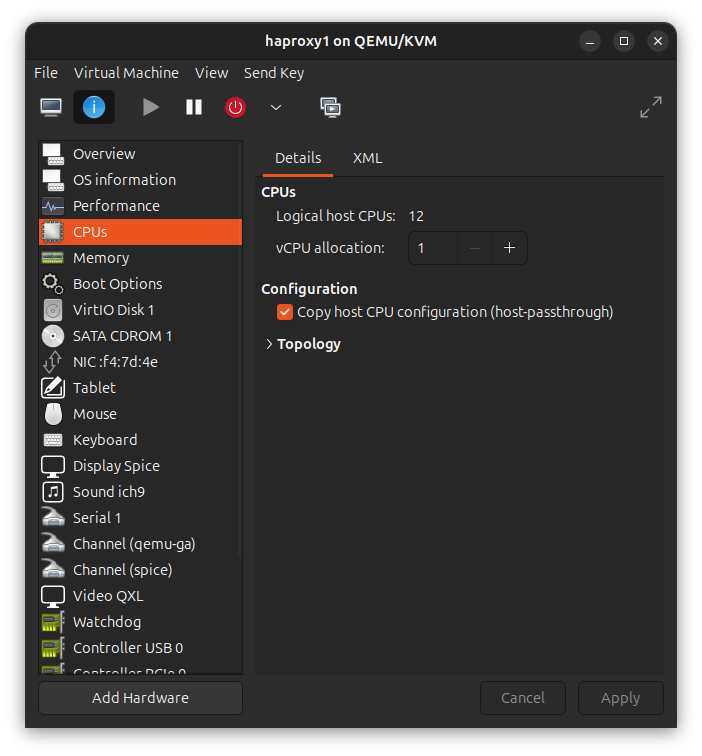
* RAM: 2 GB

    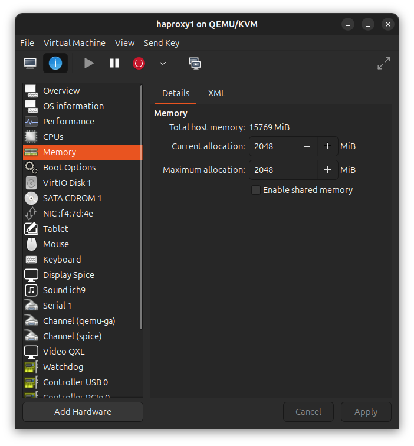
* Disk: 20 GB

    
* OS: Ubuntu 22.04 

    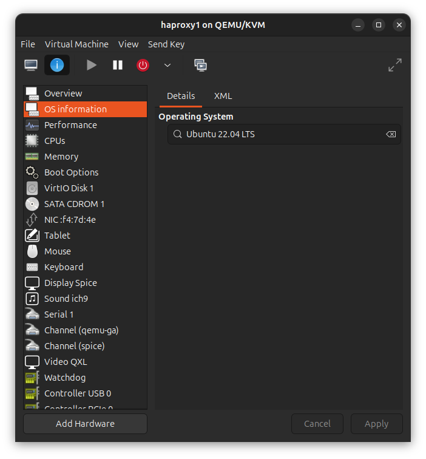

**Cấu hình mạng:**
* Static IP: 192.168.123.12
* Hostname: haproxy1
* SSH port: 22 (mặc định)

    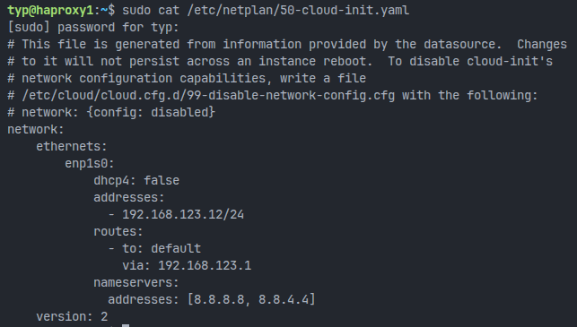
* Cài đặt Haproxy:
    ```bash
    sudo apt update
    sudo apt install haproxy -y
    ```
* Cấu hình Haproxy(`/etc/haproxy/haproxy.cfg`):
    ```ini
    global
        daemon
        maxconn 4096
        log stdout local0

    defaults
        mode tcp
        timeout connect 5000ms
        timeout client 50000ms
        timeout server 50000ms
        option tcplog
        log global

    listen stats
        bind *:8404
        mode http
        stats enable
        stats uri /stats

    frontend frontend_http
        bind *:80
        mode tcp
        default_backend backend_ingress_http

    backend backend_ingress_http
        mode tcp
        balance roundrobin
        server worker1 192.168.123.11:30633 check

    frontend frontend_https
        bind *:443
        mode tcp
        default_backend backend_ingress_https

    backend backend_ingress_https
        mode tcp
        balance roundrobin
        server worker1 192.168.123.11:31160 check
    ```
* Khởi động lại Haproxy:
    ```bash
    sudo systemctl restart haproxy
    ```
    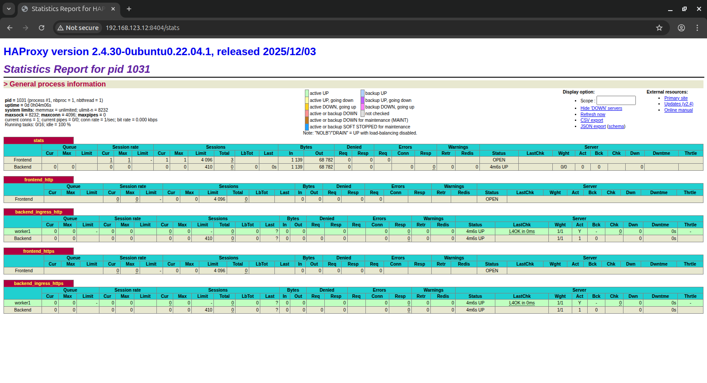
* Cấu hình DNS trỏ tên miền typ-app.local về IP của Haproxy Loadbalancer.
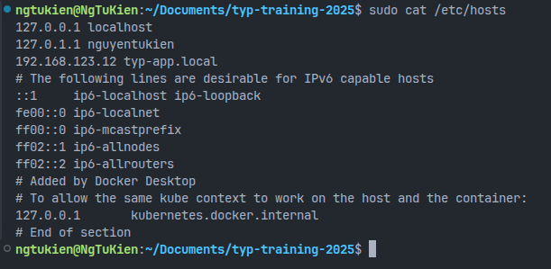
---
## Cấu hình Ingress cho Backend và Frontend:
### Backend
* File `ingress.yml`: [Backend Ingress Configuration](../0.Source_code/typ_2026_backend/backend-chart/templates/05.ingress.yml)
* Bổ xung các giá trị sau vào file `values-prod.yml` của Backend:
```yaml
ingress:
    enabled: true  
    host: api.typ-app.local  
    tls:
        secretName: vdt-tls-secret 
```
* **Kết quả:**
    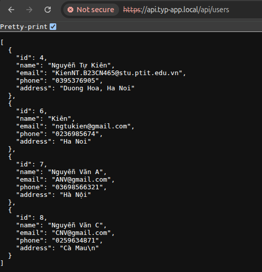
### Frontend
* File `ingress.yml`: [Frontend Ingress Configuration](../0.Source_code/typ_2026_frontend/frontend-chart/templates/06.ingress.yml)
* Bổ xung các giá trị sau vào file `values-prod.yml` của Frontend:
```yaml
ingress:
    enabled: true
    className: nginx
    annotations:
      nginx.ingress.kubernetes.io/ssl-redirect: "true"
    hosts:
      - host: web.typ-app.local
        paths:
          - path: /
            pathType: Prefix
    tls:
      - secretName: vdt-tls-secret
        hosts:
          - web.typ-app.local
```
* **Kết quả:**
    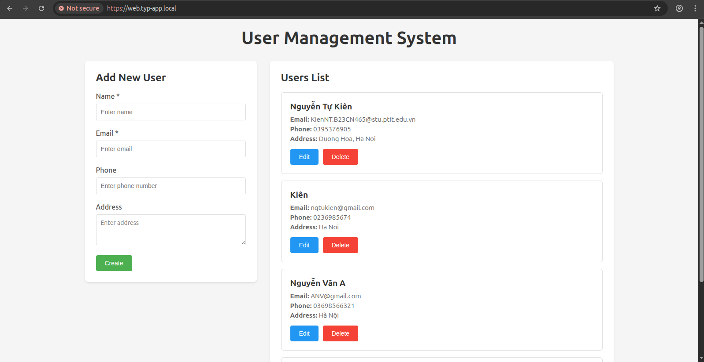
---
### Trạng thái Ingress trên K8S Cluster:
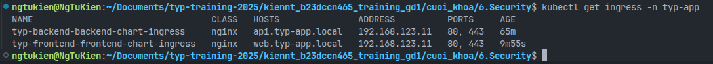
### Chi tiết Ingress Controller:
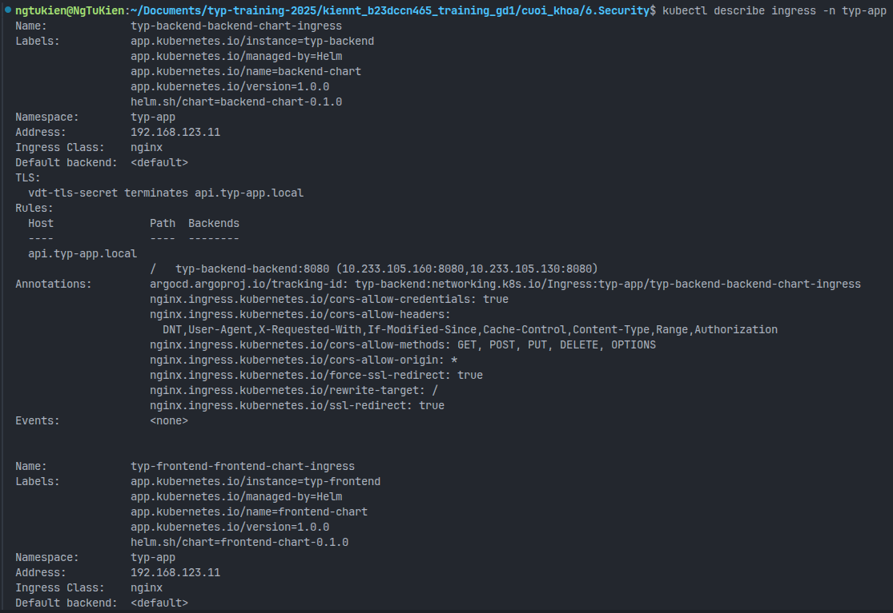
---
## Yêu cầu 2 (1đ):
* Đảm bảo 1 số URL của api service khi truy cập phải có xác thực thông qua 1 trong số các phương thức cookie, basic auth, token auth, nếu không sẽ trả về HTTP response code 403. (0.5)
* Thực hiện phân quyền cho 2 loại người dùng trên API:
    * Nếu người dùng có role là user thì truy cập vào GET request trả về code 200, còn truy cập vào POST/DELETE thì trả về 403
    * Nếu người dùng có role là admin thì truy cập vào GET request trả về code 200, còn truy cập vào POST/DELETE thì trả về 2xx
## Output 2:
* File trình bày giải pháp sử dụng để authen/authorization cho các service
* Kết quả HTTP Response khi curl hoặc dùng postman gọi vào các URL khi truyền thêm thông tin xác thực và khi không truyền thông tin xác thực
* Kết quả HTTP Response khi curl hoặc dùng postman vào các URL với các method GET/POST/DELETE khi lần lượt dùng thông tin xác thực của các
user có role là user và admin
> Tham khảo cách sử dụng công cụ CURL với thông tin xác thực: https://reqbin.com/req/c-haxm0xgr/curl-basic-auth-example
---
## Hướng triển khai:
### Tạo thêm thực thể phân quyền trong ứng dụng Backend:
* Sử dụng JWT Token để xác thực người dùng khi truy cập API.
* Sử dụng Spring Security để phân quyền người dùng dựa trên role.
---
### Tạo thêm Account và Role trong Database:
* Cấu hình cho [Account Entity](../0.Source_code/typ_2026_backend/src/main/java/com/example/demo/model/Account.java) đóng vai trò là tài khoản truy cập.
* Cấu hình cho [Role Entity](../0.Source_code/typ_2026_backend/src/main/java/com/example/demo/model/Role.java) đóng vai trò là phân quyền người dùng.
* Cấu hình con [AccRole Entity](../0.Source_code/typ_2026_backend/src/main/java/com/example/demo/model/AccRole.java) đóng vai trò là bảng trung gian giữa Account và Role.
  * `Account` và `Role` có quan hệ Many-to-Many thông qua `AccRole`:

    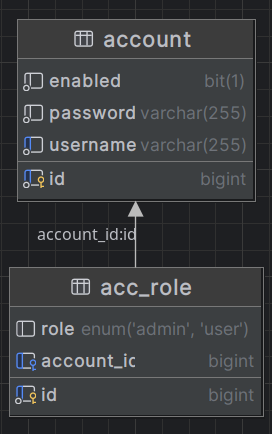
* Thêm dữ liệu mẫu vào Database:
  * Bảng Account: 
  
    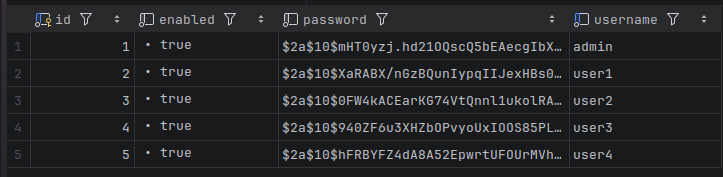
  * Bảng AccRole:
  
    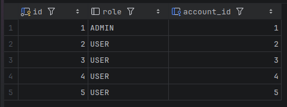
### Setup cho Spring Security và JWT
#### Thêm các `dependency` cho [pom.xml](../0.Source_code/typ_2026_backend/pom.xml):
    ```xml
        <dependency>
            <groupId>org.springframework.boot</groupId>
            <artifactId>spring-boot-starter-security</artifactId>
        </dependency>
    
        <dependency>
            <groupId>io.jsonwebtoken</groupId>
            <artifactId>jjwt-api</artifactId>
            <version>0.11.5</version>
        </dependency>
        <dependency>
            <groupId>io.jsonwebtoken</groupId>
            <artifactId>jjwt-impl</artifactId>
            <version>0.11.5</version>
            <scope>runtime</scope>
        </dependency>
        <dependency>
            <groupId>io.jsonwebtoken</groupId>
            <artifactId>jjwt-jackson</artifactId>
            <version>0.11.5</version>
            <scope>runtime</scope>
        </dependency>
    ```
---
#### Cấu hình `SecurityConfig` trong [SecurityConfig.java](../0.Source_code/typ_2026_backend/src/main/java/com/example/demo/config/SecurityConfig.java):
* Cho phép truy cập không xác thực vào các endpoint `/api/auth/**` và `/actuator/**`
* Yêu cầu role `USER` hoặc `ADMIN` cho GET request tới `/api/users/**`
* Yêu cầu role `ADMIN` cho POST/PUT/DELETE request tới `/api/users/**`
---
#### Tạo JWT Authetication Filter trong [JwtAuthenticationFilter.java](../0.Source_code/typ_2026_backend/src/main/java/com/example/demo/security/JwtAuthenticationFilter.java):
* Đọc JWT token từ Authorization header (Bearer token).
* Validate token và extract username.
* Set authentication context cho request.
* Xử lý các exception khi token không hợp lệ.
---
#### Tạo JWT Utility trong [JwtUtil.java](../0.Source_code/typ_2026_backend/src/main/java/com/example/demo/security/JwtUtil.java):
* Generate JWT token cho user.
* Validate JWT token.
---
#### Tạo Authentication Controller trong [AuthController.java](../0.Source_code/typ_2026_backend/src/main/java/com/example/demo/controller/AuthController.java):
* Login endpoint `/auth/login`, nhận username/password, trả về JWT token nếu hợp lệ.
---
## Kết quả
### Test khi chưa login:
* Test với `/api/users`:

    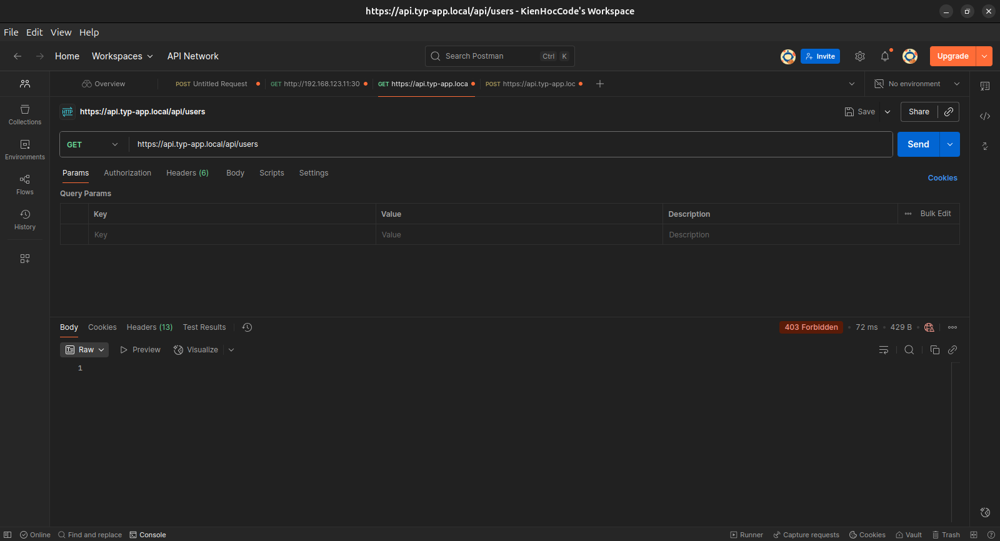
* Test với `/api/auth/login`:
    
    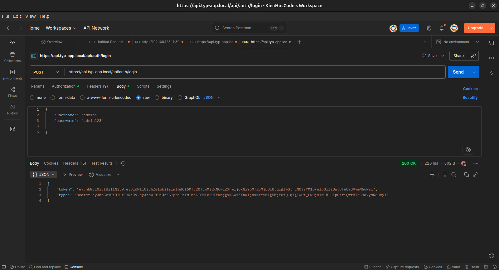
---
### Test với user role `USER`:
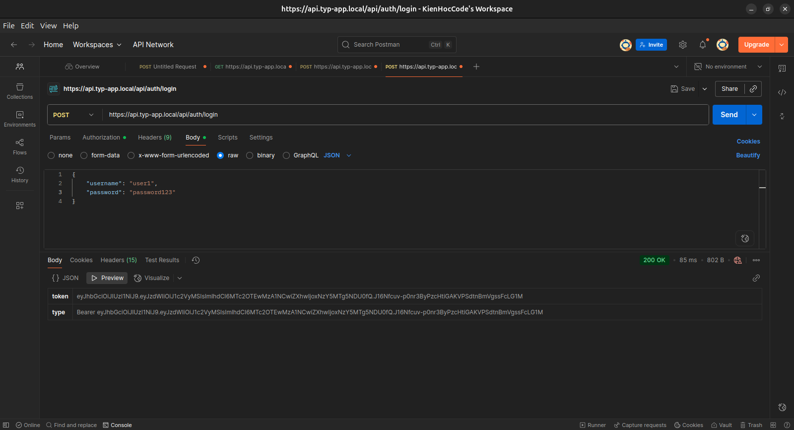
* Test với `GET /api/users`:

    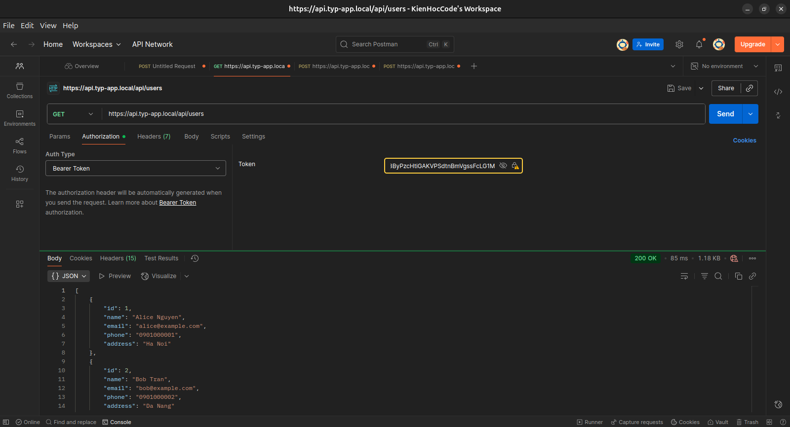
* Test với `POST /api/users`:

    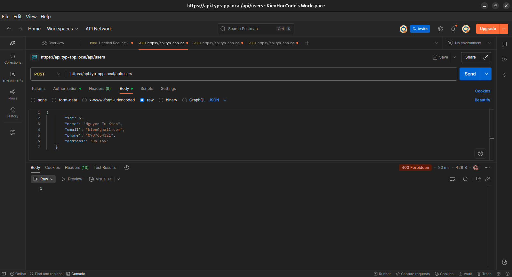
---
### Test với user role `ADMIN`:

* Test với `GET /api/users/1`:

    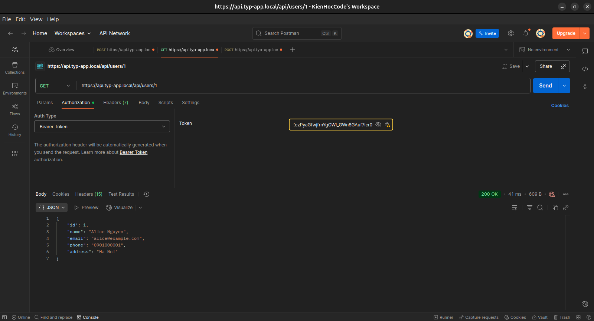
* Test với `POST /api/users`:
    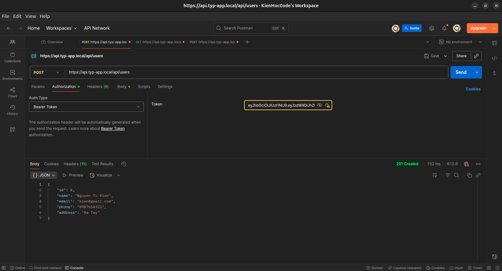
---
## Yêu cầu 3 (1đ):
Sử dụng 1 trong số các giải pháp để ratelimit cho Endpoint của api Service, sao cho nếu có quá 10 request trong 1 phút gửi đến Endpoint của api service thì
các request sau đó bị trả về HTTP Response 409 
## Output:
* File tài liệu trình bày giải pháp
* File ghi lại kết quả thử nghiệm khi gọi quá 10 request trong 1 phút vào Endpoint của API Service.

---
## Yêu cầu 3: 
Sử dụng 1 trong số các giải pháp để rate limit cho Endpoint của API Service, sao cho nếu có quá **10 request trong 1 phút** gửi đến Endpoint của api service thì các request sau đó bị trả về **HTTP Response 409**.

## Output 3: 
* File tài liệu trình bày giải pháp
* File ghi lại kết quả thử nghiệm khi gọi quá 10 request trong 1 phút vào Endpoint của API Service.
---
## Hường triến khai: Rate Limit ở HA Proxy 
Điểu chỉnh cấu hình HA Proxy (`/etc/haproxy/haproxy.cfg`) để thêm tính năng rate limit:
```ini
global
    daemon
    maxconn 4096
    log stdout local0

defaults
    mode tcp
    timeout connect 5000ms
    timeout client 50000ms
    timeout server 50000ms
    option tcplog
    log global

listen stats
    bind *:8404
    mode http
    stats enable
    stats uri /stats

frontend frontend_http
    bind *:80
    mode http

    stick-table type ip size 100k expire 60s store http_req_rate(60s)
    http-request track-sc0 src

    http-request return status 409 content-type application/json string '{"error":"Rate limit exceeded","message":"Too many requests"}' if { sc_http_req_rate(0) gt 10 }

    default_backend backend_ingress_http

backend backend_ingress_http
    mode http
    balance roundrobin
    server worker1 192.168.123.11:30633 check

frontend frontend_https
    bind *:443
    mode tcp
    default_backend backend_ingress_https

backend backend_ingress_https
    mode tcp
    balance roundrobin
    server worker1 192.168.123.11:31160 check
```
### Test rate limit:
#### Kiểm tra tổng số request gửi đến API:
```bash
SUCCESS=0
BLOCKED=0

for i in {1..20}; do
  CODE=$(curl -s -o /dev/null -w "%{http_code}" http://web.typ-app.local/)
  if [ "$CODE" = "409" ]; then
    BLOCKED=$((BLOCKED+1))
  else
    SUCCESS=$((SUCCESS+1))
  fi
done

echo "✅ Successful requests (HTTP 200): $SUCCESS"
echo "⛔ Blocked requests (rate-limited): $BLOCKED"
```
**Kết quả:**

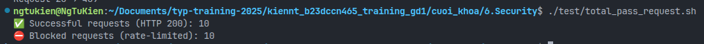
#### Chi tiết từng request:
```bash
for i in {1..20}; do
  echo -n "Request $i → "
  curl -s -o /dev/null -w "%{http_code}\n" http://api.typ-app.local/actuator/health
done
```
**Kết quả:**
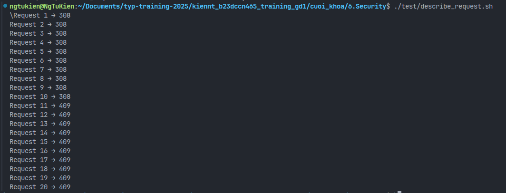
#### Hình ảnh báo cáo của 