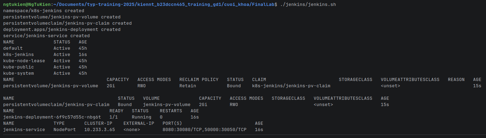
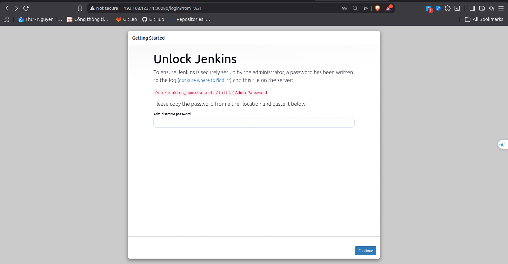
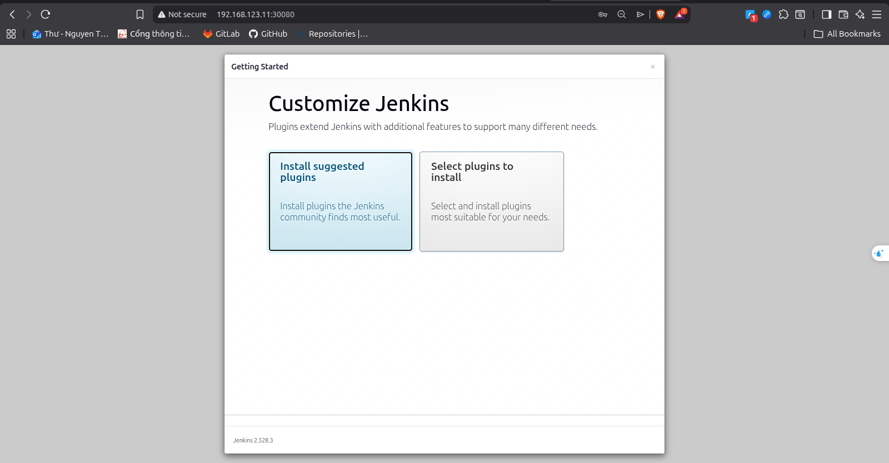
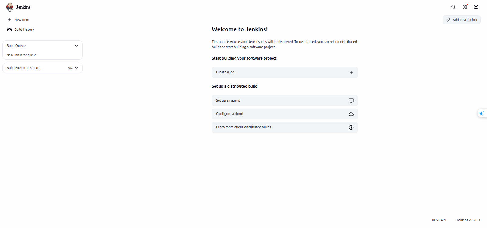
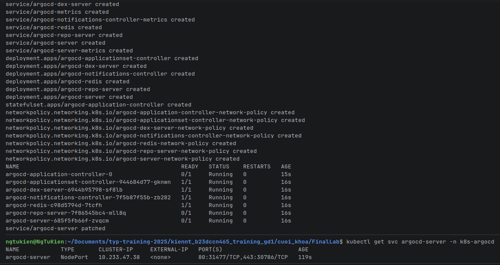
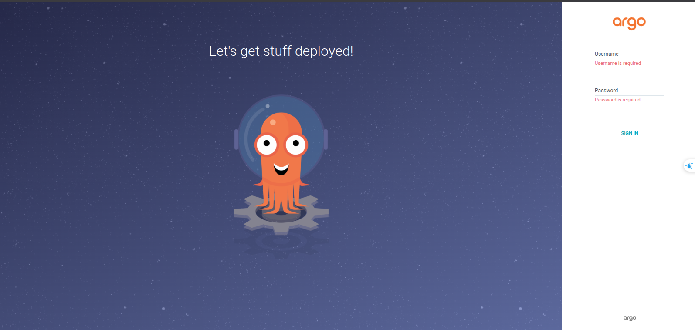
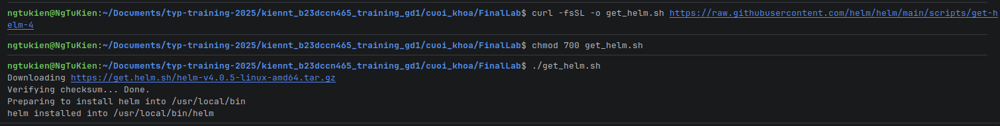
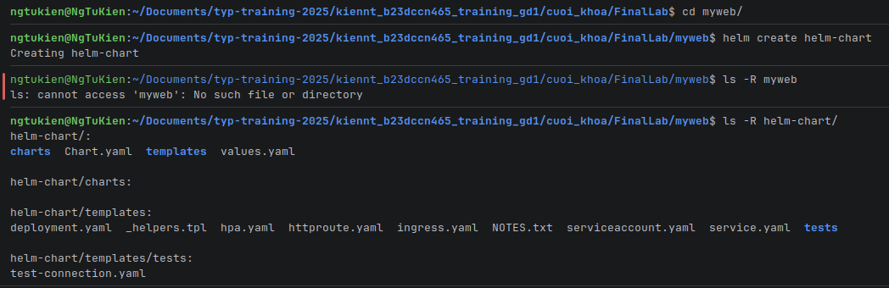

# Bài tập cuối khóa lĩnh vực Cloud
## 1. Triển khai Kubernetes
Triển khai Kubernetes thông qua công cụ kubespray lên 1 master node VM + 1 worker node VM
* Clone và run container:

  
* Viết lại inventory cho kubespray:

  
* Tạo ssh-key cho container để tạo kết nối tới 2 VM:

  
  * Trên master node:
  
    
  * Trên worker node:
  
    
* Chạy ansible playbook (Hệ thống sẽ hỏi password của user và root password cho 2 VM):

  
* Kết quả:

  
* Cài đặt kubectl:

  
* Config kubectl:
  * Copy kubectl config từ master node về local:
  
    
  * Paste và sửa ip chỏ tới master node:
  
    
  * Export kubectl config: `export KUBECONFIG=./k8s-config.yml`
* Verify:


## 2. Triển khai web application sử dụng các DevOps tools & practices.
### 2.1. Jenkins & ArgoCD
#### 2.1.1. Jenkins
* **Các file manifest**: nằm trong thư mục `jenkins/`
  
  
* Kết quả: 
  
  
* Lấy passwork Jenkins bằng câu lệnh: `kubectl exec -n k8s-jenkins jenkins-deployment-6f9c57d55c-nbg6t -- cat /var/jenkins_home/secrets/initialAdminPassword`

* Login as admin Jenkins:
  
  
* Sau khi hoàn thành việc setting cho Jenkins:
  

#### 2.1.2. ArgoCD
* **Các file manifest**: nằm trong thư mục `argocd/`
  
  
* Kết quả:
  
  
* Login ArgoCD:
  * Username: admin
  * Password: Lấy bằng câu lệnh: `kubectl -n argocd get secret argocd-initial-admin-secret -o jsonpath="{.data.password}" | base64 -d; echo`
* Đăng nhập ArgoCD:
    
  
### 2.2. Helm Charts
* From script:
  
    
* Tạo thư mục helm-charts:
    
    
* Điều chỉnh các file manifest trong thư mục helm-charts (đã có trong src code).
* Kiểm tra kết quả (log dài quá nên em xin phép không chụp ảnh):
    ```shell
    helm template helm-chart ./helm-chart --values ./helm-chart/values.yaml 
    ```  


    

    
  
    
    
  


  
  