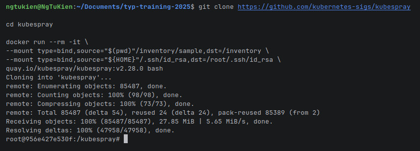
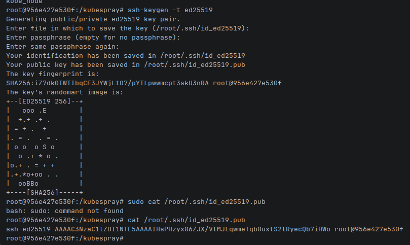
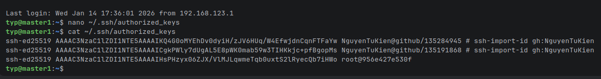
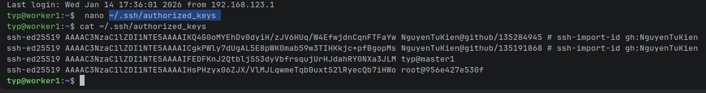
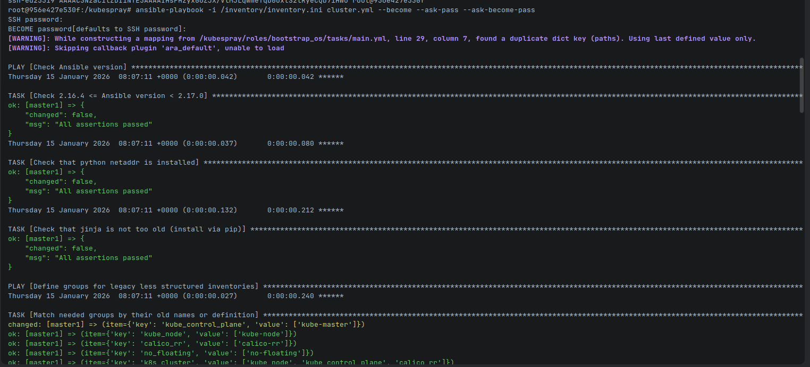
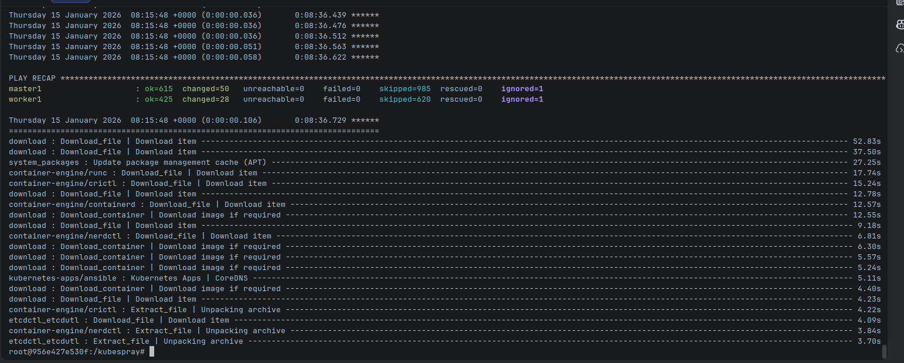
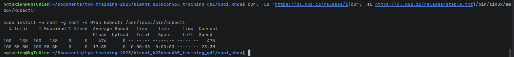
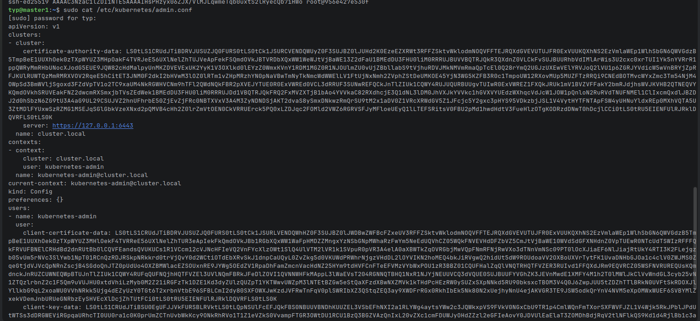
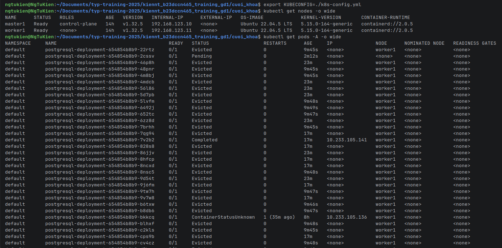

# Bài tập cuối khóa lĩnh vực Cloud
## 1. Triển khai Kubernetes
Triển khai Kubernetes thông qua công cụ kubespray lên 1 master node VM + 1 worker node VM
* Clone và run container:

* Viết lại inventory cho kubespray:

* Tạo ssh-key cho container để tạo kết nối tới 2 VM:

  * Trên master node:
  
    
  * Trên worker node:
  
    
* Chạy ansible playbook (Hệ thống sẽ hỏi password của user và root password cho 2 VM):

* Kết quả:

* Cài đặt kubectl:

* Config kubectl:
  * Copy kubectl config từ master node về local:
  
  
  * Paste và sửa ip chỏ tới master node:
  
  
  * Export kubectl config: `export KUBECONFIG=./k8s-config.yml`
* Verify:

## 2. Triển khai web application sử dụng các DevOps tools & practices.

  
  