## Báo cáo Cloud tuần 1

# Phần 1 tổng quan về git
1. Git là gì?
- Git là 1 hệ thống quản lý phiên bản phân tán, giúp theo dõi sự thay đổi của mã nguồn
- Cho phép nhiều người làm việc song song trên cùng 1 dự án mà không ghi đè code của nhau
- Được ra đời bởi Linus Torvalds năm 2005
- Lý do ra đời: Do cần 1 VCS(Version Control System) nhanh, an toàn, phân tán để tối ưu workflow cho các lập trình viên
- So sánh Git với các VCS khác:
    - Mô hình lưu trữ:
        - Git lưu trữ phân tán, mỗi dev có 1 bản sao đầy đủ của repo 
        - Các VCS khác lưu trữ tập trung, phụ thuộc vào 1 server trung tâm để commit hoặc update\
    - Tốc độ:
        - Git rất nhanh vì hầu hết thao tác chạy local, làm việc hoàn toàn offline
        - Các VSC khác phải onl để commit hoặc lấy lịch sử nên tốc độ chậm hơn vì liên tục phải kết nối đến server
    - Độ an toàn:
        - Git: Mỗi người có 1 bản sao ==> khó mất dữ liệu
        - VCS khác : Nếu server hỏng ==> nguy cơ mất lịch sử

2. Sự khác biệt của Git và GitHub/GitLab/Bitbucket

- Git: 
    - Là công cụ quản lý phiên bản trên local ==> không cần internet
    - Lưu lịch sử, quản lý nhánh, commit,..

- GitHub/GitLab/Bitbucket:
    - Remote repository
    - Nền tảng lưu trữ và cộng tác sử dụng git, hỗ trợ pull request, merge, quản lý dự án,...

3. Cài đặt git và cấu hình ban đầu
    - Kiểm tra version: git --version

    - Cấu hình thông tin người dùng:
        - git config --global user.name "CTranLam"
        - git config --global user.email "tlam15282@gmail.com"

    - Thiết lặp SSH key:
        - Tạo SSH key mới: ssh-keygen -t ed25519 -C "tlam15282@gmail.com"

        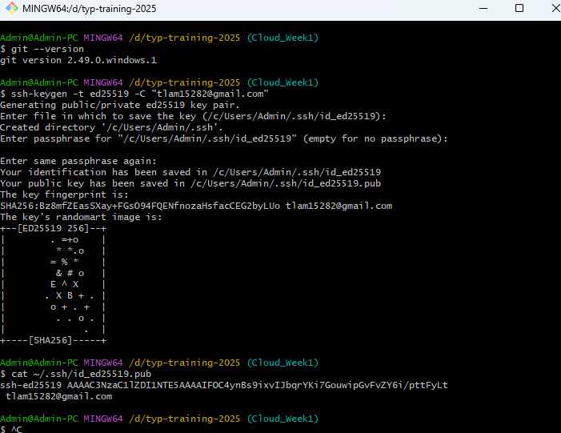
        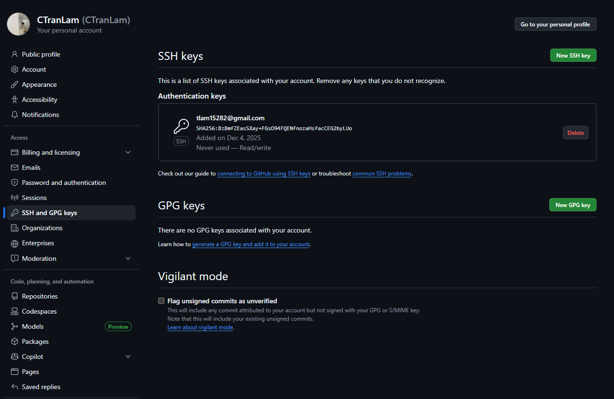

# Phần 2 Làm việc với repository

4. Khởi tạo và clone repository

- git init : Khởi tạo 1 repository git mới trên máy local
- git clone <url> : Tạo 1 bản sao đẩy đủ của repo từ remote về local
- Cấu trúc thư mục .git :
    - .git/HEAD : Con trỏ đến nhánh hiện tại
    - .git/objects/ : Lưu trữ commit, tree,..dưới dạng hash
    - .git/refs/ : Chứ thông tin nhánh và tag
    - .git/config : Cấu hình riêng của repo

5. Trạng thái file trong Git

- untracked : File mới chưa đc Git quản lý
- staged : File đã được chọn để commit
- committed : File đã được lưu vào lịch sử commit
- modified : File đã thay đổi nhưng chưa đc add lại
- git status : Kiểm tra trạng thái file
- git diff : Xem sự khác biệt giữa working directory và commit gần nhất

6. Thêm và commit thay đổi

- git add <file> / git add . : Thêm file vào staging area
- git commit -m "message" : Lưu các thay đổi từ stagin area vào lịch sử Git với message
- Quy tắc viết commit message tốt:
    - Viết ngắn gọn, rõ ràng, mô tả hành động
    - Dạng mệnh lệnh: Add, Update, Fix, Remove, ...

- Thực hành:
    - Clone 1 repo được tạo sẵn trên github với - `git clone`:
        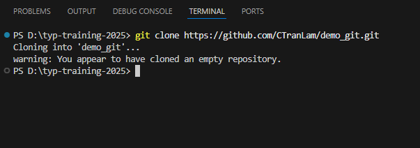

    - Thêm 1 file và xem trạng thái của git - `git status`:
        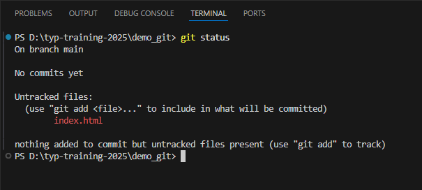

    - Thêm file vào trong staging và kiểm tra trạng thái - `git add .`:
        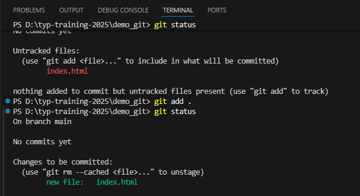

    - Commit đưa nó vào local repo - `git commit`:
        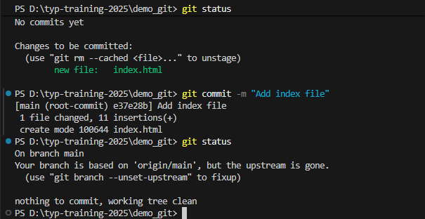        

    - Thêm code, commit lại và push lên remote:
        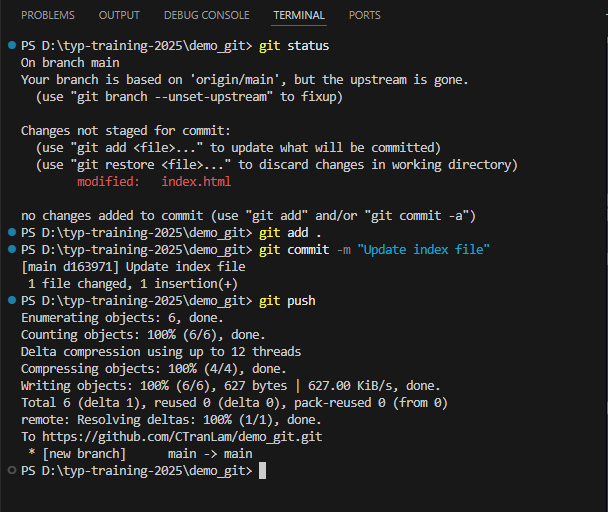        

# Phần 3 Làm việc với lịch sử và phiên bản

7. Xem lịch sử commit
    - `git log` : Hiển thị toàn bộ lịch sử commit 
        - commit ID (SHA-1 hash)
        - Tác giả (author)
        - Thời gian commit
        - Commit message
        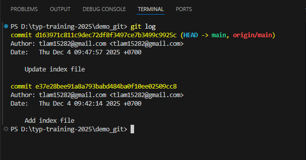
    
    - `git show <commid_id>` : Hiển thị chi tiết các thay đổi trong commit
        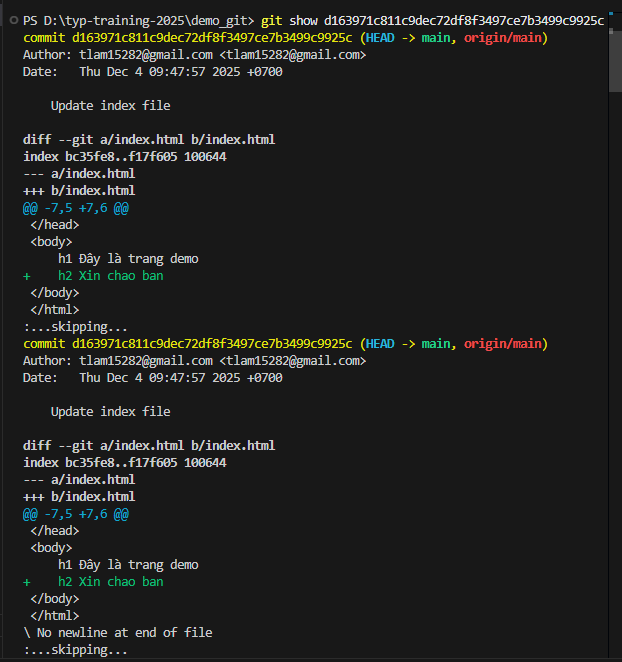

    - `git blame <file>` : Cho biết dòng nào được commit bởi ai và ai là tác giả
        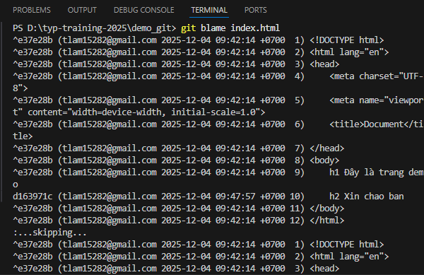                

    - Commid ID (SHA-1 hash):
        - Là mã hash 40 ký tự duy nhất xác định 1 commit
        - Git dùng SHA-1 để đảm bảo tính toàn vẹn của dữ liệu, tránh bị sửa đổi hoặc mất commit
    
8. Undo/ Revert/ Reset
    - `git restore <file>` : Hoàn tác thay đổi trả về phiên bản commit gần nhất khi file chưa đc add vào staging

    - `git restore --stage <file>` : Loại 1 file khỏi staging nhưng vẫn giữ lại những chỉnh sửa

    - `git reset --soft <commit_id>` : Quay branch về commit chỉ định, lưu những thay đổi vào staging area

    - `git reset --hard <commit_id>` : Quay branch về commit chỉ định, bỏ tất cả những thay đổi

    ==> git reset chỉ ở thực hiện khi còn ở local

    -  `git revert <commit_id>` : Tạo commit mới để đảo ngược commit cũ, giữ nguyên lịch sử commit nhưng code đã đc quay về lần commit trước

        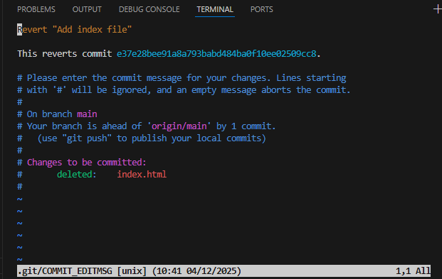
        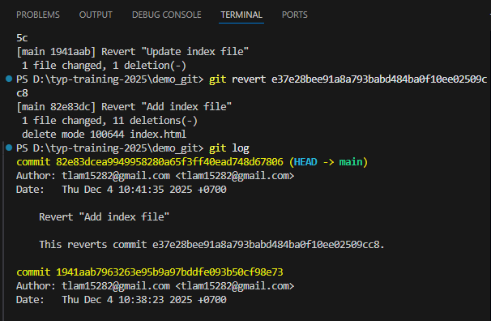

    - Khi nào dùng revert thay reset:
        - commit chưa push ==> có thể dùng `reset`
        - commit push rồi ==> dùng `revert` để không phá vỡ lịch sử chung

    - `.gitignore` là file quy định các file/thư mục git không theo dõi
        - `node_modules/` : bỏ qua toàn bộ thư mục node_modules
        - `build/` : bỏ qua thư mục build
        - `.env` : bỏ qua file cấu hình chứa secrets
        - `*.log` : bỏ qua tất cả file có đuôi `.log`
    - Ví dụ thực tế:
        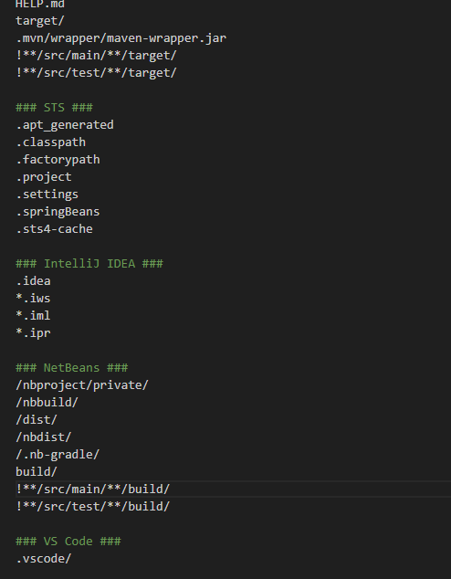

# Phần 4 Nhánh(Branching) & hợp nhất(Merging)
10. Branch
    - Branch trong Git là 1 dòng phát triển độc lập trong cùng 1 repository
    - Cho phép nhiều người cùng phát triển các tính năng khác nhau mà không ảnh hưởng đến nhánh main
    - Lợi ích:
        - Tách biệt môi trường dev và product
        - Quản lý code theo tính năng
        - Kiểm soát code trước khi merge vào main
        - Giảm rủi ro gây lỗi trên production

11. Tạo và chuyển nhánh
    - `git branch` : Liệt kê nhánh
    - `git branch <tên nhánh>` : tạo nhánh 
    - `git checkout <tên nhánh>` , `git switch <tên nhánh>` : chuyển sang nhánh khác
    - `git checkout -b <tên nhánh>` : tạo và chuyển nhánh ngay lập 
    - ví dụ:
        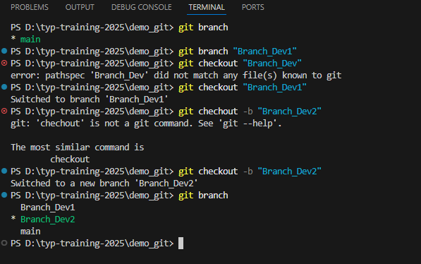

12. Merge branch
    - Hợp nhất nhánh vào nhánh hiện tại:
        `git merge <tên nhánh cần merge>`
    - Nếu có xung đột (confict):
        - Git báo file bị confict cần xử lý thủ công để giữ nội dung mong muốn
        - Sau đó commit merge
    ==> Xử lý thực tế sẽ làm ở Phần 7

14. Chiến lược branching phổ biến
    - Github Flow:
        - Đơn giản, phù hợp với team nhỏ
        - Main chạy production, mỗi tính năng phát triển trên nhánh feature/*
        - Khi xong thì pull request vào 
        - Ví dụ:
            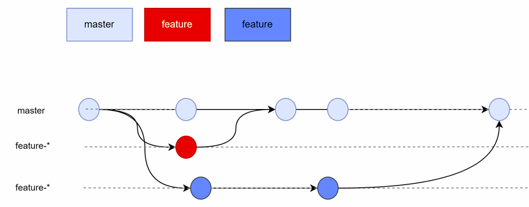

    - Git Flow:
        - Phù hợp với dự án lớn
        - Các nhánh chính:
            - main: production
            - develop: tích hợp code trước khi release
            - feature/: phát triển chức năng
            -  hotfix/: sửa lỗi khẩn cấp trên production

        - Ví dụ:
        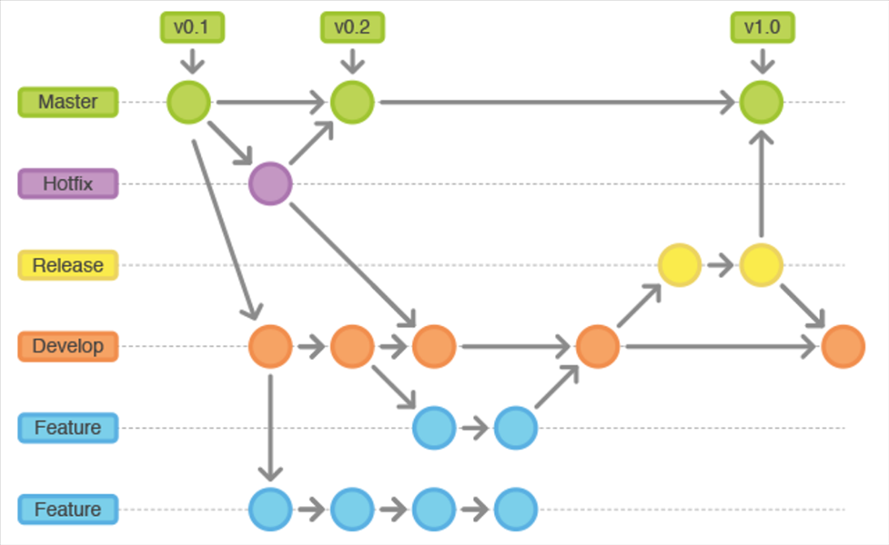

# Phần 5: Remote repository

14. Thêm remote và đẩy code

- `git remote -v` : Kiểm tra remote hiện có
- `git remote add origin <url>` : Thêm remote mới
- `git push -u origin main`, `git push` : Push code lên remote
- `git fetch` : Lấy dữ liệu từ remote về remote-tracking branches nhưng chưa merge vào local ==> `merge origin/main` để merge vào main trong local
- `git pull = git fetch + git merge` : Lấy code từ remote và merge luôn vào local

-   Ví dụ:      
    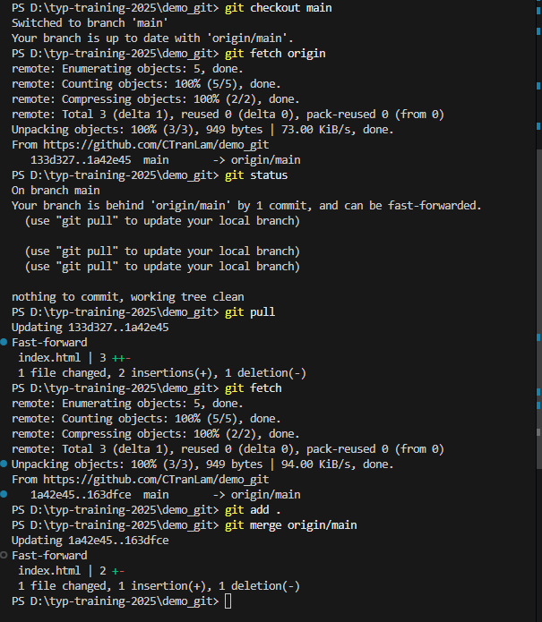

15. Làm việc nhóm: fork, clone, pull request

- Quy trình khi tham gia project của team:
    - Fork repo ==> Tạo bản sao repo trên github
    - Clone repo đó về máy
    - Tạo branch để code
    - Commit và push code lên
    - Lên github, tạo pull request để xin merge code vào repo gốc
    - Reviewer kiểm tra ==> merge PR

- Ví dụ chính là quá trình nhận issue và nộp bài trong quá trình training

16. Giải quyết conflict khi làm việc nhóm

- Giả sử có 2 branch là main và Branch_Dev1, hai branch này do 2 người khác nhau code, 2 người cùng sửa file `index.html`, người code main khi merge code của Branch_Dev1 thì xảy ra conflict.
- Lúc đó người đó sẽ phải quyết định là sẽ giữ code phần nào, nếu giữ code của người đó thì sẽ giữ code phần HEAD bên trái và xóa đi phần code của người kia gây conflict
    - Nếu giữ code người kia thì lấy code phía dưới
    - Nếu muốn kết hợp thì tự gộp lại theo ý muốn

- Sau khi xử lý conflict xong thì tiến hành add, commit với message resolve conflict để nhận biết

- Ví dụ như sau:
    - Khi bị conflict: 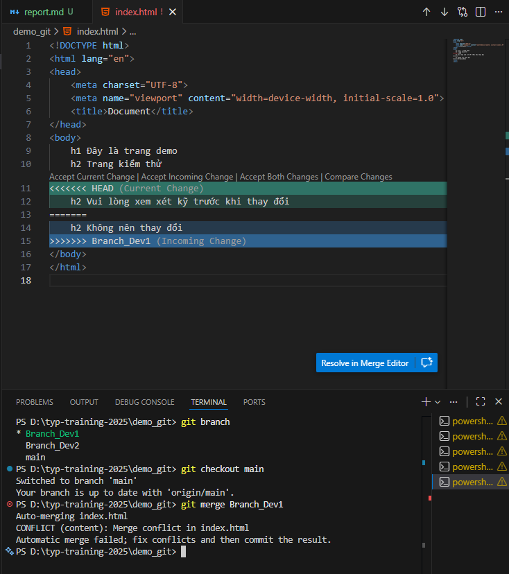
    - Xử lý conflict:   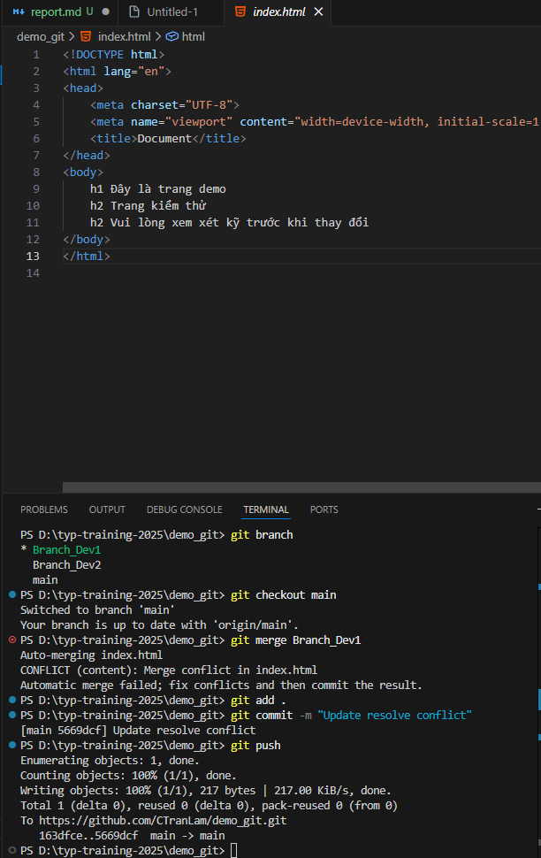

# Phần 6: Công cụ & kỹ năng nâng cao

17. Tag và versioning

- Dùng để đánh dấu mốc quan trong trong lịch sử ví dụ như release: v1.0, v2.0
    - `git tag v1.0` : Tạo tag
    - `git tag -a v1.0 -m "message"` : Tạo tag có message
    - `git push origin --tags` : Đẩy tag lên github
    - `git tag` : Xem tag
    - `git tag <tag_name> <branch_name>` : đánh tag cho nhánh

- Git stash:
    - `git stash` : Lưu tạm thời thay đổi chưa commit
    - `git stash pop` : Lấy lại những thay đổi đó để code tiếp
    - `git stash list` : Xem danh sách các stash

- Rebase và squash:
    - Rebase: Làm lịch sử thẳng, đẹp và dễ đọc hơn, rebase sẽ di chuyển commit của branch lên đỉnh của main

    - Squash commit: gộp nhiều commit thành 1
        ví dụ gộp 3 commit thành 1: `git rabase -i HEAD~3`
    
- Git Alias & log formatting:
    - Tạo alias giúp viết lệnh ngắn gọn, tăng tốc khi làm việc thường xuyên

    - alias phổ biến:
        - `git config --global alias.st status`
        - `git config --global alias.cm commit`
        - `git config --global alias.br branch`

- Git reflog:
    - Khôi phục commit tưởng như đã mất khi reset nhầm hoặc merge sai
    - Reflog hiển thị mọi điểm dịch chuyển HEAD

# Phần 7: Thực hành dự án thực tế
1. Tình huống conflict đã minh họa ở phần 5
2. Revert code đã minh họa ở phần 3
3. Rollback code đã minh họa ở phần 3
4. Tạo release đã minh họa ở phần 6
5. Khi nào cần thực hiện việc fetch, pull

- git fetch: 
    - Dùng để lấy dữ liệu mới từ remote nhưng chưa muốn cập nhật code trên local
    - An toàn vì không thay đổi file
    - Dùng khi muốn xem có commit mới hay không, muốn xem diff trước khi merge
    - Minh họa:
        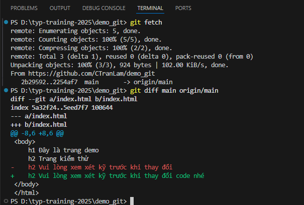
        
- git pull = git fetch + merge:
    - Lấy code mới và nhập trực tiếp vào nhánh hiện tại
    - Dễ gây conflict
    - Dùng trong trường hợp chuẩn bị làm việc, phải đồng bộ code mới nhất, trước khi tạo branch mới từ main, hoặc trước khi push code lên remote

        

    
