## Training Cloud Week 2

# Phần 1: Giới thiệu tổng quan về Linux
1. Linux là gì?

- Linux là 1 hệ điều hành mã nguồn mở được xây dựng dựa trên Unix. Gồm 3 phần Kernel, Shell và Applications. Trong đó phần Linux Kernel đóng vai trò quan trọng nhất, là thành phần quản lý tài nguyên hệ thống và giao tiếp giữa phần cứng và phần mềm.

- Hệ điều hành mã nguồn mở là:
    - Mã nguồn được công khai, ai cũng có thể xem, sửa đổi và phân phối lại
    - Công đồng phát triển rộng lớn và liên tục cải tiến

- Lịch sử phát triển của Linux:
    - Linux được phát triển bởi Linus Tovalds vào năm 1991 như 1 dự án cá nhân
    - Ban đầu chỉ là kernel, sau đó cộng đồng đóng góp và xây dựng thành 1 hệ điều hành hoàn chỉnh

- Linux Kernel và Linux distribution:
    - Linux kernel: Lõi hệ điều hành(do Linus Torvalds và cộng đồng phát triển)
    - Linux distribution: Xây dựng dựa trên kernel + thêm công cụ quản lý gói, giao diện, tiện ích,...
    - 1 số Linux distributon phổ biến:
        - Ubuntu
        - Debian
        - CentOs
        - Kali Linux

2. Tại sao nên học Linux
- Ứng dụng rộng rãi:
    - Server: 90% server trên thế giới chạy Linux
    - Cloud: AWS, Azure,.. đều sử dụng Linux làm nền
    - DevOps: Docker, Kubernetes, Ansible, Jenkins chạy chủ yếu trên Linux
    - AI/Machine Learning: Môi trường Linux tối ưu cho GPU và thư viện AI
    - Lập trình hệ thống: C/C++/Python thường phát triển chủ yếu trên Linux

- Sự khác biệt giữa Linux và Windows/macOs:
    | `Tiêu chí` | `Linux` | `Window/MacOs`|
    |---------|-------|-------------|
    | Mã nguồn | Mở    | Đóng        |
    | Chi phí | Miễn phí | Có phí |
    | Bảo mật | Cao | Trung bình |
    | Tùy biến | Rất cao | Ít |
    | Tối ưu Server | Rất tốt | Không tối ưu |
    | Giao diện | Tùy distro | Đồng nhất |

3. Kiến trúc hệ thống 
- Hình ảnh minh họa: 
    

- Linux gồm 3 phần chính:
    - `Kernel`:
        - Là phần quan trọng nhất được ví như trái tim của hệ điều hành, chứa các module, thư viện để quản lý tài nguyên hệ thông như: CPU, RAM, Disk, Process
        - Giao tiếp với phần cứng

    - `Shell`: 
        - Là 1 chương trình thực thi lệnh từ người dùng hoặc từ các ứng dụng yêu cầu chuyển đến cho kernel xử lý
        - Là thành phần nằm giữa Kernel và Application, đóng vai trò trung gian gọi về phía bên dưới và trả dữ liệu lên trên cho Application
        - 1 số loại Shell:
            - Command-line shell : Bash, Zsh.
            - Gui shell : GNOME, KDE.
    
    - `Application`:
        - Các ứng dụng, dịch vụ chạy trên hệ điều hành(web server, database, tool,...)

4. Quá trình khởi động của Linux (Boot process)
    - BIOS/UEFI khởi động.
    - Nạp bootloader (GRUB)
    - Bootloader tìm và nạp Linux kernel vào RAM
    - Kernel kết nối các phân vùng ổ đĩa, gắn chúng vào cây thư mục Linux và khởi tạo hệ thống
    - Khởi chạy tiến trình systemd (PID 1) là tiến trình đầu tiên chạy sau khi kernel khởi động xong, giúp khởi chạy các service, quản lý tiến trình, quản lý log hệ thống,..
    - Load các service và hiển thị màn hình đăng nhập

5. Các thư mục hệ thống chính
    
    | Thư mục | Chức năng |
    |--------|-----------|
    | `/bin` | Chứa các lệnh cơ bản cho user(ls, cp,...) |
    | `/sbin` | Chứa các lệnh quản trị hệ thống |
    | `/etc`  | Chứa file cấu hình hệ thống |
    | `/home` | Thư mục người dùng  |
    | `/root` | Thư mục người dùng root |
    | `/usr`  | Chứa ứng dụng và file dùng chung |
    | `/var`  | Chứa Log và dữ liệu thường xuyên thay đổi |
    | `/tmp`  | Chứa file tạm thời |
    | `/dev`  | Đại diện cho thiết bị(Disk, Usb,...) |

# Phần 2: Làm quen với Terminal và Shell

4.  Terminal & Shell
- `Terminal` là giao diện dòng lệnh (CLI - Command Line Interface) cho phép người dùng nhập lệnh để tương tác với hệ điều hành

- `Shell` là chương trình trung gian giữa người dùng và kernel.
    - Nhiệm vụ:
        - Nhận lệnh từ người dùng
        - Phân tích cú pháp
        - Gửi yêu cầu cho kernel thực thi
        - Trả kết quả lại cho người dùng

    - Các shell phố biến: bash(phổ biến), zsh, fish

5. Lệnh cơ bản trong Linux
    - `pwd` : Hiển thị đường dẫn thư mục hiện tại
    - `ls` : Liệt kê file/thư mục hiện tại
        - `ls -L` : Hiển thị tên danh sách file
        - `ls -l` : Hiển thị danh sách file
        - `ls -a` : Hiển thị tất cả bao gồm cả file ẩn
        - `ls -R` : Hiển thị tất cả các file bên trong thư mục con
    - `cd <Folder>` : Di chuyển vào thư mục
    - `cd ..` : Lùi lại thư mục cha
    - `cd`, `cd ~` : Về thư mục home
    - `clear` : Xóa màn hình terminal
    - `history` : Xem lịch sử các lệnh đã chạy
    - Thực hành: 
        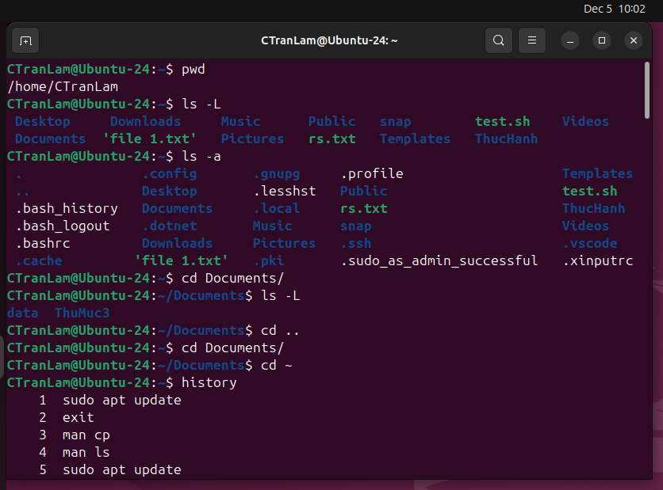

    - Một số phím tắt:
        - `Ctrl + Alt + T` : Mở terminal
        - `Tab` : Tự động hoàn thành lệnh, tên file hoặc folder
        - `Ctrl + C` : Dừng lệnh đang chạy
        - `Ctrl + D` : Thoát khỏi shell/kết thúc input
        - `Ctrl + L` : Làm sạch màn hình terminal giống clear

6. Cấu trúc đường dẫn
    - Đường dẫn tuyệt đối:
        - Bắt đầu bằng /
        - Tính từ thư mục root
        - Ví dụ: `/home/CTranLam/Documents`, `/etc/ssh/sshd_config`

    - Đường dẫn tương đối:
        - Không bắt đầu bằng /
        - Tính từ thư mục hiện tại
        - Ví dụ: `../Downloads`, `folder1/file.txt`

    - Các ký hiệu đặc biệt:
        - `~` : thư mục home của người dùng hiện tại 
        - `.` : thư mục hiện tại
        - `..` : Lùi lên 1 thư mục cha
        - `$` : Ký hiệu cho biết terminal đang chạy với quyền User bình thường
        - `#` : Terminal đang chạy với quyền Root

    - Minh họa:
        


# Phần 3: Làm việc với file và thư mục
7. Tạo, xem, xóa và di chuyển file
    - Tạo tập tin:
        - Tạo tập tin rỗng sử dụng lệnh `touch`
            ví dụ: `touch data/a.txt`
        - Tạo tập tin với nd txt trong thư mục data sử dụng `echo`
            ví dụ: `echo "Đây là ví dụ" >> data/vidu.txt`

        

    - Xem nội dung file:
        - `cat <tên_file>`: Hiển thị toàn bộ nội dung file
        - `more <tên_file>`: Hiển thị nội dung của tệp tin 1 cách trang trang, sử dụng space để di chuyển lên xuống, q để thoát
        - `less <tên_file>`: Hiển thị nội dung có thể tương tác bằng nút lên xuống
        - `tail <tên_file>`: Hiển thị các dòng cuối của tệp tin
        - `tail -n(số dòng) <tên_file>` : Hiển thị n dòng cuối
        - `head <tên_file>`: Hiển thị các dòng đầu của tệp tin
        - `head -n(số dòng) <tên_file>` : Hiển thị n dòng đầu

        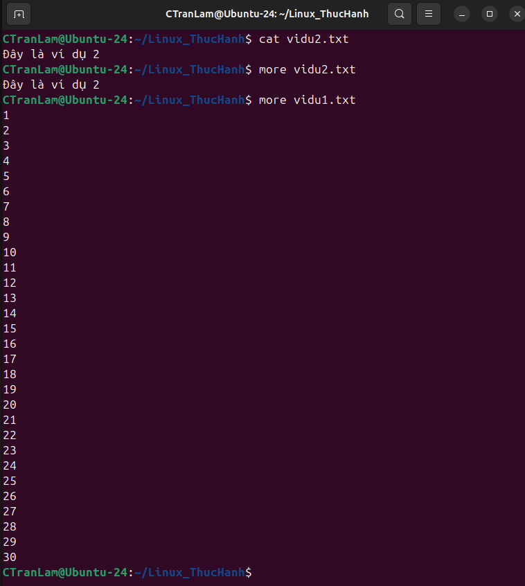
        
        
    - Sao chép, di chuyển, xóa:
        - `cp <nguồn> <đích>`: Sao chép file.
        - `cp -r <thư mục nguồn> <thư mục đích>` : Sao chép thư mục
        

        - `mv <nguồn> <đích>` : Di chuyển hoặc đổi tên file/thư mục
        - `rm [Options] <file>` : Xóa file
        - `rm -r <thư mục>` : Xóa toàn bộ thư mục
        - `mkdir <thư mục>` : Tạo thư mục mới
        - `rmdir [Options] <thư mục>` : Xóa thư mục rỗng
        - Một số Option như:
            - -f: Xóa không cần hỏi
            - -i: Hỏi trước khi xóa
            - -r: xóa thưu mục chứa nội dung bên trong
        ví dụ: rm -ir ThuMuc2

        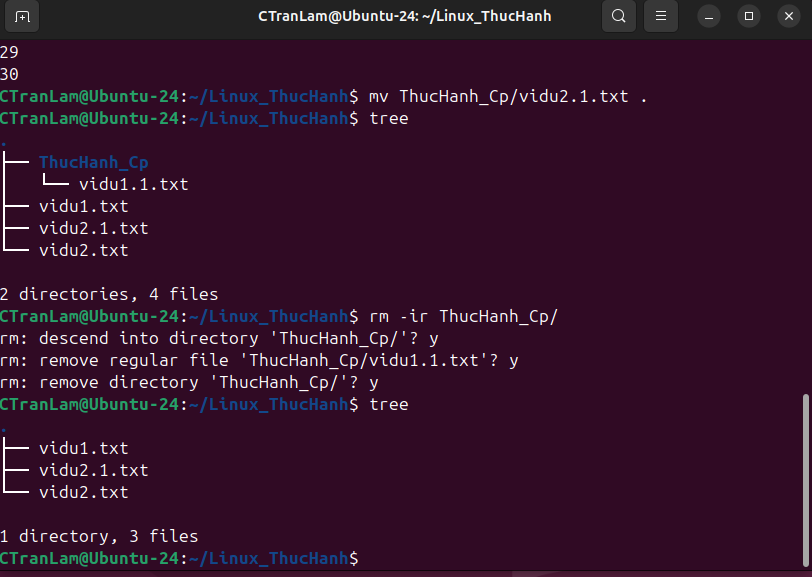

    - Nén và giải nén file/thư mục:
        - `tar Options <tên_file>`: Nén và giải nén bằng lệnh tar
            - Các tùy chọn phổ biến:
                - -c: Tạo ra 1 tệp tin nén mới
                - -x: Giải nén 1 tệp tin đã tồn tại
                - -f: Xác định tên của tập tin nén
                - -v: Hiển thị thông tin về quá trình làm việc
                - -z: sử dụng giải nén gzip khi tạo hoặc giải nén
                - -r: Thêm các tệp tin vào tệp tin nén đã tồn tại
                - ==> Có thể kết hợp nhiều option và đặt lại tại file nén:
                - ví dụ: tar -czvf filenen.tar.gz folder/
            - Minh họa:
                - Tạo 1  tên my_folder trong folder Linux_ThucHanh và thêm các file vào:
                    - 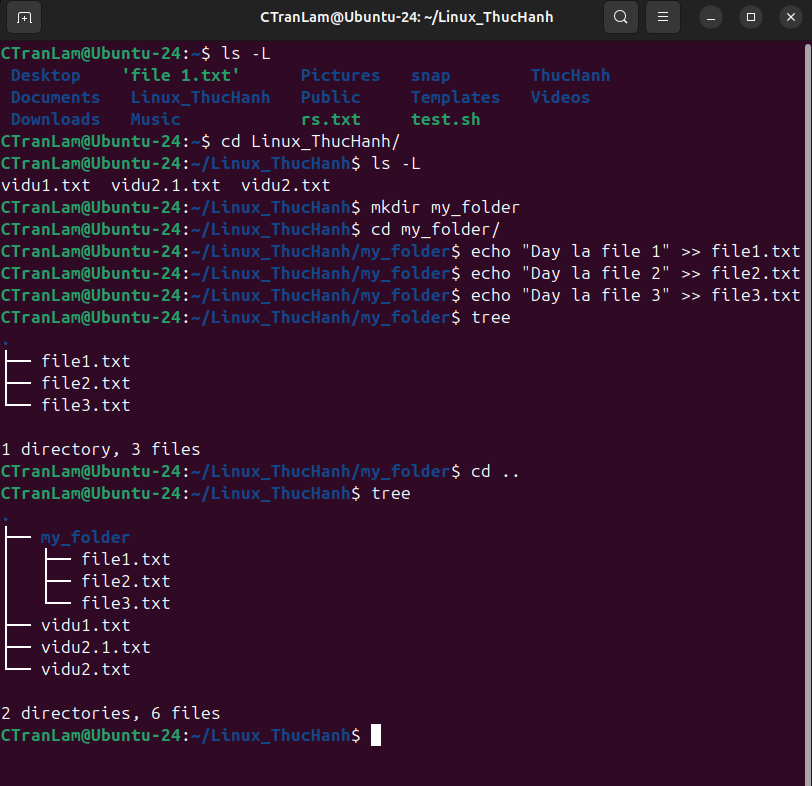
                - Nén my_folder bằng tar và đặt tên filenen.tar.gz:
                    - 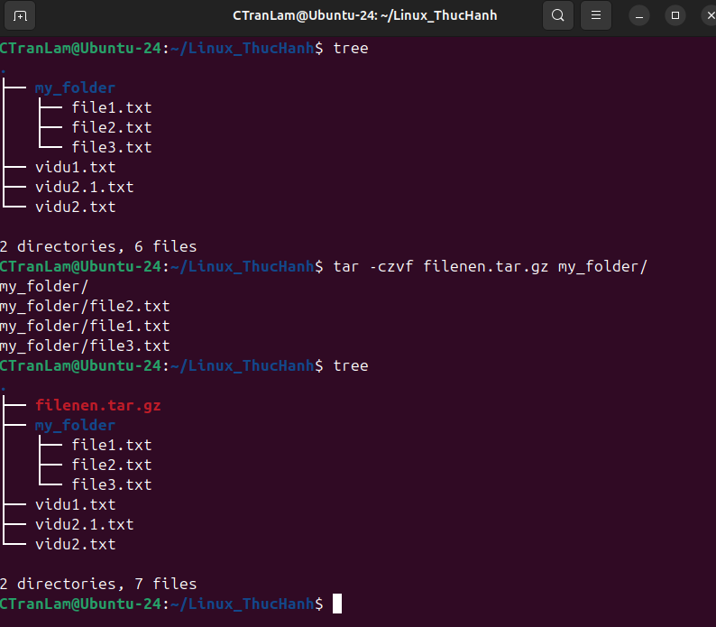
                - Giải nén và ghi đè:
                    - 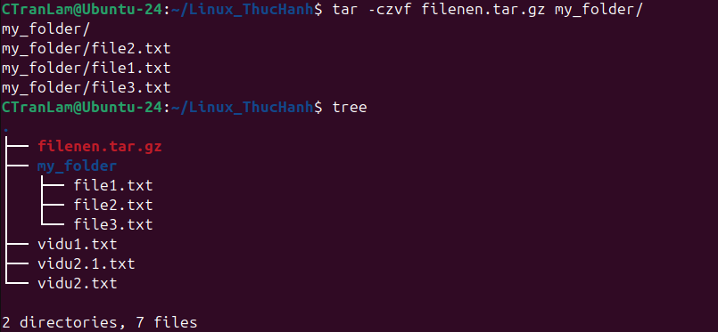
                - Giải nén và không ghi đè:
                    - 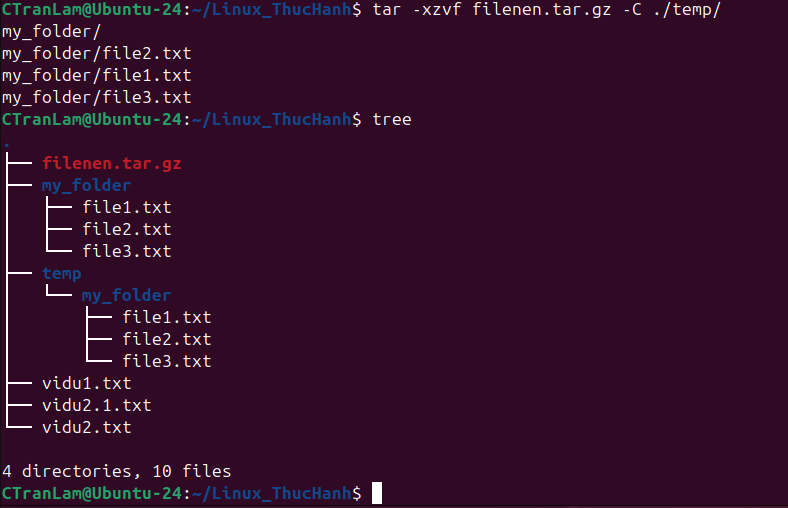

        - `gzip Options <tên_file>`: Nén gzip
            - Các tùy chọn:
                - -c, --stdout : In ra kết quả nén trên màn hình thay vì ghi đè nên tệp tin gốc
                - -d, --decompress: giải nén tệp tin được nén
                - -f, --force: bắt buộc nén tệp tin mà không hỏi lại người dùng
                - -r, --recursive: nén tất cả các tệp tin trong thư mục và các thư mục con
                - Ví dụ:
                    - Nén 2 file: gzip file1.txt file2.docx
                    - Nén 1 folder: gzip -r 
                - Minh họa nén file vidu1.txt:
                    - 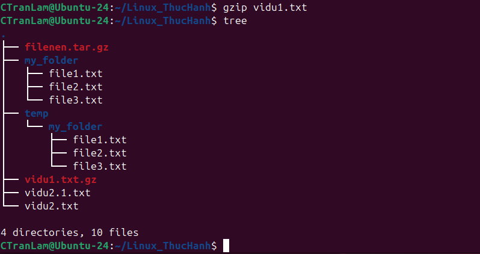

        - `gunzip Options <tên_file>`: Giải nén gunzip
            - Các tùy chọn:
                - -c, --stdout : In ra kết quả nén trên màn hình thay vì ghi đè nên tệp tin gốc
                - -f, --force: bắt buộc nén tệp tin mà không hỏi lại người dùng
                - -r, --recursive: nén tất cả các tệp tin trong thư mục và các thư mục con
                - Minh họa giải nén:
                    - 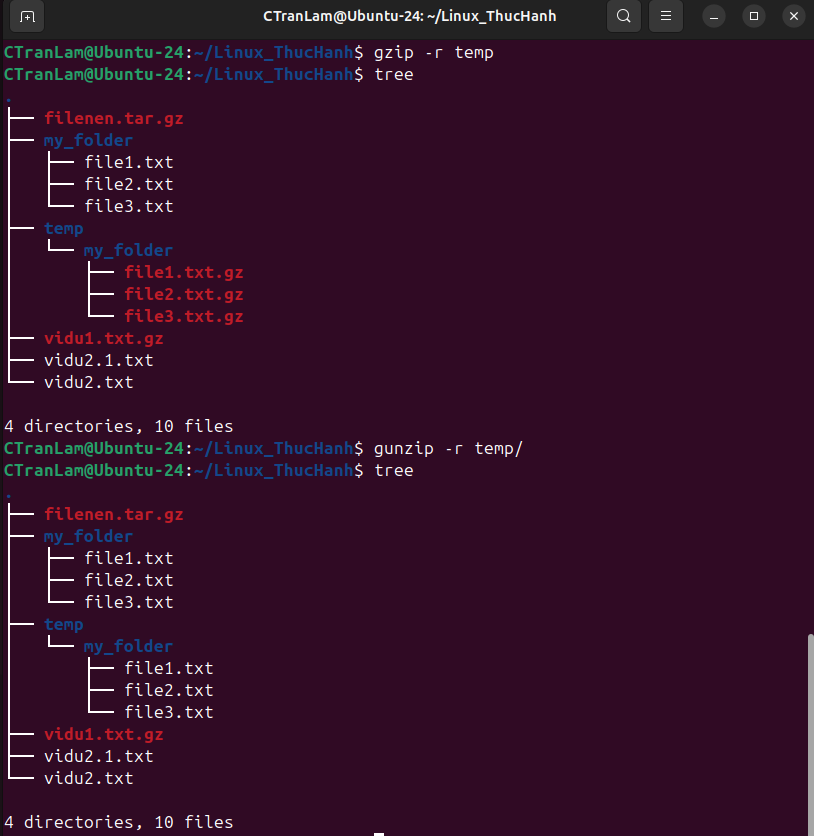

        - `zip -r file.zip <thư_mục>`: Nén thư mục thành .zip
        - `unzip file.zip`: giải nén file.zip
                - 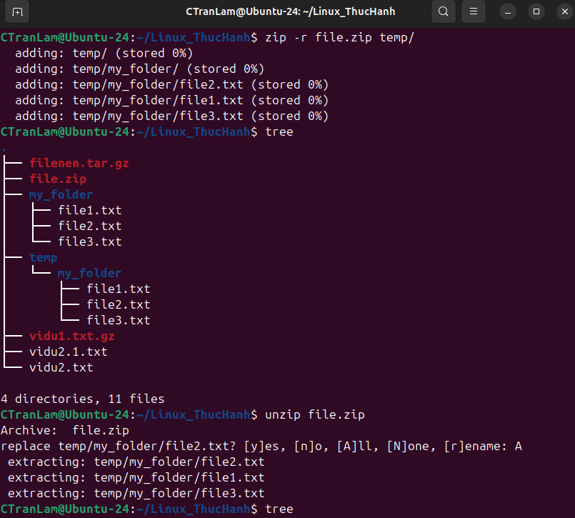

        - Phân biệt `tar`,`gzip`,`zip`:
            - `tar`: Chỉ gộp các file/thư mục nhưng không nén ==> dùng khi không muốn nén chỉ muốn gộp
            - `gzip`: Chỉ nén 1 file đơn lẻ để giảm dung lượng không gộp
            - `zip`: Vừa gộp vừa nén

    - Sao chép file qua mạng bằng `scp`:
        - `scp <file> user@host:/đường_dẫn>`: Sao chép file từ máy
        cục bộ sang máy từ xa
        - `scp user@host:/đường_dẫn ./`: Tải file từ máy từ xa về máy hiện tại
        
    - Khái niệm về luồng dữ liệu(stream): Trong Linux mọi thứ đều được coi là luồng dữ liệu
        - Luồng `stdin`: số hiệu 0, Dữ liệu nhập vào từ bàn phím
        - Luồng `stdout`: số hiệu 1, Dữ liệu xuất ra chuẩn
        - Luồng `stderr`: số hiệu 2, Xuất lỗi
    
9. Tìm kiếm file
    - Lệnh `find`:
        - `find [vị trí tìm] <điều kiện tìm>`
        - 1 số điều kiện tìm:
            - Tên: -name
            - Timestamp: -atime
            - Quyền: -perm mode
            - Kích thước: -size n
            - Group: -gid
            - User Id: -uid
            - Cấp thư mục con: -maxdepth levels
        - Ví dụ: tìm theo tên find 
            - 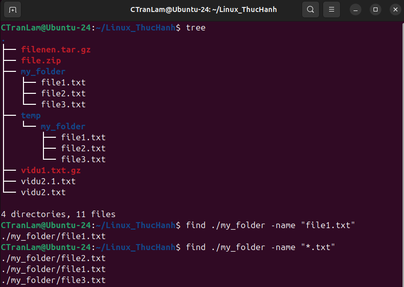

    - Lệnh `grep` và đường ống pipeline:
        - đường ống pipeline: dấu | trong linux đc sử dụng để kết nối đầu
        ra của 1 lệnh với đầu vào của một lệnh khác. 
        - grep: tìm kiếm chuỗi ký tự trong file hoặc thư mục
            - Cấu trúc lệnh:  `grep [Option] pattern [File]`
            - Các options thông dụng:
                - -c: đếm số lần xh của 1 string
                - -i: không phân biệt hoa thường
                - -v: lọc kết quả không khớp
                - -n: hiển thị số dòng của từ tìm kiếm trong file
        - Ví dụ: grep 'root' /etc/passwd, ls -l | grep "file*",...
        - Minh họa:
            - 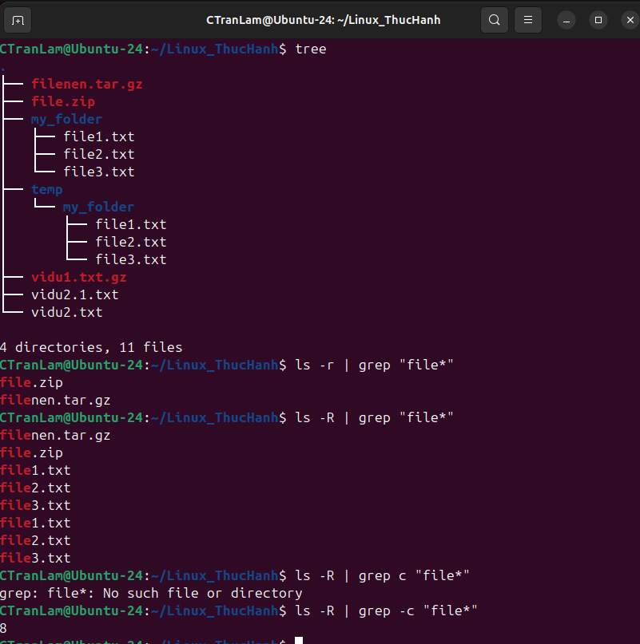
  
    - Lệnh `locate`: tìm file nhanh hơn (dựa trên database)
        - Dùng như sau:
            - bash
            - sudo apt install mlocate -y
            - sudo updatedb    
            - locate nginx.conf` 
        - Tốc độ nhanh hơn `find` rất nhiều, nhưng kết quả có thể chưa cập nhật file mới nếu bạn chưa `updatedb`


# Phần 4: Quyền truy cập và người dùng

10. Người dùng và nhóm(user & group):

- Linux có 2 loại tài khoản User đó là User hệ thống và User người dùng
    - `User hệ thống`: dùng để thực thi các module, script cần thiết phục vụ cho hệ điều hành
    - `User người dùng`: là những tài khoản login để sử dụng HDH. Trong các User thì User `root (super user)` là tài khoản quan trọng nhất, Tài khoản này được tự động tạo khi cài đặt linux, tài khoản này không thể đổi tên hoặc xóa bỏ. Nó có toàn quyền trên hệ thống, chỉ làm  việc với root khi muốn thực hiện công tác quản trị hệ thống

- Mỗi User có các đặc điểm sau:
    - Tên của mỗi User là duy nhất
    - Mỗi User có 1 mã định danh duy nhất uid
    - Mỗi User có thể thuộc về nhiều nhóm
    - tài khoản super user có UID = GID = 0

- Một số lệnh cơ bản:
    - `whoami`: Hiển thị tên User hiện tại
    - `id`: Hiển thị UID, GID
    - `sudo adduser`: Tạo người dùng
    - Minh họa: 
        - 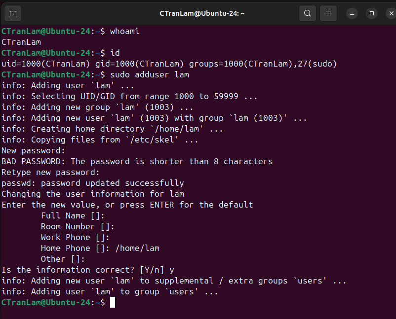

    - `sudo deluser`: Xóa người dùng
        - 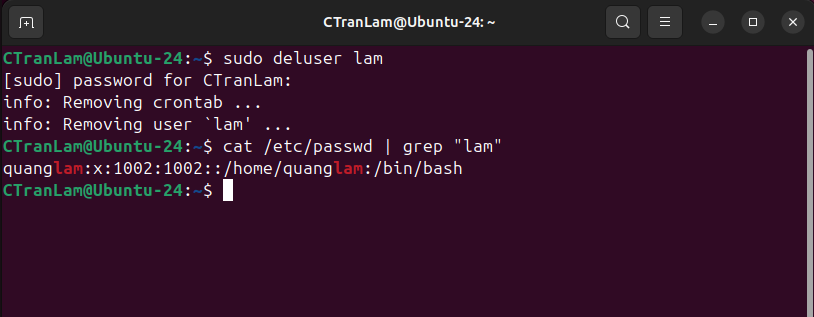

    - `su + Username`: Chuyển sang tài khoản khác
    - `cat /etc/passwd`: Xem danh sách toàn bộ user trên hệ thống
        - 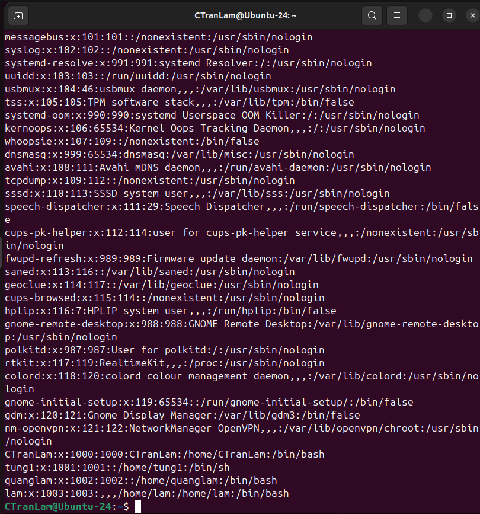
        - 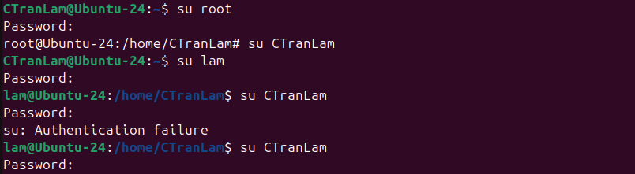

11. Phân quyền file
    - Phân quyền: giúp tăng mức độ an toàn, đảm bảo đúng trách nhiệm, quyền hạn của tưng user khi sử dụng tài nguyên trên máy
    - Quyền truy xuất trên thư mục và tập tin được trình bày khi thực hiện lệnh ls -l. ==> Vị trí đầu là cờ đặc tính, cứ 3 ký tự lần lượt là quyền của 1 
    - Minh họa:
        - 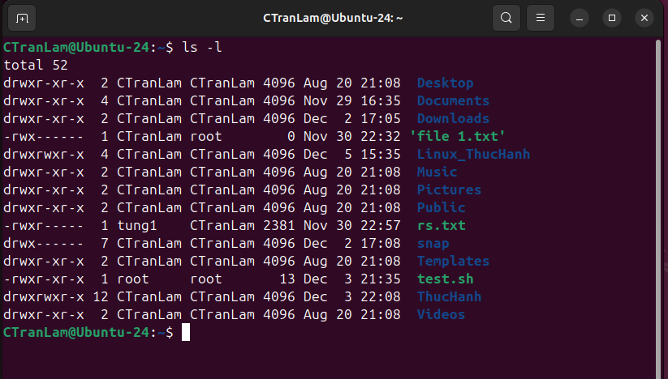

    - Quyền truy xuất gồm 3 nhóm:
        - Quyền của người sở hữu(u): là người tạo ra thư mục hoặc tập tin
        - Quyền của nhóm(g): nhóm người sử dụng được gán quyền
        - Quyền của những người khác(o): là những người không thuộc 2 loại trên

    - Biểu diễn quyền truy xuất: bằng chữ hoặc bằng số
        - Bằng chữ:
            - r : read
            - w : write
            - x : excute
            - _ : không có quyền
            - Ví dụ:
                - rwx : có toàn quyền
                - r__ : chỉ có quyền đọc
                - ___ : không có quyền gì
        - Bằng số:
                | Quyền | Giá trị |
                |--------|--------|
                |   r     |  4     |
                |   w     |   2    |
                |   x     |    1   |

            - Ví dụ:
                - rwx = 7 : có toàn quyền
                - rw_ = 6 : có quyền đọc và ghi
    
    - Lệnh `chmod`: Thay đổi quyền truy xuất trên thư mục/tập tin
        - Cấu trúc lệnh: `chmod [Options] Mode <file>`
        - Options:
            - -R : Áp dụng tới cả các thư mục con(đệ quy)
            - Mode: Quyền truy xuất mới trên tập tin. u, g, o ,a đại diện cho các nhóm. +, - , = lần lượt là thêm, rút bớt quyền và gán quyền
            - ví dụ:
                - g+w : thêm quyền ghi cho nhóm
                - o-rwx : loại bỏ tất cả các quyền của người dùng khác
                - o=x : chỉ cho phép thực thi với mọi người
                - a+rw : thêm quyền đọc ghi cho tất cả
        
        - Thực hành:
            - 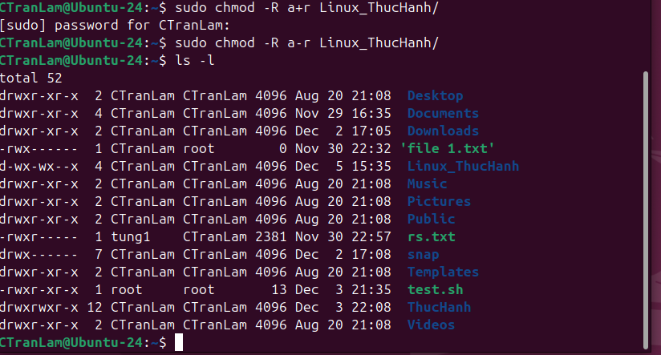    
            - 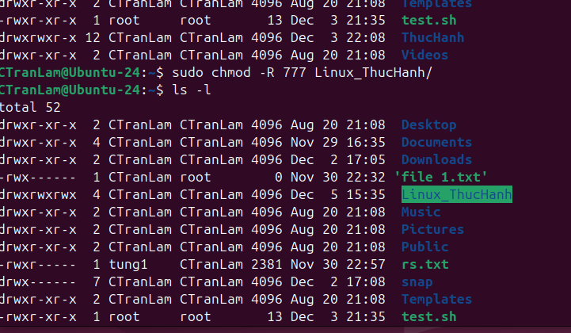

    - Lệnh `chown`: Thay đổi người sở hữu thư mục/tập tin
        - Cấu trúc lệnh: chown [Options] Owner file
        - Options:
            - -R: Áp dụng với thư mục làm cho lệnh chmod có tác dụng trên cả các thư mục con
            - Owner: Người sở hữu mới trên tập tin

         - Ví dụ: chuyển quyển sở hữu folder Linux_ThucHanh từ CTranLam sang root
            - 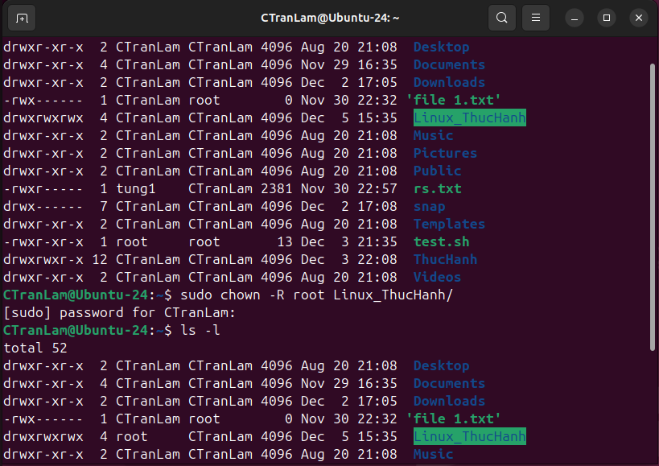
    
    - Lệnh `chgrp`: Thay đổi nhóm sở hữu tập tin
        - Cấu trúc lệnh: `chgrp [Options] Group file`
        - Options:
            - -R: Áp dụng đối với thư mục làm cho lệnh chmod có tác dụng trên cả các thư mục con
            - Group: Nhóm sở  hữu mới

        - Ví dụ: chuyển group của Linux_ThucHanh sang root
            - 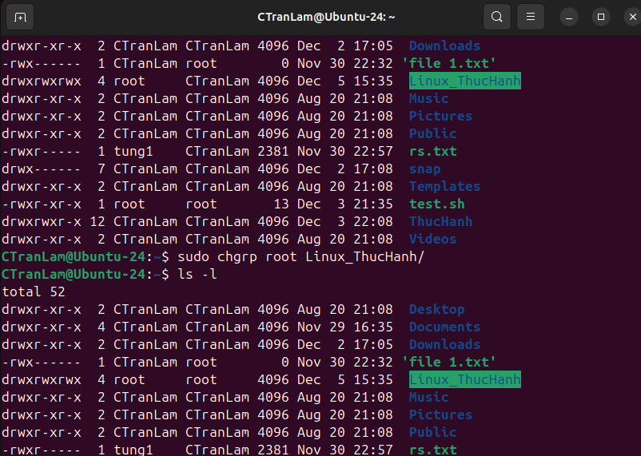

10. Quyền root và an toàn
    - Không nên chạy mọi thứ bằng root vì:
        - Không có giới hạn, mọi lệnh tác động trực tiếp lên hệ thống kể cả xóa file hệ thống, ghi đè cấu hình,.. đều được ==> dễ gây hỏng toàn bộ OS
        - Tăng rủi ro bảo mật, nếu 1 phần mềm hoặc 1 script chứa mã độc mà chạy quyền root nó sẽ toàn quyền kiểm soát máy
        - Không kiểm soát được nhật ký do các thao tác của root ít đc ghi lại log chi tiết như sudo
    
    - Phân biệt sudo và su:
        - sudo (substitute user do):
            - Cho phép chạy 1 lện với quyền của root
            - Yêu cầu user nằm trong nhóm đc cấp quyền sudoers
            - Mỗi lần chạy lệnh cần nhập mật khẩu của chính user
            - Các thao tác được ghi lại trong log
        
        - su (switch user):
            - Chuyển hẳn sang tài khoản khác (mặc định là root)
            - Cần nhập mật khẩu tài khoản mục tiêu
            - Sau khi chuyển sang root thì tất cả lệnh tiếp theo đều chạy với quyền root cho tới khi thoát
            - Ít ghi log hơn nen khó kiểm soát an toàn

# Phần 5: Quản lý tiến trình và hệ thống

13. Quản lý tiến trình (process)
    - Process là 1 chương trình đang chạy trong hệ điều hành
    - Mỗi tiến trình có các thuộc tính như:
        - PID (Process ID): mã định danh duy nhất của tiến trình
        - PPID (Parent Process ID): mã định danh duy nhất của tiến trình cha
        - Trạng thái tiến trình:
            - R (Running): đang chạy hoặc sẵn sàng chạy
            - S (Sleeping): tạm nghỉ, chờ sự kiện kết thúc
            - Z (Zombie): đã kết thúc nhưng chưa được thu dọn
            - T (Stopped): bị tạm dừng
        - Owner: người sở hữu tiến trình
        - CPU/RAM usage: tài nguyên tiến trình sử dụng

    - Các lệnh quán lý tiến trình:
        - `ps` : xem snapshot các tiến trình hiện tại
        - `ps aux` : xem toàn bộ tiến trình đang chạy trong hệ thống
            - 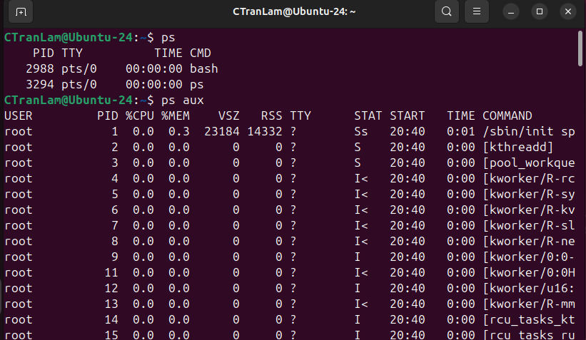
        
        - `top`: theo dõi tiến trình thời gian thực
            - 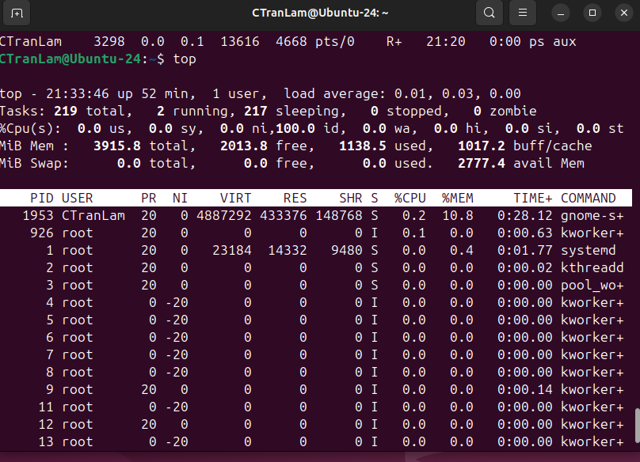

        - `htop`: top nâng cao có màu sắc
            - 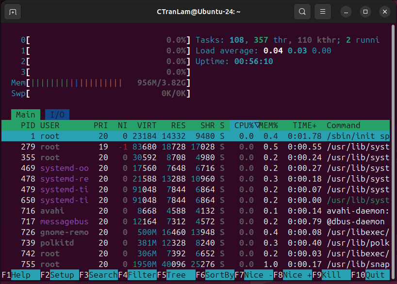

    - Dừng tiến trình: 
        - `kill <PID>` : Gửi tín hiệu dừng tiến trình theo PID
        - `kill -9 <PID>` : Buộc dừng ngay lập tức
        - `killall <tên_tiến_trình>` : Dừng tất cả các tiến trình cùng tên

    - Foreground và background process:
        - Foreground Process:
            - Chạy trực tiếp trên terminal
            - Chiểm terminal không gõ lệnh khác được
        - Background Process:
            - Chạy ẩn phía sau, terminal vẫn rảnh để tiếp tục thao tác

        - `command &`: Chạy tiến trình ở background
        - `jobs`: Xem danh sách job chạy nền
        - `fg %1`: Đưa 1 job lên foreground
        - `bg %1`: Đưa 1 job chạy tiếp ở background
        - `ctrl + z`: tạm dừng tiến trình và đưa thành job

14. Kiểm tra tài nguyên hệ thống
    - `df -h`: Kiểm tra dung lượng ổ đĩa
        - 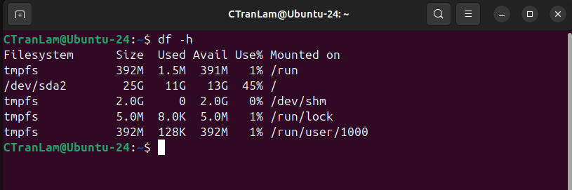

    - `du -sh <thư_mục>`: Kiểm tra dung lượng thư mục
        - 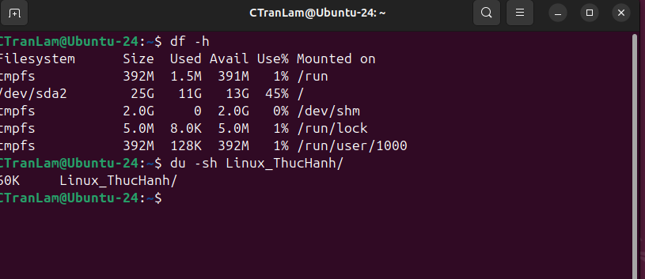

    - `free -h`: Kiểm tra RAM
        - 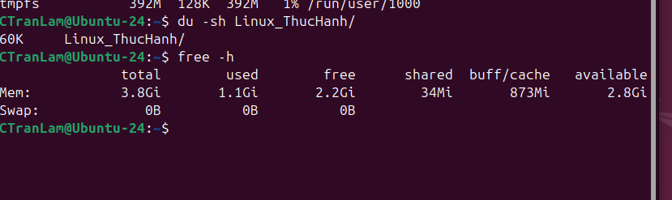

    - Các lệnh hệ thống khác:
        - `uptime` : thời gian hoạt động của hệ thống + tải CPU
        - `uname -a` : thông tin kernel + OS
            - 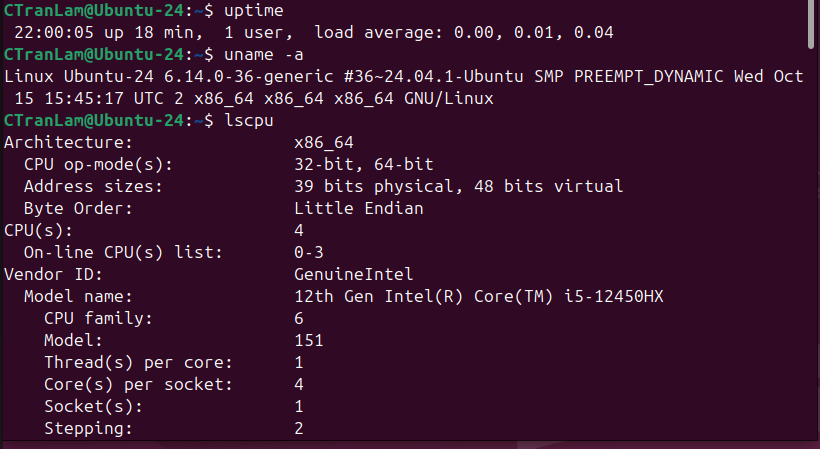

        - `lscpu` : thông tin CPU
        - `lsblk` : thông tin ổ cứng, phân vùng

15. Dịch vụ và tiến trình chạy nền (Daemon trong Linux)
    - Daemon:
        - Là tiến trình chạy nền liên tục
        - Thường bắt đầu khi máy khởi động

    - Service: là các daemon được quản lý bới systemd
        - Liệt kê toàn bộ service: `systemctl list-units --type=service`
        - 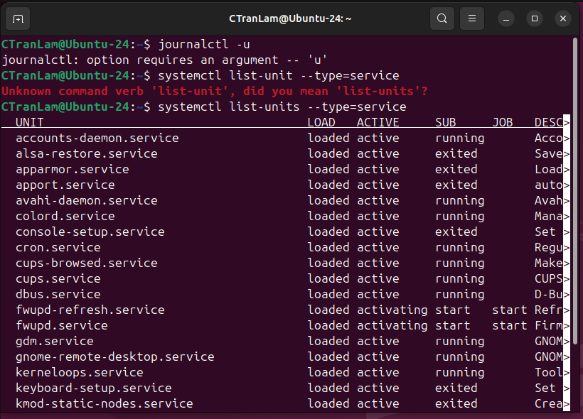

    - Các lệnh quan trọng của systemctl:
        - `systemctl start <service>`: khởi chạy dịch vụ
        - `systemctl stop <service>`: dừng dịch vụ
        - `systemctl restart <service>`: khởi động lại
        - `systemctl status <service>`: kiểm tra trạng thái
        - `systemctl enable <service>`: tự động bật khi boot
        - `systemctl disable <service>`: không bật khi boot
    - `journalctl -u <service>`: xem log dịch vụ 

# Phần 6: Quản lý gói phần mềm

16. Trình quản lý gói (Package Manager)
    - Debian / Ubuntu: `apt`, `apt-get`
    - Redhat/CentOS: `yum`, `dbf`

17. Cài đặt và gỡ bỏ phần mềm
    - Cập nhật danh sách gói: `sudo apt update`
        - 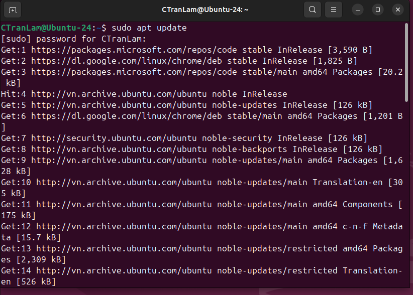

    - Nâng cấp phần mềm: `sudo apt upgrade`
        - 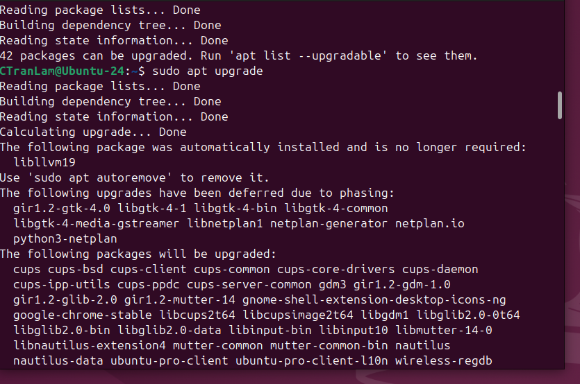

    - Cài đặt phần mềm: `sudo apt install <tên_phần_mềm>`
    - Gỡ bỏ phần mềm: `sudo apt remove <tên_phần_mềm>`
    - Kiểm tra gói đang cài đặt `dpkg -l`, `dpkg -l | grep <tên>`
        - 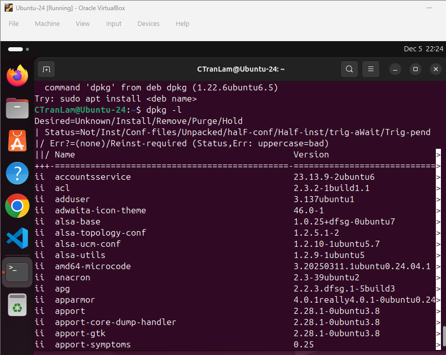

18. Tạo và sử dụng alias
    - Giúp tạo lệnh rút gọn cho những lệnh dài

    - Tạo alias tạm thời:
        - `alias ll='ls -alF'`: khi gõ ll hệ thống sẽ thực hiện `ls -alF`
        alias này sẽ mất khi đóng terminal

    - Tạo alias vĩnh viễn:
        - mở file cấu hình shell: ~/.bashrc
        - thêm dòng: alias ll='ls -alF'
        - Lưu lại rồi tải lại file: source ~/.bashrc

# Phần 7: Làm việc với mang (Networking)

19. Lệnh kiểm tra mạng:
    - `ping`: kiểm tra kết nối đến 1 host
        - Kiểm tra kết nối tới gg
            - 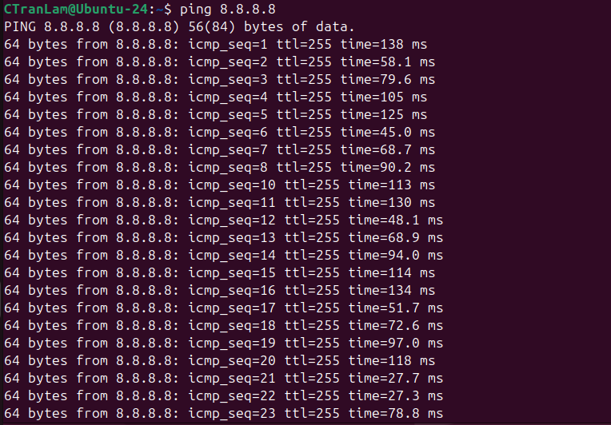

    - `ifconfig` và `ip addr`: hiển thị thông tin mạng
        - 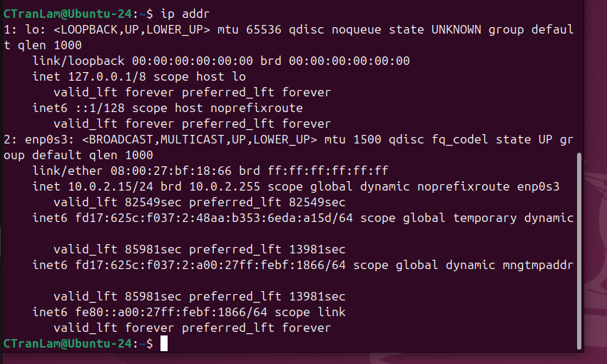

    - `nestat` và `ss -tuln`: Kiểm tra kết nối mạng, port, routing
        - 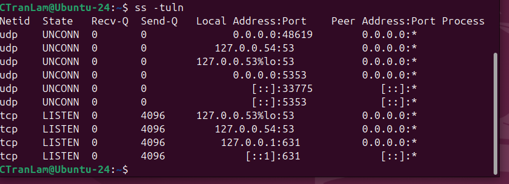

    - `curl <url>`: gửi request HTTP, kiểm tra API
        - 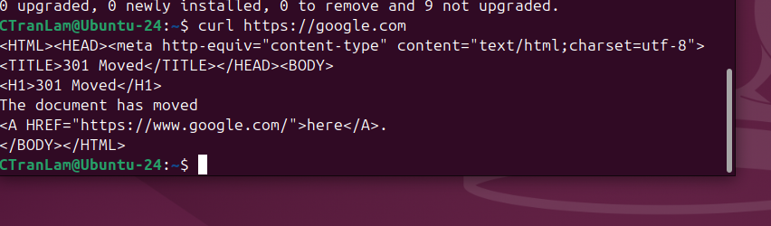

    - `wget <url>`: tải file từ internet

20. Kết nối SSH và truyền file
    - `ssh user@ip` : Kết nối tới máy chủ từ xa
    - Truyền file an toàn giữa 2 máy qua SSH, ví dụ: `scp file.txt 
    user@ip_server:/home/user/`: sao chép file.txt sang thư mục /home/
    user/ của máy đích
    - `rsync`: công cụ đồng bộ dữ liệu thông minh hơn `scp` (chỉ sao chép 
    phần thay đổi)

    - Thiết lập SSH key:
        - `ssh-keygen` : tạo ssh key
        - `ssh-copy-id user@ip` : copy public ket lên server
        - `ssh user@ip` : SSH không cần mật khẩu
        - Thực hành:
            - 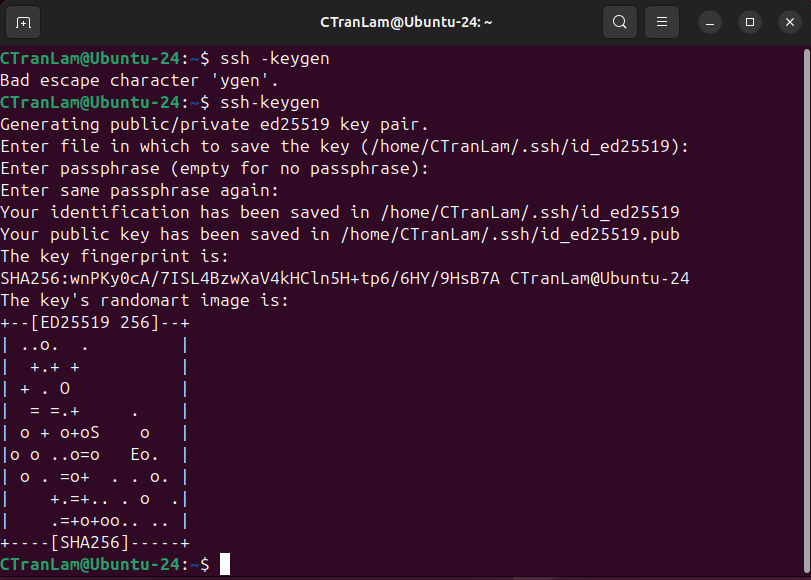
            - 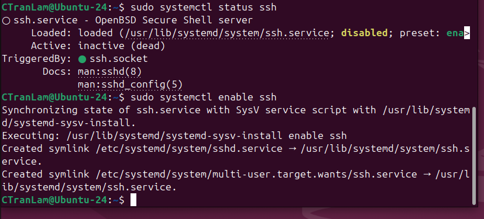
            - 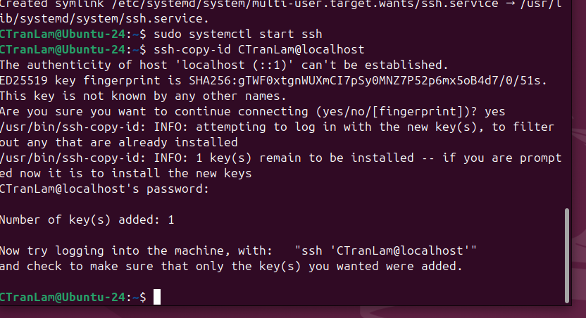
            - 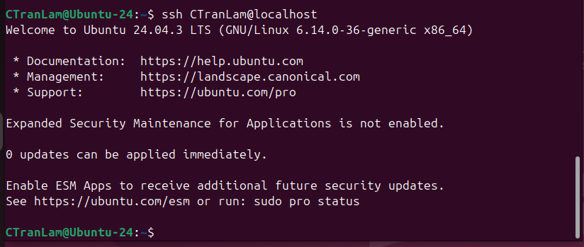

21. Kiểm tra cổng và firewall
    - `ss -tuln`: Kiểm tra cổng đang mở
    - Cấu hình firewall:
        - Bật firewall: `sudo ufw unable`
            - ví dụ: `sudo ufw allow 22`, `sudo ufw deny 80`,...
            - 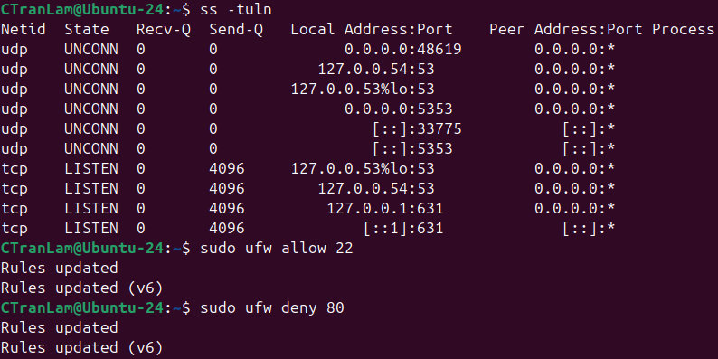

        - Kiểm tra trạn thái firewall: `sudo ufw status`
        - Xem tất cả rule firewall hiện có: `sudo iptables -L -n -v`
            - 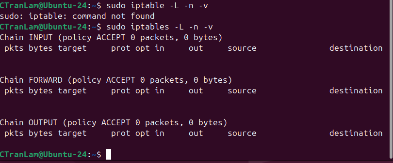
    
# Phần 8: Script & Automation cơ bản

22. Shell 
    - Shell Script là tập hợp các lệnh Linux được viết trong một file 
    `.sh` để chạy tự động thay vì gõ từng lệnh bằng tay.
    - Định dạng file script:
        - phần đầu luôn có dòng: `#!/bin/bash`
    - Cách chạy script:
        - Chạy bằng bash: `bash script.sh`
        - Hoặc cấp quyền chạy và chạy trực tiếp:
            - `chmod +x script.sh`
            - `./script.sh` 
         
    - Lệnh nhập xuất:
        - Xuất dữ liệu : `echo`
        - Nhập dữ liệu : `read`
            - `-p`: chỉ định 1 câu thông báo
            - `-s`: nhập mật khẩu không hiển thị trên terminal
            - `-a`: đọc và lưu dữ liệu vào mảng
        
    - Các phép toán so sánh:

        |   ký hiệu |   ý nghĩa |
        |-----------|-----------|
        | `-eq`|    bằng nhau   |
        |   `-ne`|  không bằng nhau |
        |   `lt` |  nhỏ hơn |
        |   `-gt`   |   lớn hơn |
        |   `-le`   |   lớn hơn hoặc bằng   |
        |   `-ge`   |   lớn hơn hoặc bằng   |
    
    - Một số biến môi trường quan trọng:
        - `$USER` – tên user hiện tại
        - `$HOME` – thư mục home
        - `$PWD` – thư mục hiện tại
        - `$PATH` – danh sách path chứa executable
        - `$HOSTNAME`: tên máy chủ

    - Câu điều kiện `if`:
        ```bash
        if [ ... ]; then
		    code
	    else if [ ... ]; then
		    code
	    else
		    code
	    fi
        ```
    -  Vòng lặp `for`:
        ```bash
        for i in {1..n}; do
			code
		done
        ```
    - Vòng lặp `while`:
        ```bash
        count=1
		while [ $count -le n]; do
			code
			((count++))
		done 
        ```

24. Tự động hóa tác vụ:
    - Cron job trong hệ điều hành Linux là một công cụ giúp lên lịch 
    thực thi các tác vụ tự động vào một thời điểm cụ thể
    
    - Cronjob của Linux được quản lý ở file: /etc/crontab

    - Một số câu lệnh: 
        - `crontab -l`: list tất cả cronjob của user hiện tại
        - `sudo crontab -l`: list tất cả cronjob của user root
        - `crontab -e` hoặc `sudo crontab -e`: edit một cronjob

# Phần 9: Thực hành tổng hợp

- Tạo user mới và cấp quyền hạn chế:
    - đã thực hành ở phần 4

- Tạo và nén backup thư mục:
    - đã thực hành ở phần 3

- Cấu hình SSH và kiểm tra kết nối:
    - đã thực hành ở phần 7

- Dò tìm file lớn nhất trong thư mục home:
    - đã thực hành ở phần 3

- Viết Scrip tự động sao lưu log hệ thống hàng ngày
    - 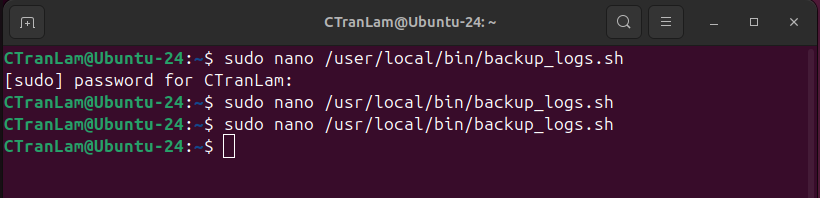
    - 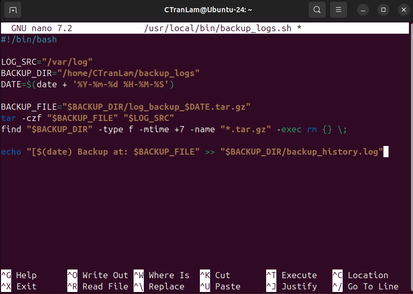
    - 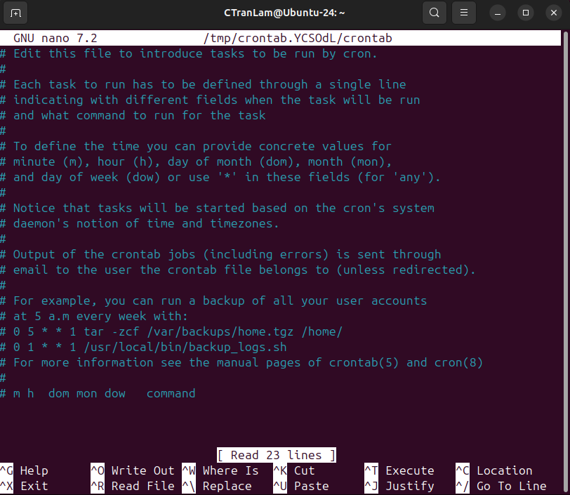
    - 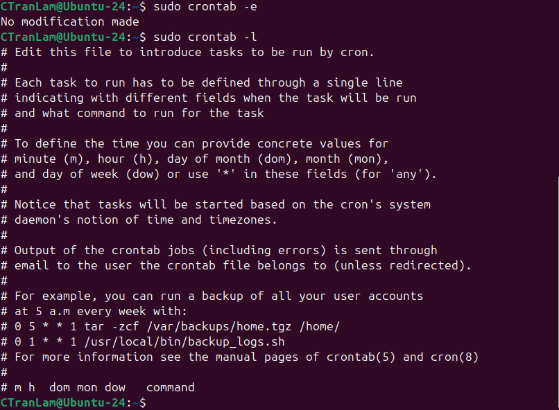

