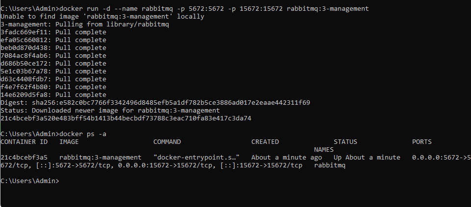

## Báo cáo Backend Week 4

# I. Tìm hiểu về Message Queue

1. 
    - Khái niệm: `Message Queue - MQ` là một cơ chế trung gian cho 
    phép
    các service giao tiếp với nhau thông qua việc gửi và nhận message
    một cách bất đồng bộ.
    - Hiểu 1 cách đơn giản Queue (hàng đợi) chứa Message(thông tin)
    giống như hòm thư

    - Một hệ thống Message Queue thường có những thành phần sau:
        - `Message`: Thông tin được gửi có thể là text, binary hoặc
        JSON
        - `Message Queue`: Nơi chứa những message, cho phép producer 
        và consumer có thể trao đổi với nhau
        - `Producer`: Service tạo ra message và đưa message vào 
        message queue 
        - `Consumer`: Service nhận message từ message queue và xử lý
        - `Channel`: Là cơ chế truyền thông tin giữa Producer và 
        Consumer thông qua Message Queue (Một số MQ không có)
        - `Broker`: Xử lý message và quản lý message queue để đảm bảo 
        Producer và Consumer truyền thông tin được cho nhau. Broker 
        giúp định tuyến thông tin, quản lý tình trạng của hành đợi, 
        và đảm bảo rằng thông tin được chuyển giao đúng các
        - Một service có thể vừa là producer và consumer

        - 

    - Hoạt động theo mô hình `Producer -> Queue -> Consumer`
        - Điểm cốt lõi của mô hình là nó tách biệt các service, 
        Producer không cần chở Consumer xử lý.
        
        - 

        - Ví dụ: Gửi email đăng ký tài khoản, hệ thống cần gửi email xác nhận
            - Khi không sử dụng MQ: Producer và Consumer gắn chặt với nhau, Producer(Service đăng ký) phải tự gửi email, xử lý 
            xong toàn bộ mọi việc rồi mới trả về kết 
            
            - Khi sử dụng MQ: Producer và Consumer tách rời nhau, 
            Producer(Auth Service) chỉ cần đẩy 1 message vào queue, 
            không chờ Consumer gửi email mà nó sẽ phản hồi lại ngay 
            cho User ví dụ : "Đăng ký thành công! Vui lòng kiểm tra 
            email". Consumer (Email Service) có thể lấy message từ 
            queue bất cứ lúc nào, xử lý gửi email riêng không ảnh 
            hưởng tới request của 
            
2. Những lý do cần sử dụng MQ
    - Ưu điểm:
        - `Bất đồng bộ`: Message Queue hỗ trợ truyền thông điệp giữa các thành phần mà không đòi hỏi chúng phải chờ đợi nhau. Nó giúp cải thiện hiệu suất và tăng tính mở rộng của hệ thống

        - `Chia nhỏ hệ thống`: Các service chỉ giao tiếp qua mesage -> giảm sự phụ thuộc

        - `Chống quá tải hệ thống`: Khi lượng request tăng cao MQ đóng vai trò như 1 lớp đệm để không làm cho hệ thống sập, nó chỉ giao cho consumer 1 số lượng request trong khả năng sử lý của DB còn lại sẽ chờ ở trong queue 

        - `Đảm bảo an toàn dữ liệu`: Do message được lưu trong queue, khi 1 service xử lý nhưng bị lỗi, ta không lo mất data vì có thể thấy message trong queue ra và retry

    - Những Message Queue phổ biến:
        - `RabbitMQ`
        - `Kafka`
        - `Redis Stream`
        - `AWS SQS`
        - `MSMQ - Microsoft Message Queuing`
        - `RocketMQ`

# II. Implement
 
1. RabbitMQ
    - RabbitMQ là message broker hỗ trợ AMQP - Advance Message 
    Queuing Protocol giao thức tiêu chuẩn để truyền message

    - 

    - Kiến trúc của `RabbitMQ`:
        - `Producer`: Ứng dụng gửi message vào RabbitMQ
        - `Consumer`: Ứng dụng nhận và xử lý message
        - `Queue`: Nơi message được lưu trữ tạm thời
        - `Message`: Dữ liệu được truyền từ producer -> consumer
        - `Connection`: Một kết TCP giữa ứng dụng và RabbitMQ broker
        - `Channel`: Một kết nối ảo trong 1 Connection, việc
        publishing hoặc consuming từ một queue đều được thực hiện trên channel.

        - `Exchange`: Là nơi nhận message được publish tử Producer và đẩy chúng vào queue dự trên quy tắc của từng loại Exchange

        - `Bingding`: Đảm bảo nhận nhiệm vụ liên kết giữa Exchane và Queue

        - `Routing Key`: Một key mà Exchange dựa vào đó để quyết định cách để định tuyến message đến queue. Hiểu nôm na, Routing key là địa chỉ dành cho 
        
        - `AMQP - Advance Message Queuing Protocol`: Giao thức tiêu chuẩn để truyền message

        - `User`: Tài khoản truy cập RabbitMQ, gán quyền theo vhost

        - `Virtual host - vhost`: Không gian logic để tách queue/exchange giữa nhiều ứng dụng khác nhau

        - 

    - Các loại Exchange:
        - Direct Exchange: 
            - Định tuyến message đến queue dựa trên sự 
            khớp chính xác giữa routing key của message và routing key 
            của queue binding. Là loại exchange đơn giản nhất, thường dùng gửi đến đúng 1 key, nhưng nhiều nhiều queue dùng 1
            routing key => nó cũng trở thành multicast

            - Cách hoạt động:
                - Queue được blind tới Direct Exchane với 1 routing key K
                - Producer gửi message với routing key R vào exchange
                - Exchange so sánh R và K:
                    - Nếu R = K: message được chuyển vào queue đó
                    - Nếu R != K: queue sẽ không được nhận
            
        - Fanout Exchange:
            - Gửi message đến tất cả các queue được blind, bỏ qua
            routing key. 
            - Cách hoạt động:
                - 1 Fanout Exchange có thể bind với nhiều queue
                - Khi producer gửi message ==> tất cả queue được
                blind đều nhận được 

        - Topic Exchange:
            - Định tuyến message dựa trên pattern khớp giữa routing   key của message và blind key của queue. Dùng cho routing phức tạp, linh hoạt hơn direct exchange
            - Có thể sử dụng ký tự đại diện: * - khớp 1 phần tử trong 
            routing key; # - khớp 0 hoặc nhiều phần tử
            - Cách hoạt động:
                - Queue bind với topic exchange bằng 1 pattern
                - Message gửi đến exchange với routing key
                - Nếu routing key khớp với pattern ==> message được chuyển vào queue

        - Headers Exchange:
            - Định tuyến dựa trên header trong message, không dựa vào routing key. Phù hợp khi routing dựa trên nhiều thuộc tính phức tạp
            - Cách hoạt động:
                - Queue bind với header exchange bằng 1 hoặc nhiều cặp key-value
                - Message gửi kèm header
                - Nếu header của message khớp với header queue => 
                message được gửi vào queue

2. Implement use caase trong project đang làm sử dụng RabbitMQ

    - Trường hợp gửi email lấy mã otp để đổi mật khẩu

    - B1 Sử dụng docker để tải môi tường RabbitMQ về:
        - 


    - B2 Thêm dependency vào project:
        ```xml
        <dependency>
            <groupId>org.springframework.boot</groupId>
            <artifactId>spring-boot-starter-amqp</artifactId>
        </dependency>
        ```
    - B3 Thêm cấu hình vào properties:
        ```
        spring:
            rabbitmq:
                host: localhost
                port: 5672
                username: guest
                password: guest
        ```

    - B4 Cấu hình RabbitMQ:
        ```java
        @Configuration
        public class RabbitMQConfig {

            public static final String QUEUE_NAME = "bookingcare_queue";
            public static final String EXCHANGE_NAME = "bookingcare_exchange";
            public static final String ROUTING_KEY = "bookingcare_routingkey";

            @Bean
            public Queue queue() {
                return new Queue(QUEUE_NAME, true);
            }

            @Bean
            public DirectExchange exchange() {
                return new DirectExchange(EXCHANGE_NAME);
            }

            @Bean
            public Binding binding(Queue queue, DirectExchange exchange) {
                return BindingBuilder.bind(queue).to(exchange).with(ROUTING_KEY);
            }

            // JSON converter
            @Bean
            public Jackson2JsonMessageConverter jackson2JsonMessageConverter() {
                return new Jackson2JsonMessageConverter();
            }

            // RabbitTemplate dùng JSON converter
            @Bean
            public RabbitTemplate rabbitTemplate(ConnectionFactory connectionFactory) {
                RabbitTemplate template = new RabbitTemplate(connectionFactory);
                template.setMessageConverter(jackson2JsonMessageConverter());
                return template;
            }

            // Listener container factory dùng JSON converter
            @Bean
            public SimpleRabbitListenerContainerFactory rabbitListenerContainerFactory(
                    ConnectionFactory connectionFactory
            ) {
                SimpleRabbitListenerContainerFactory factory = new SimpleRabbitListenerContainerFactory();
                factory.setConnectionFactory(connectionFactory);
                factory.setMessageConverter(jackson2JsonMessageConverter());
                return factory;
            }
        }
        ```

    - B5 DTO gửi qua RabbitMQ:
        ```java
        @Data
        @AllArgsConstructor
        @NoArgsConstructor
        public class EmailMessageDTO {
            private String to;
            private String subject;
            private String content;
        }

        ```
    - B6 Producer gửi message:
        ```java
        @Service
        @RequiredArgsConstructor
        public class EmailProducerService {

            private final RabbitTemplate rabbitTemplate;

            @Async
            public void sendEmailAsync(EmailMessageDTO emailMessageDTO) {
                rabbitTemplate.convertAndSend(
                        RabbitMQConfig.EXCHANGE_NAME,
                        RabbitMQConfig.ROUTING_KEY,
                        emailMessageDTO
                );
            }
        }
        ```
    
    - B7 Consumer - Nhận message và gửi email:
        ```java
        @Component
        public class EmailConsumer {

            private final IEmailService emailService;

            public EmailConsumer(IEmailService emailService) {
                this.emailService = emailService;
            }

            @RabbitListener(
                    queues = RabbitMQConfig.QUEUE_NAME,
                    containerFactory = "rabbitListenerContainerFactory"
            )
            public void handleEmailMessage(EmailMessageDTO dto) {
                System.out.println("Received email to: " + dto.getTo());
                emailService.sendEmail(dto.getTo(), dto.getSubject(), dto.getContent());
            }
        }
        ```
    - B8 Service gửi email:
        ```java
        @Service
        @RequiredArgsConstructor
        public class EmailServiceImpl implements IEmailService {

            private final JavaMailSender mailSender;

            @Async
            @Override
            public void sendEmail(String to, String subject, String content) {
                SimpleMailMessage message = new SimpleMailMessage();
                message.setTo(to);
                message.setSubject(subject);
                message.setText(content);
                message.setFrom("tql213598@gmail.com");
                mailSender.send(message);
            }
        }
        ```

    - B9 API gọi Producer:
        ```java
        @PostMapping("/forgot-password")
        public ResponseEntity<?> sendOtp(@RequestBody Map<String, String> request) {
            String email = request.get("email");

            if (email == null || email.isEmpty()) {
                return ResponseEntity.badRequest()
                        .body(Map.of("message", "Email không được để trống"));
            }

            try {
                userService.sendOtp(email);
                return ResponseEntity.ok(Map.of("message", "OTP đã được gửi đến email của bạn"));
            } catch (NoSuchElementException e) {
                return ResponseEntity.status(HttpStatus.NOT_FOUND)
                        .body(Map.of("message", "Email không tồn tại"));
            }
        }
        ```
    - Flow tổng thể: Client gọi API sendOTP ==> OTP được lưu vào DB 
    ngay ==> Producer gửi EmailMessageDTO vào RabbitMQ ( bất đồng bộ)
    ==>Client nhận response ngay mà không cần chờ email gửi xong ==>
    Consumer nhận message và gọi EmailService gửi OTP qua Gmail

    - Xem video demo và project được đính kèm để có cái nhìn rõ hơn nữa

3. Lưu ý khi sử dụng MQ
    - Khi triển khai hệ thống dựa trên **Message Queue** như RabbitMQ,
    cần chú ý các vấn đề quan trọng để đảm bảo độ tin cậy, tránh lỗi,
    và duy trì tính nhất quán.

    - Tính bất biến khi thực thi nhiều lần:
        - Vấn đề: Message có thể được gửi hoặc nhận nhiều lần do retry, network failure hoặc consumer crash.
        - Giải pháp: Consumer nên thiết kế **idempotent**, nghĩa là xử lý message nhiều lần vẫn cho kết quả giống nhau.

        - Ví dụ:
            ```java
            @RabbitListener(queues = RabbitMQConfig.QUEUE_NAME)
            public void handleEmailMessage(EmailMessageDTO dto) {
                // Kiểm tra OTP đã gửi chưa
                if (!otpAlreadySent(dto.getTo(), dto.getContent())) {
                    emailService.sendEmail(dto.getTo(), dto.getSubject(), dto.getContent());
                    markOtpAsSent(dto.getTo(), dto.getContent());
                }
            }
            ```
    - Duplicate messages (message trùng lặp):
        - RabbitMQ không đảm bảo mỗi message chỉ được nhận 1 lần
        - Consumer cần xử lý duplicate để tránh gửi email hoặc ghi dữ liệu nhiều lần
        - Ví dụ:
            - Lưu message ID hoặc OTP trong DB
            - Trước khi thực hiện hành động, kiểm tra đã xử lý chưa
            - Nếu đã xử lý, bỏ qua

    - Message ordering (thứ tự message):
        - RabbitMQ không đảm bảo thứ tự message khi có nhiều consumer
        - Nếu thứ tự quan trọng (ví dụ: update trạng thái OTP) nên:
            - Dùng single consumer cho queue
            - Thêm sequence number trong message để consumer sắp xếp trước khi xử lý

    - Message persistence (bền vững của message):
        - Để message không bị mất khi RabbitMQ crash:
            - Queue phải durable (new Queue("queueName", true))
            - Message phải persistent (MessageProperties.PERSISTENT_TEXT_PLAIN)
            ```java
                rabbitTemplate.convertAndSend(
                    RabbitMQConfig.EXCHANGE_NAME,
                    RabbitMQConfig.ROUTING_KEY,
                    dto,
                    message -> {
                        message.getMessageProperties().setDeliveryMode(MessageDeliveryMode.PERSISTENT);
                        return message;
                    }
                );
            ```
    - Retry và Dead Letter Queue (DLQ):
        - Nếu consumer xử lý lỗi, RabbitMQ có thể retry message nhiều lần.
        - Sử dụng Dead Letter Queue để lưu các message lỗi, tránh retry vô hạn.    

    - Monitoring và alert:
        - Giám sát queue length, consumer health, message age.
        - Khi queue backlog tăng hoặc message quá lâu chưa xử lý => trigger alert để xử lý kịp thời.

        
