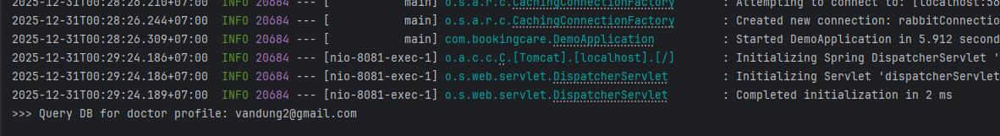

## Week 5: Caching & Redis

# I. Tìm hiểu về Caching & Redis

1. Caching là gì?

- Caching là kỹ thuật lưu trữ tạm thời (temporary storage) các dữ liệu thường xuyên được truy cập vào một vùng nhớ trung gian (cache) nhằm giảm thời gian truy xuất dữ liệu và giảm tải cho hệ thống backend.

- Cache có thể tồn tại ở nhiều tầng:
    - Client-side (Browser cache)
    - Server-side (Application cache)
    - Distributed cache (Redis, Memcached)
    - CDN (Content Delivery Network)

- Luồng hoạt động cơ bản của cache: Client -> Cache -> Database
- Cache hit: dữ liệu tồn tại trong cache, trả về ngay
- Cache miss: cache không có dữ liệu, truy vấn database rồi lưu lại vào cache

2. Vì sao cần Caching/Redis ?

- Khi không sử dụng cache/redis:
    - Database phải xử lý toàn bộ request
    - Thời gian phản hồi (latency) cao
    - Khó mở rộng khi lượng người dùng tăng
    - Chi phí hạ tầng lớn

- Khi sử dụng caching/redis:

    | Lợi ích | Mô tả |
    |-------|------|
    | Tăng hiệu năng tốc độ phản hồi | Truy xuất RAM nhanh hơn DB rất nhiều |
    | Giảm tải database| Hạn chế query lặp lại |
    | Cải thiện UX, xử lý dữ liệu real-time | Response nhanh |
    | Dễ scale | Phù hợp hệ thống lớn |
    | Giảm chi phí | Ít tài nguyên backend |

3. Các chiến lược Caching phổ biến ? 

- Cache-Aside(Lazy loading)- phổ biến nhất:
    - Các bước hoạt động:
        - B1: Ứng dụng đọc cache trước
        - B2: Nếu cache miss thì đọc DB
        - B3: Lưu dữ liệu vào cache
        - B4: Trả kết quả cho client

    - Ưu điểm:
        - Đơn giản, dễ triển khai
        - Cache chỉ chứa dữ liệu cần thiết
        - Kiểm soát được logic cache
    
    - Nhược điểm:
        - Cache miss mất lần đầu
        - Dữ liệu có thể bị sai nếu DB thay đổi mà không xóa cache

    - Khi dùng:
        - Hệ thống đọc nhiều, ghi ít
        - API, service BE
        - Redis + DB(MySQL, PostgreSQL)

- Read-Through Cache:
    - Cách hoạt động:
        - Ứng dụng chỉ đọc cache
        - Cache tự động lấy dữ liệu từ DB nếu miss
        - Client -> APP -> Cache -> DB nếu miss

    - Ưu điểm: 
        - Code nhanh gọn
        - Dữ liệu cache nhất quán hơn

    - Nhược điểm:
        - Cache phụ thuộc chặt vào DB khó tùy biến logic

    - Khi dùng:
        - cache middleware/ framework hỗ trợ
        - Hệ thống enterprise

- Write-Through Cache:
    - Cách hoạt động: Ghi dữ liệu vào cache và DB cùng lúc
    
    - Ưu điểm:
        - Cache luôn đồng bộ với DB
        - Đọc rất nhanh, ít cache miss 

    - Nhược điểm:
        - Ghi chậm hơn
        - Cache chứa cả dữ liệu ít dùng

    - Khi dùng:
        - Cần dữ liệu nhất quán cao
        - Tần suất đọc lớn

- Write-Back Cache:
    - Cách hoạt động:
        - Ghi cache trước
        - Ghi xuống DB bất đồng bộ

    - Ưu điểm:
        - Ghi rất nhanh
        - Giảm tải DB

    - Nhược điểm:
        - Có thể mất dữ liệu nếu cache crash
        - Phức tạp khi triển khai

- Cache Invalidation(Chiến lược làm mới cache):
    - Time-based(TTL): Dữ liệu hết hạn sau thời gian nhất định
    - Event-based: Khi DB thay đổi -> xóa cache liên quan
    - Manual Invalidation: Admin/service chủ động clear cache

- Distributed Cache:
    - Cache dùng chung cho nhiều instance
    - Ví dụ như Redis, Memcached
    - Lợi ích: Mở rộng tốt, nhất quán dữ liệu giữa các server

- Multi-Level Cache:
    - L1: IN-memory (Local)
    - L2: Redis
    - L3: Database

4. Redis
- Redis (REmote DIctionary Server) là một hệ quản trị dữ liệu dạng key-value lưu trữ dữ liệu trong bộ nhớ RAM.

- Đặc điểm:
    - In-memory data store
    - Tốc độ truy xuất rất cao
    - Hỗ trợ persistence (lưu xuống disk)
    - Open-source
    - Single-threaded nhưng hiệu quả

- Redis thường được sử dụng cho:
    - Cache
    - Session store
    - Pub/Sub
    - Rate limiting
    - Leaderboard

- Vì sao cần dùng Redis:
    | Cache truyền thống | Redis |
    |------------------|-------|
    | Cache cục bộ | Distributed cache |
    | Không chia sẻ | Dùng chung cho nhiều server |
    | Ít kiểu dữ liệu | Nhiều data structure |
    | Không bền | Có persistence |

    - ==> Redis đặc biệt phù hợp với: Microservices, Hệ thống nhiều instance, Hệ thống real-time

- Redis trong kiến trúc hệ thống:
    - Client -> Application Server -> Redis cache -> Database

    - Luồng xử lý: 
        - Application kiểm tra Redis
        - Nếu cache hit -> trả dữ liệu
        - Nếu cache mis -> query DB -> lưu Redis và trả client

- Các kiểu dữ liệu cơ bản trong Redis:
    - String: Kiểu dữ liệu đơn giản lưu text, số, JSON
        - Ví dụ: 
            - SET user:1 "Lam Tran"  
            - GET user:1  
    - List: Danh sách có thứ tự
        - Ví dụ: 
            - LPUSH tasks "task1"  
            - RPUSH tasks "task2"  
            - LRANGE tasks 0 -1 
    - Set: Tập hợp không trùng lặp
        - Ví dụ:
            - LPUSH tasks "task1"  
            - RPUSH tasks "task2"  
            - LRANGE tasks 0 -1 
    - Sorted Set (ZSet)
        - Set có score
        - Ví dụ:
            - ZADD leaderboard 100 user1  
            - ZRANGE leaderboard 0 -1 WITHSCORES 
        
    - Hash: lưu dữ liệu dạng Object
        - Ví dụ: 
            - HSET user:1 name "Lam" age 20  
            - HGETALL user:1  

# II Implement Redis

1. Cài đặt Redis bằng Docker
    - Redis container:
        ```bash
            docker run -d ^
            --name redis ^
            --restart unless-stopped ^
            -p 6379:6379 ^
            redis:7
        ```

2. Thêm dependency Redis và Cache
    - Thêm vào trong pom.xml
        ```xml
        <dependency>
            <groupId>org.springframework.boot</groupId>
            <artifactId>spring-boot-starter-data-redis</artifactId>
        </dependency>
        <dependency>
            <groupId>org.springframework.boot</groupId>
            <artifactId>spring-boot-starter-cache</artifactId>
        </dependency>
        ```
    
3. Cấu hình Redis connection
    - Thêm vào file application.yml
        ```
        spring:
            cache:
                type: redis

            data:
                redis:
                host: localhost
                port: 6379
                timeout: 60000
        ```

4. Bật Cache trong Application
    ```java
    @SpringBootApplication
    @EnableCaching
    public class BookingCareApplication {
        public static void main(String[] args) {
            SpringApplication.run(BookingCareApplication.class, args);
        }
    }
    ```

5. Áp Cache vào DoctorServiceImpl

- Cache danh sách bác sĩ theo chuyên khoa:
    ```java
        @Cacheable(
        value = "doctors_by_specialization",
        key = "#specialization"
        )
        @Override
        public List<DoctorDTO> findDoctorBySpecialization(String specialization) {
            List<DoctorEntity> doctorEntityList =
                    doctorRepository.findAllBySpecial_NameAndIsDeletedFalse(specialization);

            List<DoctorDTO> doctorDTOList = new ArrayList<>();
            for (DoctorEntity doctorEntity : doctorEntityList) {
                DoctorDTO doctorDTO = convertDoctorEntityToDetail.convert(doctorEntity);
                doctorDTOList.add(doctorDTO);
            }
            return doctorDTOList;
        }
    ```

- Cache thông tin bác sĩ:
    ```java
    @Cacheable(
    value = "doctor_profile",
    key = "#username"
    )
    @Override
    public DoctorProfileDTO getDoctorInfor(String username) {

        Optional<UserEntity> optionalUser = userRepository.findByUserName(username);
        if(optionalUser.isEmpty()){
            throw new RuntimeException("Không tìm thấy thông tin bác sĩ");
        }

        UserEntity userEntity = optionalUser.get();
        DoctorProfileDTO doctorProfileDTO = new DoctorProfileDTO();
        doctorProfileDTO.setId(userEntity.getId());
        doctorProfileDTO.setSpecialization(userEntity.getDoctorEntity().getSpecial().getName());
        doctorProfileDTO.setFullname(userEntity.getDoctorEntity().getFullName());
        doctorProfileDTO.setGender(
                userEntity.getDoctorEntity().getGender() != null
                        ? userEntity.getDoctorEntity().getGender().name()
                        : null
        );
        doctorProfileDTO.setAddress(userEntity.getDoctorEntity().getAddress());
        doctorProfileDTO.setClinicAddress(userEntity.getDoctorEntity().getClinic().getDescription());
        doctorProfileDTO.setClinicName(userEntity.getDoctorEntity().getClinic().getName());
        doctorProfileDTO.setPhone(userEntity.getDoctorEntity().getPhone());
        doctorProfileDTO.setEmail(userEntity.getDoctorEntity().getEmail());
        doctorProfileDTO.setPrice(userEntity.getDoctorEntity().getPrice());
        return doctorProfileDTO;
    }
    ```

- Xóa cache khi update thông tin bác sĩ:
    ```java
    @CacheEvict(
    value = {"doctor_profile", "doctors_by_specialization"},
    allEntries = true
    )
    @Override
    public void updateDoctorProfile(DoctorUpdateProfileDTO doctorUpdateProfileDTO, String userName) {
        UserEntity user = userRepository.findByUserName(userName)
                .orElseThrow(() -> new EntityNotFoundException("User không tồn tại"));

        if (doctorUpdateProfileDTO.getNewPassword() != null &&
            !doctorUpdateProfileDTO.getNewPassword().isEmpty()) {
            String hashed = passwordEncoder.encode(doctorUpdateProfileDTO.getNewPassword());
            user.setPassword(hashed);
            userRepository.save(user);
        }

        DoctorEntity doctor = doctorRepository.findByEmailAndIsDeletedFalse(userName)
                .orElseThrow(() -> new EntityNotFoundException("Doctor không tồn tại"));

        doctor.setFullName(doctorUpdateProfileDTO.getFullname());
        doctor.setGender(Gender.valueOf(doctorUpdateProfileDTO.getGender()));
        doctor.setAddress(doctorUpdateProfileDTO.getAddress());
        doctor.setPhone(doctorUpdateProfileDTO.getPhone());
        doctor.setPrice(doctorUpdateProfileDTO.getPrice());
        doctorRepository.save(doctor);
    }
    ```

- Khi áp dụng Redis vào để kiểm tra Redis có thành công không thì có thể thêm log vào trước method:
    - Ví dụ khi gọi API `GET /api/doctor/profile?username=doctor1`:
        - Redis chưa có key `doctor_profile::doctor1`
        - Spring cho phép method chạy
        - Log thêm vào sẽ đc in ra:
            - 

        - Kết quả được trả ra cho client và lưu lại vào Redis

    - Lần thứ 2 gọi API trên:
        - Redis hỏi có key `doctor_profile::doctor1` chưa
        - Redis trả lời có rồi
        - Spring sẽ trả dữ liệu luôn mà không chạy vào method ==> Không in ra log nữa